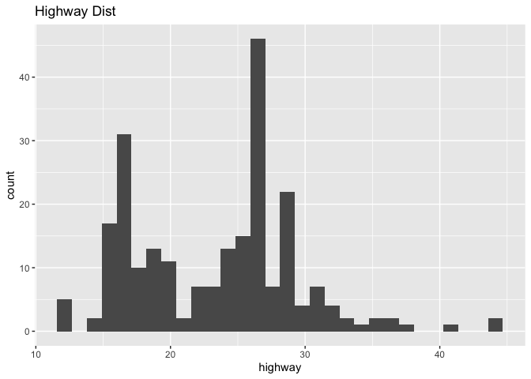

Problem Set 1
================
Hunter Giles
2022-08-18

``` r
library(tidyverse)

cars <- read_csv("data/cars.csv")
```

# Learning R

Tell me that you worked through the primers and videos and examples at
the example page for this week:

The primers and videos were great!

# My first plots

Insert a chunk below and use it to create a scatterplot (hint:
`geom_point()`) with diplacement (`displ`) on the x-axis, city MPG
(`cty`) on the y-axis, and with the points colored by drive (`drv`).

``` r
ggplot(cars, aes(displ, cty)) +
  geom_point() +
  labs(title = "Corr: City & Displacement", y = "City", x = "Displacement")
```

<!-- -->

Insert a chunk below and use it to create a histogram (hint:
`geom_histogram()`) with highway MPG (`hwy`) on the x-axis. Do not
include anything on the y-axis (`geom_histogram()` will do that
automatically for you). Choose an appropriate bin width. If you’re
brave, facet by drive (`drv`).

``` r
ggplot(cars) +
  geom_histogram(mapping = aes(hwy)) +
  labs(title = "Highway Dist", x = "highway")
```

    ## `stat_bin()` using `bins = 30`. Pick better value with `binwidth`.

<!-- -->

# My first data manipulation

Insert a chunk below and use it to calculate the average city MPG
(`cty`) by class of car (`class`). This won’t be a plot—it’ll be a
table. Hint: use a combination of `group_by()` and `summarize()`.

``` r
df <- cars %>% group_by(class)
summarise(df, mean = mean(cty))
```

    ## # A tibble: 7 × 2
    ##   class       mean
    ##   <chr>      <dbl>
    ## 1 2seater     15.4
    ## 2 compact     20.1
    ## 3 midsize     18.8
    ## 4 minivan     15.8
    ## 5 pickup      13  
    ## 6 subcompact  20.4
    ## 7 suv         13.5
