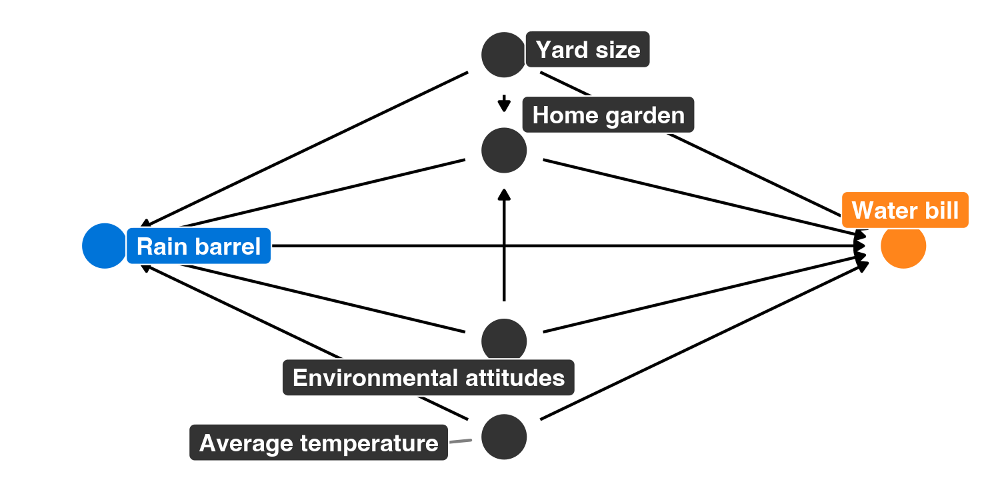
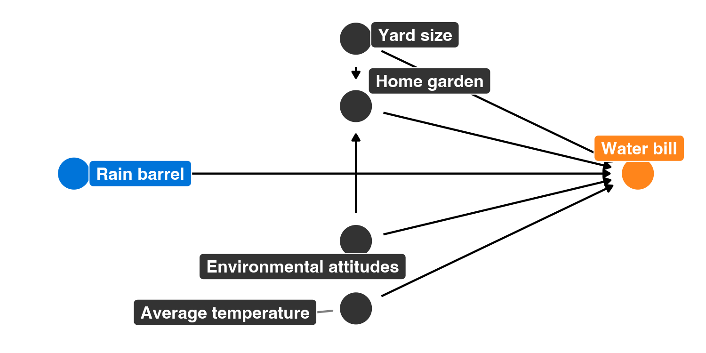

------------------------------------------------------------------------

# Program overview

The metropolitan Atlanta area is interested in helping residents become more environmentally conscious, reduce their water consumption, and save money on their monthly water bills. To do this, Fulton, DeKalb, Gwinnett, Cobb, and Clayton counties have jointly initiated a new program that provides free rain barrels to families who request them. These barrels collect rain water, and the reclaimed water can be used for non-potable purposes (like watering lawns and gardens). Officials hope that families that use the barrels will rely more on rain water and will subsequently use fewer county water resources, thus saving both the families and the counties money.

Being evaluation-minded, the counties hired an evaluator (you!) before rolling out their program. You convinced them to fund and run a randomized controlled trial (RCT) during 2018, and the counties rolled out the program city-wide in 2019. You have two datasets: `barrels_rct.csv` with data from the RCT, and `barrels_obs.csv` with observational data from self-selected participants.

These datasets contain the following variables:

-   `id`: A unique ID number for each household
-   `water_bill`: The family's average monthly water bill, in dollars
-   `barrel`: An indicator variable showing if the family participated in the program
-   `barrel_num`: A 0/1 numeric version of `barrel`
-   `yard_size`: The size of the family's yard, in square feet
-   `home_garden`: An indicator variable showing if the family has a home garden
-   `home_garden_num`: A 0/1 numeric version of `home_garden`
-   `attitude_env`: The family's self-reported attitude toward the environment, on a scale of 1-10 (10 meaning highest regard for the environment)
-   `temperature`: The average outside temperature (these get wildly unrealistic for the Atlanta area; just go with it)

# Your goal

Your task in this problem set is to analyze these two datasets to find the causal effect (or average treatment effect (ATE)) of this hypothetical program.

***Follow these two examples from class as guides:***

-   [RCTs](https://evalsp22.classes.andrewheiss.com/example/rcts/)
-   [Matching and IPW](https://evalsp22.classes.andrewheiss.com/example/matching-ipw/)

As a reference, Figure 1 shows the DAG for the program:



------------------------------------------------------------------------

```{r setup, warning=FALSE, message=FALSE}
library(tidyverse)
library(broom)
library(patchwork)
library(MatchIt)

barrels_rct <- read_csv("data/barrels_rct.csv") %>% 
  # This makes it so "No barrel" is the reference category
  mutate(barrel = fct_relevel(barrel, "No barrel"))

barrels_obs <- read_csv("data/barrels_observational.csv") %>% 
  # This makes it so "No barrel" is the reference category
  mutate(barrel = fct_relevel(barrel, "No barrel"))
```

# 1. Finding causation from a randomized controlled trial

## Modified DAG

You remember from PMAP 8521 that when running an RCT, you can draw the DAG for the program like this (Figure 2). **Why?**



## Check balance

**Discuss the sample size for the RCT data and how many people were assigned to treatment/control. Are you happy with this randomization?**

```{r}
# Check for balance of numbers in the treatment and control groups
barrels_rct %>% group_by(barrel) %>% 
  summarise(cnt = n()) %>% mutate(freq = (cnt / sum(cnt)))
```

The treatment and control group have roughly the same number of observations in them. This balance will help the authenticity of the RCT. However, this is a city wide policy, so I would like more observations than 493.

**Check the balance of the main pre-treatment characteristics. Are you happy with the balance?**

```{r message=FALSE, warning=FALSE}
# Insert as many chunks as you need to check the balance of the RCT across
# different pre-treatment characteristics like yard size, home garden,
# environmental attitudes, and average temperature.
barrels_rct %>% group_by(barrel,home_garden) %>% summarise(cnt = n()) %>% mutate(freq = cnt / sum(cnt))
```

This seems balanced to me.

```{r message=FALSE, warning=FALSE}
ggplot(barrels_rct) +
  geom_bar(data = filter(barrels_rct, barrel == "Barrel"), mapping = aes(x=attitude_env), fill = "red", alpha = 0.2) + 
  geom_bar(data = filter(barrels_rct, barrel == "No barrel"), mapping = aes(x=attitude_env), fill = "blue", alpha = .7) +
  scale_x_discrete(limits = seq(1,10)) + 
  labs(x = "barrels (red) & no barrels (blue)", title = "Distribution of env attitude by RCT group")
```

It looks like the distributions of environmental attitude are about the same between the treatment and control group, however, there seems to be more people in the barrels category.

```{r}
waterbill_summary <- ggplot(barrels_rct, mapping = aes(x = barrel, y = water_bill, color = barrel)) +
  stat_summary(geom = "pointrange", fun.data = "mean_se", fun.args = list(mult = 1.96)) +
  guides(color = "none") +
  labs(title = "Mean and SE of water bill", x = NULL, y = "Water Bill")

waterbill_dis <- ggplot(barrels_rct, aes(x=water_bill, fill=barrel)) +
  geom_histogram(alpha = .5) + 
  labs(title = "Distribution of Water Bill", x = "Water Bill")

waterbill_summary + waterbill_dis
```

There is a difference in means which is ok because water_bill is the dependent variable. The distributions are both relatively normal.

## Estimate difference

**What is the effect of the program on participants' water bills? How credible is this result?**

```{r}
# Insert as many chunks as you need to measure the difference in water bills for
# those in the program and those not in the program.
df <- barrels_rct %>% group_by(barrel) %>% summarise(mean = mean(water_bill))
abs(df$mean[1] - df$mean[2])
```


# 2. Finding causation from observational data

## Naive difference in means

**As a baseline measure, calculate the average difference in water bills for those in the program and those not in the program using the observational data. How much of an effect is there? How credible is this result? Why?**

```{r}
# Find the naive difference in means

```

## Adjustment with Mahalanobis nearest-neighbor matching

**Use matching to make the proper adjustments and close the backdoor effects from the four main confounders: `yard_size`, `home_garden`, `attitude_env`, and `temperature`**

```{r matching}
# Insert as many chunks as you need to close the backdoors by using nearest
# neighbor matching with Mahalanobis distance.

matchit(water_bill ~ barrel_num, 
        data = barrels_obs,
        method = "nearest",
        distance = "mahalnobis",
        replace = TRUE)
```

## Adjustment with inverse probability weighting

**Use inverse probability weighting to make the proper adjustments and close the backdoor effects from the four main confounders: `yard_size`, `home_garden`, `attitude_env`, and `temperature`**

```{r}
# Insert as many chunks as you need to close the backdoors by using propensity
# scores and inverse probability weighting.
```

# 3. Comparing results

You just calculated a bunch of ATEs using experimental and observational data. **Put them all in a single table here:**

```{r}
# Table with all model results side-by-side
```

**Which estimates do you believe? Why? Would observational ATEs be sufficient to prove program effect in this case? Why or why not? Should this program be rolled out throughout Georgia? Why or why not?**
