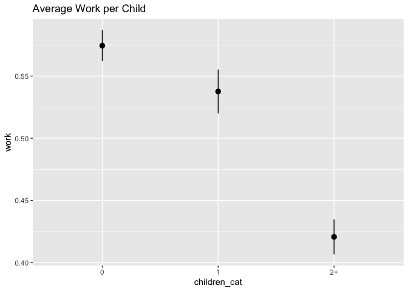
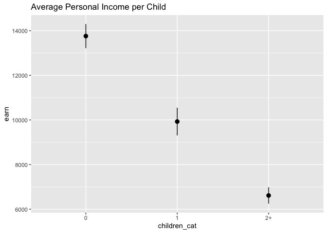
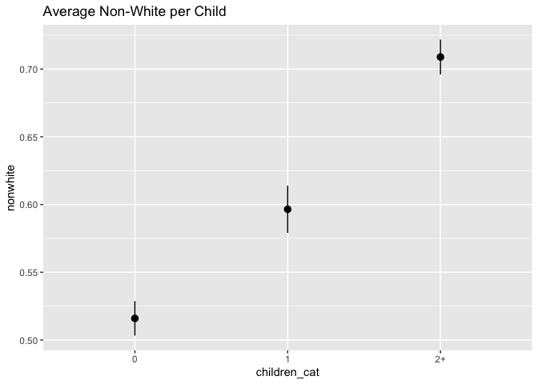
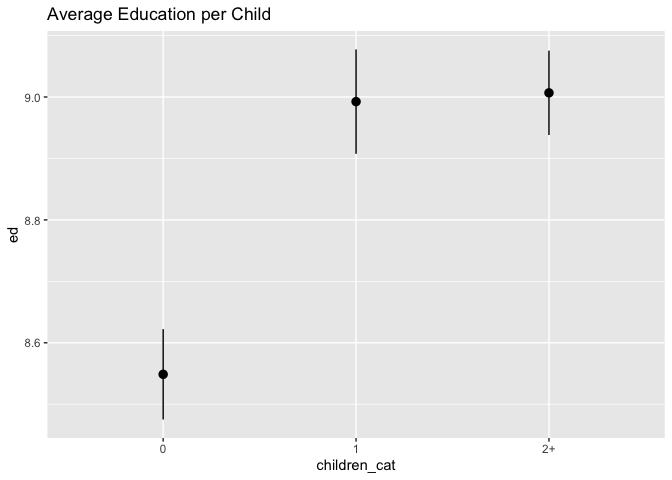
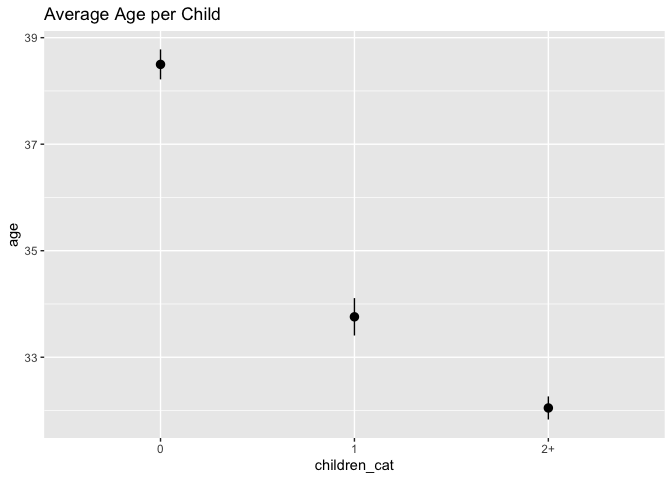
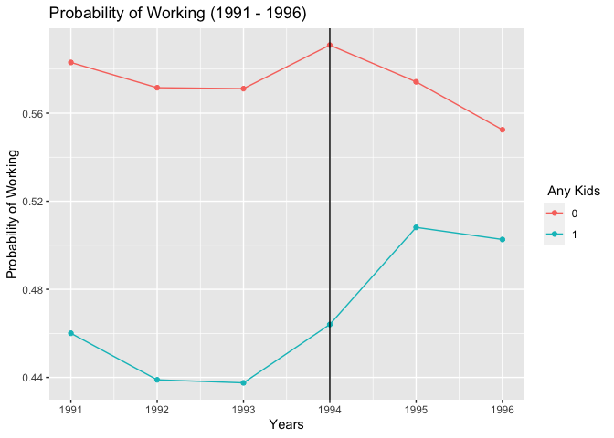

Problem Set 4
================
W. Hunter Giles

- <a href="#exploratory-data-analysis"
  id="toc-exploratory-data-analysis">1. Exploratory data analysis</a>
  - <a href="#work" id="toc-work">Work</a>
  - <a href="#family-income" id="toc-family-income">Family income</a>
  - <a href="#earnings" id="toc-earnings">Earnings</a>
  - <a href="#race" id="toc-race">Race</a>
  - <a href="#education" id="toc-education">Education</a>
  - <a href="#age" id="toc-age">Age</a>
  - <a href="#general-summary" id="toc-general-summary">General summary</a>
- <a href="#create-treatment-variables"
  id="toc-create-treatment-variables">2. Create treatment variables</a>
- <a href="#check-pre--and-post-treatment-trends"
  id="toc-check-pre--and-post-treatment-trends">3. Check pre- and
  post-treatment trends</a>
  - <a href="#plot-for-parallel-trends"
    id="toc-plot-for-parallel-trends">Plot for Parallel Trends</a>
- <a href="#difference-in-difference-by-hand-ish"
  id="toc-difference-in-difference-by-hand-ish">4.
  Difference-in-difference by hand-ish</a>
- <a href="#difference-in-difference-with-regression"
  id="toc-difference-in-difference-with-regression">5.
  Difference-in-difference with regression</a>
- <a href="#difference-in-difference-with-regression-and-controls"
  id="toc-difference-in-difference-with-regression-and-controls">6.
  Difference-in-difference with regression and controls</a>
- <a href="#varying-treatment-effects"
  id="toc-varying-treatment-effects">7. Varying treatment effects</a>
- <a href="#check-parallel-trends-with-fake-treatment"
  id="toc-check-parallel-trends-with-fake-treatment">8. Check parallel
  trends with fake treatment</a>

------------------------------------------------------------------------

In 1996, Nada Eissa and Jeffrey B. Liebman [published a now-classic
study on the effect of the Earned Income Tax Credit (EITC) on
employment](http://darp.lse.ac.uk/papersdb/Eissa-Liebman_(QJE96).pdf).
The EITC is a special tax credit for low income workers that changes
depending on (1) how much a family earns (the lowest earners and highest
earners don’t receive a huge credit, as the amount received phases in
and out), and (2) the number of children a family has (more kids =
higher credit). See [this brief
explanation](https://www.cbpp.org/research/federal-tax/policy-basics-the-earned-income-tax-credit)
for an interactive summary of how the EITC works.

Eissa and Liebman’s study looked at the effects of the EITC on women’s
employment and wages after it was initially substantially expanded in
1986. The credit was expanded substantially again in 1993. For this
problem set, you’ll measure the causal effect of this 1993 expansion on
the employment levels and annual income for women.

A family must have children in order to quality for the EITC, which
means the presence of 1 or more kids in a family assigns low-income
families to the EITC program (or “treatment”). We have annual data on
earnings from 1991–1996, and because the expansion of EITC occurred in
1993, we also have data both before and after the expansion. This
treatment/control before/after situation allows us to use a
difference-in-differences approach to identify the causal effect of the
EITC.

The dataset I’ve provided (`eitc.dta`) is a Stata data file containing
more than 13,000 observations. This is non-experimental data—the data
comes from the US Census’s Current Population Survey (CPS) and includes
all women in the CPS sample between the ages of 20–54 with less than a
high school education between 1991–1996. There are 11 variables:

- `state`: The woman’s state of residence. The numbers are Census/CPS
  state numbers: <http://unionstats.gsu.edu/State_Code.htm>
- `year`: The tax year
- `urate`: The unemployment rate in the woman’s state of residence
- `children`: The number of children the woman has
- `nonwhite`: Binary variable indicating if the woman is not white (1 =
  Hispanic/Black)
- `finc`: The woman’s family income in 1997 dollars
- `earn`: The woman’s personal income in 1997 dollars
- `age`: The woman’s age
- `ed`: The number of years of education the woman has
- `unearn`: The woman’s family income minus her personal income, in
  *thousands* of 1997 dollars

``` r
library(tidyverse)  # For ggplot, %>%, mutate, filter, group_by, and friends
library(haven)      # For loading data from Stata
library(broom)      # For showing models as data frames

# This turns off this message that appears whenever you use summarize():
# `summarise()` ungrouping output (override with `.groups` argument)
options(dplyr.summarise.inform = FALSE)

# Load EITC data
eitc <- read_stata("../data/eitc.dta") %>% 
  # case_when() is a fancy version of ifelse() that takes multiple conditions
  # and outcomes. Here, we make a new variable named children_cat(egorical) 
  # with three different levels: 0, 1, and 2+
  mutate(children_cat = case_when(
    children == 0 ~ "0",
    children == 1 ~ "1",
    children >= 2 ~ "2+"
  ))
```

# 1. Exploratory data analysis

## Work

``` r
# Work
eitc %>% 
  group_by(children_cat) %>% 
  summarize(avg_work = mean(work))
```

    # A tibble: 3 × 2
      children_cat avg_work
      <chr>           <dbl>
    1 0               0.574
    2 1               0.538
    3 2+              0.421

``` r
# stat_summary() here is a little different from the geom_*() layers you've seen
# in the past. stat_summary() takes a function (here mean_se()) and runs it on
# each of the children_cat groups to get the average and standard error. It then
# plots those with geom_pointrange. The fun.args part of this lets us pass an
# argument to mean_se() so that we can multiply the standard error by 1.96,
# giving us the 95% confidence interval
ggplot(eitc, aes(x = children_cat, y = work)) +
  stat_summary(geom = "pointrange", fun.data = "mean_se", fun.args = list(mult = 1.96)) +
  labs(title = "Average Work per Child")
```



## Family income

``` r
eitc %>% 
  group_by(children_cat) %>%
  summarise(avg_inc = mean(finc))
```

    # A tibble: 3 × 2
      children_cat avg_inc
      <chr>          <dbl>
    1 0             18560.
    2 1             13942.
    3 2+            11985.

``` r
ggplot(eitc, aes(x = children_cat, y = finc)) +
  stat_summary(geom = "pointrange", fun.data = "mean_se", fun.args = list(mult = 1.96)) +
  labs(title = "Average Family Income per Child")
```


## Earnings

``` r
eitc %>% 
  group_by(children_cat) %>%
  summarise(avg_inc = mean(earn))
```

    # A tibble: 3 × 2
      children_cat avg_inc
      <chr>          <dbl>
    1 0             13760.
    2 1              9928.
    3 2+             6614.

``` r
ggplot(eitc, aes(x = children_cat, y = earn)) +
  stat_summary(geom = "pointrange", fun.data = "mean_se", fun.args = list(mult = 1.96)) +
  labs(title = "Average Personal Income per Child")
```



## Race

``` r
eitc %>% 
  group_by(children_cat) %>%
  summarise(avg_inc = mean(nonwhite))
```

    # A tibble: 3 × 2
      children_cat avg_inc
      <chr>          <dbl>
    1 0              0.516
    2 1              0.596
    3 2+             0.709

``` r
ggplot(eitc, aes(x = children_cat, y = nonwhite)) +
  stat_summary(geom = "pointrange", fun.data = "mean_se", fun.args = list(mult = 1.96)) +
  labs(title = "Average Non-White per Child")
```



## Education

``` r
eitc %>% 
  group_by(children_cat) %>%
  summarise(avg_inc = mean(ed))
```

    # A tibble: 3 × 2
      children_cat avg_inc
      <chr>          <dbl>
    1 0               8.55
    2 1               8.99
    3 2+              9.01

``` r
ggplot(eitc, aes(x = children_cat, y = ed)) +
  stat_summary(geom = "pointrange", fun.data = "mean_se", fun.args = list(mult = 1.96)) +
  labs(title = "Average Education per Child")
```



## Age

``` r
eitc %>% 
  group_by(children_cat) %>%
  summarise(avg_inc = mean(age))
```

    # A tibble: 3 × 2
      children_cat avg_inc
      <chr>          <dbl>
    1 0               38.5
    2 1               33.8
    3 2+              32.0

``` r
ggplot(eitc, aes(x = children_cat, y = age)) +
  stat_summary(geom = "pointrange", fun.data = "mean_se", fun.args = list(mult = 1.96)) +
  labs(title = "Average Age per Child")
```



## General summary

The number of children has a strictly monotonic relationship with
`work`, `finc`, `earn`, `nonwhite`, `ed`, and `age` (be aware that
children is binned for \>=2). These relationships are not yet proven to
be causal, so the above results should be treated as correlation. As
probability of employment (`work`) increases, the number of children
decrease. As family income (`finc`) increases, the number of children
decrease. As personal income (`earn`) increase the number of children
decreases. As education (`ed`) increases, the number of children
increases. As families become more non-white (`non-white`), the number
of children decrease. As age (`age`) increases, then number of children
decrease.

# 2. Create treatment variables

``` r
# dummy for has any children
eitc <- eitc %>%
  mutate(any_kids = ifelse(children > 0,1,0)) 

# dummy for after 1993
eitc <- eitc %>% 
  mutate(after_1993 = year > 1993) 

# View(select(eitc, any_kids, children, after_1993, year))
```

# 3. Check pre- and post-treatment trends

``` r
eitc_by_year_kids <- eitc %>% group_by(any_kids, year) %>% 
  summarise(avg_work = mean(work))
print(eitc_by_year_kids)
```

    # A tibble: 12 × 3
    # Groups:   any_kids [2]
       any_kids  year avg_work
          <dbl> <dbl>    <dbl>
     1        0  1991    0.583
     2        0  1992    0.572
     3        0  1993    0.571
     4        0  1994    0.591
     5        0  1995    0.574
     6        0  1996    0.552
     7        1  1991    0.460
     8        1  1992    0.439
     9        1  1993    0.438
    10        1  1994    0.464
    11        1  1995    0.508
    12        1  1996    0.503

### Plot for Parallel Trends

``` r
ggplot(data = eitc_by_year_kids) +
  geom_point(mapping = aes(x = year, y = avg_work, color=factor(any_kids))) +
  geom_line(mapping = aes(x = year, y = avg_work, group=any_kids, color=factor(any_kids))) +
  geom_vline(xintercept = 1994) +
  labs(title = "Probability of Working (1991 - 1996)", x = "Years", y = "Probability of Working", color = " Any Kids") 
```



Parallel trends can be assumed for the pre-treatment period.

# 4. Difference-in-difference by hand-ish

``` r
a <- eitc %>% group_by(any_kids, after_1993) %>%
  summarise(avg_work = mean(work))
a <- spread(a, key = after_1993, value = avg_work)
a
```

    # A tibble: 2 × 3
    # Groups:   any_kids [2]
      any_kids `FALSE` `TRUE`
         <dbl>   <dbl>  <dbl>
    1        0   0.575  0.573
    2        1   0.446  0.491

``` r
mutate(a, first_difference_time = `TRUE` - `FALSE`)
```

    # A tibble: 2 × 4
    # Groups:   any_kids [2]
      any_kids `FALSE` `TRUE` first_difference_time
         <dbl>   <dbl>  <dbl>                 <dbl>
    1        0   0.575  0.573              -0.00207
    2        1   0.446  0.491               0.0448 

``` r
data.frame(t(a)[2:3,]) %>% mutate(first_difference_kids = X1 - X2)
```

                 X1        X2 first_difference_kids
    FALSE 0.5754597 0.4459619            0.12949788
    TRUE  0.5733862 0.4907615            0.08262475

``` r
0.044799623 - -0.002073509
```

    [1] 0.04687313

``` r
0.12949788 - 0.08262475
```

    [1] 0.04687313

|                    | Before 1993 | After 1993 | Difference   |
|--------------------|-------------|------------|--------------|
| Women with no kids | 0.5754597   | 0.5733862  | -0.002073509 |
| Women with kids    | 0.4459619   | 0.4907615  | 0.044799623  |
| Difference         | 0.12949788  | 0.08262475 | 0.04687313   |

From the table above, we can see that women without kids works .2% after
the EITC tax, and women with kids worked 4.4% more. In the pre-treatment
period, 12.9% of women without kids worked more than women with kids.
After the treatment, 8% of women without kids worked more than women
with kids. The difference and difference shows that the EITC increases
the number of women with kids that worked by 4.6%.

# 5. Difference-in-difference with regression

``` r
lm_model <- lm(work ~ (any_kids * after_1993), data = eitc)
tidy(lm_model)
```

    # A tibble: 4 × 5
      term                    estimate std.error statistic  p.value
      <chr>                      <dbl>     <dbl>     <dbl>    <dbl>
    1 (Intercept)              0.575     0.00885    65.1   0       
    2 any_kids                -0.129     0.0117    -11.1   1.84e-28
    3 after_1993TRUE          -0.00207   0.0129     -0.160 8.73e- 1
    4 any_kids:after_1993TRUE  0.0469    0.0172      2.73  6.31e- 3

The diff-and-diff regression yields the same results as the table in
part 4. The advantage of the regression, is we can can see the standard
error, t statistics, and p values. Now we can say that the EITC policy
significantly (p\<.01) increase the number of women with kids that work
by 4.6%.

# 6. Difference-in-difference with regression and controls

``` r
# Make new dataset with columns for age squared and education squared
# Regression model with demographic controls here
eitc <- eitc %>% 
  mutate(age_sq = age*age, ed_sq = ed*ed)

lm_model_controls <- lm(work ~ (any_kids * after_1993) + age + age_sq + ed + ed_sq + unearn + nonwhite, data = eitc)
tidy(lm_model_controls)
```

    # A tibble: 10 × 5
       term                     estimate std.error statistic   p.value
       <chr>                       <dbl>     <dbl>     <dbl>     <dbl>
     1 (Intercept)              0.136    0.0599        2.27  2.34e-  2
     2 any_kids                -0.123    0.0117      -10.6   5.50e- 26
     3 after_1993TRUE          -0.00846  0.0124       -0.683 4.94e-  1
     4 age                      0.0256   0.00326       7.87  3.75e- 15
     5 age_sq                  -0.000311 0.0000448    -6.95  3.85e- 12
     6 ed                      -0.00402  0.00598      -0.673 5.01e-  1
     7 ed_sq                    0.00142  0.000436      3.25  1.16e-  3
     8 unearn                  -0.0184   0.000576    -32.0   4.01e-217
     9 nonwhite                -0.0735   0.00847      -8.68  4.46e- 18
    10 any_kids:after_1993TRUE  0.0583   0.0164        3.55  3.94e-  4

This model include variables that could be confounding the main
difference and difference (DD) interaction. This includes two squared
variables, `age_sq` and `ed_eq`, that account for non linear returns in
percent worked explained by age and education. With all controls, we can
see that the DD interaction term’s coefficient went up, meaning the
leaving the co-variates out of the model, biased the interaction down.
The treatment effect is now interpreted as significantly (p \< .01)
increasing the number of women with kids that worked by 5.8%.

# 7. Varying treatment effects

``` r
eitc <- eitc %>% mutate(one_kid = ifelse(children == 1, 1, 0))
eitc <- eitc %>% mutate(two_plus_kid = ifelse(children > 1, 1, 0))
```

``` r
lm_model_differentiated_kids <- lm(work ~ (one_kid * after_1993) + (two_plus_kid * after_1993), data = eitc)

tidy(lm_model_differentiated_kids)
```

    # A tibble: 6 × 5
      term                        estimate std.error statistic  p.value
      <chr>                          <dbl>     <dbl>     <dbl>    <dbl>
    1 (Intercept)                  0.575     0.00881    65.3   0       
    2 one_kid                     -0.0519    0.0150     -3.45  5.56e- 4
    3 after_1993TRUE              -0.00207   0.0129     -0.161 8.72e- 1
    4 two_plus_kid                -0.179     0.0131    -13.6   4.08e-42
    5 one_kid:after_1993TRUE       0.0326    0.0221      1.48  1.40e- 1
    6 after_1993TRUE:two_plus_kid  0.0553    0.0193      2.86  4.19e- 3

Form the regression above, we can see that the treatment has a stronger
effect on women with 2 or more kids. One intuitive reasoning for this is
women with more kids receive more funding. This gives them a greater
incentive to work than women with one kid.

# 8. Check parallel trends with fake treatment

``` r
eitc_fake_treatment <- eitc %>% 
  filter(year < 1994) %>% 
  mutate(after_1991 = year >= 1992)
# Make new dataset that only includes rows less than 1994 (with filter), and add
# a new binary indicator variable for after_1991

# Run simple regression with interaction term any_kids * after_1991
lm_fake_model <- lm(work ~ (any_kids * after_1991), data = eitc_fake_treatment)
tidy(lm_fake_model)
```

    # A tibble: 4 × 5
      term                    estimate std.error statistic   p.value
      <chr>                      <dbl>     <dbl>     <dbl>     <dbl>
    1 (Intercept)               0.583     0.0149    39.1   1.34e-304
    2 any_kids                 -0.123     0.0196    -6.26  4.02e- 10
    3 after_1991TRUE           -0.0117    0.0185    -0.631 5.28e-  1
    4 any_kids:after_1991TRUE  -0.0101    0.0244    -0.415 6.78e-  1

The effect is both small and insignificant. The fake treatment procedure
serves as a robustness check. We can now me more certain that the
treatment caused the change in work, and the DD model is measuring the
intended effect.
