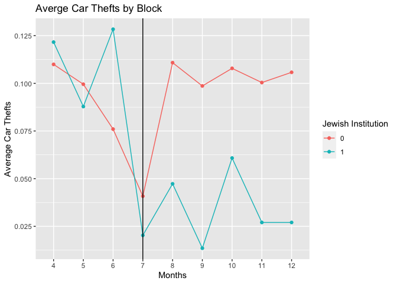

Problem Set 5
================
W. Hunter Giles

<script src="5_assignment_files/libs/kePrint-0.0.1/kePrint.js"></script>
<link href="5_assignment_files/libs/lightable-0.0.1/lightable.css" rel="stylesheet" />


- <a href="#research-design" id="toc-research-design">1. Research
  design</a>
- <a href="#trends" id="toc-trends">2. Trends</a>
- <a href="#difference-in-differences-by-hand-ish"
  id="toc-difference-in-differences-by-hand-ish">3.
  Difference-in-differences by hand-ish</a>
- <a href="#difference-in-differences-with-regular-ols"
  id="toc-difference-in-differences-with-regular-ols">4.
  Difference-in-differences with regular OLS</a>
- <a href="#difference-in-differences-with-fixed-effects-ols"
  id="toc-difference-in-differences-with-fixed-effects-ols">5.
  Difference-in-differences with fixed effects OLS</a>
- <a href="#translate-results-to-something-more-interpretable"
  id="toc-translate-results-to-something-more-interpretable">6. Translate
  results to something more interpretable</a>

In 2004, Rafael Di Tella and Ernesto Schargrodsky published a study that
analyzed the effect of increased police presence on crime. You looked at
this study previously in your threats to validity assignment. To measure
this effect, Di Tella and Schargrodsky leveraged a quasi-experiment.
Following a synagogue bombing in Buenos Aires, Argentina on July 18,
1994, extra municipal police were assigned to protect synagogues around
the city. The increase of police patrols on some city blocks, but not
others, means that there is arguably a treatment group and control group
for increased police presence, which Di Tella and Schargrodsky used to
measure the effect of extra police on car thefts.

The dataset I’ve provided (`MonthlyPanel.dta`) is a Stata data file
nearly 10,000 observations. It comes directly from [Di Tella and
Schargrodsky’s data appendix available at their study’s *AER*
webpage](https://www.aeaweb.org/articles?id=10.1257/000282804322970733).
This is non-experimental data that includes counts of car thefts for
every city block in Buenos Aires from April to December 1994. There are
12 variables:

- `observ` (we’ll rename to `block`): The ID number of the block
- `barrio`: The barrio (neighborhood) for the block
- `calle`: The street for the block
- `altura`: The street number
- `institu1` (we’ll rename to `same_block`): Indicator variable marking
  if there’s a Jewish institution on the block (1 if yes, 0 if no)
- `institu3`: Indicator variable marking if there’s a Jewish institution
  within one block (1 if yes, 0 if no)
- `distanci` (we’ll rename to `distance`): Distance to the nearest
  Jewish institution, measured in blocks
- `edpub`: Indicator variable marking if there’s an educational building
  or embassy on the block (1 if yes, 0 if no)
- `estserv`: Indicator variable marking if there’s a gas station on the
  block (1 if yes, 0 if no)
- `banco`: Indicator variable marking if there’s a bank on the block (1
  if yes, 0 if no)
- `totrob` (we’ll rename to `car_theft`): Total number of car robberies
- `mes` (we’ll rename to `month`): Month

------------------------------------------------------------------------

``` r
library(tidyverse)     # For ggplot, %>%, mutate, filter, group_by, and friends
library(haven)         # For loading data from Stata
library(broom)         # For showing models as data frames
library(fixest)        # For fast, nice, fixed effects regression
library(modelsummary)  # For side-by-side regression tables

# This turns off this message that appears whenever you use summarize():
# `summarise()` ungrouping output (override with `.groups` argument)
options(dplyr.summarise.inform = FALSE)

# Load terror data
terror <- read_stata("../data/MonthlyPanel.dta") %>% 
  # The attack happened on July 18. The authors omitted data from July 19-31, so
  # all July observations are from before the attack. Make a new indicator
  # variable `after` to mark if the row is from before or after the attack
  mutate(after = mes > 7) %>% 
  # There are some weird months in the data like 73. Filter out anything > 12
  filter(mes <= 12) %>% 
  # Rename some columns to be more readable
  rename(same_block = institu1,
         distance = distanci,
         car_theft = totrob,
         month = mes,
         block = observ) %>% 
  # Create indicator variables for the distance of each block to a synagogue
  mutate(one_block_away = ifelse(distance == 1, 1, 0),
         two_blocks_away = ifelse(distance == 2, 1, 0),
         more_than_two_away = ifelse(distance > 2, 1, 0)) %>% 
  # Make these factors/categories
  mutate(block = as.factor(block),
         month = as.factor(month),
         same_block_factor = as.factor(same_block))
```

# 1. Research design

**Imagine you went out and collected data on the presence of police in
each city, and the amount of crime in each city, and found a positive
relationship. Does this mean police *cause* crime? Explain.**

*No, an increase in crime can cause and increase in police presents,
while an increase in police presence can cause crime to fall. From
reverse causality, it is difficult to claim one causes the other.*

Di Tella and Ernesto Schargrodsky explore this question with a
difference-in-difference design. They collected data on both the
presence of police and car robberies in Buenos Aires city blocks both
before and after the attack. Their interest is in seeing whether the
extra police reduced the amount of car theft. **How is this data
suitable for a diff-in-diff design? What would we be comparing here? Be
specific about the pre/post treatment/control groups.**

*The researcher exploit the terror attack by creating a difference and
difference model. Before the attack, police presents was consistent
(constant or random) for city blocks, after the attack, police presence
increased for blocks with Jewish institutions. The treatment is the
increase in police presence. Assuming parallel trends, the first
derivative crime rate was the same in blocks both with and with out
Jewish institutions.*

*The treatment group are blocks with Jewish institutions, and the
control group are those without. After the attach, the treatment group
will be subjected to the treatment. The two differences are taken to
estimate the ATE.*

**Why does it help the researchers that the police were dispatched to
certain blocks *because of terrorist attacks?***

*The researchers can now control for time (after).*

# 2. Trends

One of the most crucial assumptions for difference-in-differences
designs is the idea that the trends in the treatment and control groups
need to be parallel prior to the intervention or program. **Why?**

If the treatment and control group have parallel trends, then the
treatment and control are comparable in the pre-treatment stage.

Create a plot that shows the average number of car thefts per month for
blocks with synagogues and blocks without (Hints: it’ll be easiest if
you make a smaller dataset using `group_by()` and `summarize()` and then
plot that smaller dataset with `ggplot()` Make sure you group by `month`
and `same_block_factor`. Add `group = same_block_factor` as an aesthetic
so the line goes across the categorical months on the x-axis). Add a
vertical line (`geom_vline(xintercept = "7")`) in the month where the
terror attack happened.

**What would you say about the parallel trends assumption here? Does it
hold up? Maybe? Maybe not?**

*From the graph below, We can see that the parallel trends assumption
does not hold.*

``` r
car_theft_by_group <- terror %>% 
  group_by(same_block_factor, month) %>% 
  summarise(avg_car_theft=mean(car_theft))

ggplot(data=car_theft_by_group) +
  geom_point(mapping = aes(x=month, y=avg_car_theft, color = same_block_factor)) +
  geom_line(mapping = aes(x=month, y=avg_car_theft, color = same_block_factor, group = same_block_factor)) +
  geom_vline(xintercept = "7") +
    labs(title = "Averge Car Thefts by Block", x = "Months", y = "Average Car Thefts", color = "Jewish Institution")
```



# 3. Difference-in-differences by hand-ish

Calculate the average number of car thefts in the treatment and control
groups before and after the attack. (Hint: group by `same_block` and
`after` and find the average of `car_theft`.)

``` r
did_hand <- terror %>% 
  group_by(same_block_factor, after) %>%
  summarise(avg_car_theft = mean(car_theft)) %>% spread(key = after, value = avg_car_theft)
```

|                         | Before attack | After attack | Difference |
|-------------------------|---------------|--------------|------------|
| Block without synagogue | 0.0815        | 0.1047       | -0.0231    |
| Block with synagogue    | 0.0895        | 0.0351       | 0.0543     |
| Difference              | -0.0079       | 0.0695       | -0.0774    |

After the treatment period, the treatment group car had 0.0543 less car
thefts, and the control group had 0.0231 more car thefts. The effect of
the treatment on the treatment group decreased car thefts by 0.0774.

# 4. Difference-in-differences with regular OLS

Run a regression model to find the diff-in-diff estimate of the effect
of the increased police presence (`after`) on car thefts (`car_theft`)
(hint: remember that you’ll be using an interaction term).

``` r
did <- lm(car_theft ~ (after*same_block_factor), data=terror)
tidy(did)
```

    # A tibble: 4 × 5
      term                         estimate std.error statistic  p.value
      <chr>                           <dbl>     <dbl>     <dbl>    <dbl>
    1 (Intercept)                   0.0816    0.00417    19.6   3.33e-83
    2 afterTRUE                     0.0231    0.00560     4.13  3.59e- 5
    3 same_block_factor1            0.00796   0.0203      0.392 6.95e- 1
    4 afterTRUE:same_block_factor1 -0.0775    0.0272     -2.85  4.42e- 3

**How does this value compare with what you found in part 3 earlier?
What is the advantage of doing this instead of making a table?**

Form the regression table above, we can see that that coefficients are
the same as when the calculations are done by hand. The advantage of the
regression, the level of significance is displayed, in this case level
of ATE significance is p \< .05.

# 5. Difference-in-differences with fixed effects OLS

The diff-in-diff coefficient you found in part 4 is accurate, but the
standard errors and $R^2$ are wrong (run `glance()` on your model object
to see how tiny the $R^2$ is)! This is because of a host of mathy
reasons, but also because of the DAG. The effect of increased police
presence is confounded by both month and block, but all we’ve really
adjusted for binary before/after (for month) and binary synagogue/no
synagogue (for block). By reducing these confounders to just binary
variables, we lose a lot of the variation across months and blocks.

To fix this, run a diff-in-diff model that includes two additional
control variables: `block + month`.

> ***Warning***: this will be *incredibly* slow! There are 876 blocks
> and `nrow(distinct(terror, month))` months, and R is finding estimates
> for each block and month, and the math to do that is complex. Every
> time you knit this document, R will rerun the model, which takes 5-10
> seconds, and the delay when knitting can be annoying. If you want to
> speed this up across knitting sessions, add the option `cache=TRUE` to
> the chunk options for this chunk. R will store the results in a
> temporary file and won’t re-run the model if the data hasn’t changed.

**Don’t use `tidy` to view the results**. You’ll get a table with almost
900 rows and it’ll take up pages and pages of your knitted document. If
you really want to see the results, filter out the block and month rows
(like this:).

``` r
tidy(name_of_model) %>% 
  filter(!str_starts(term, "month"), 
         !str_starts(term, "block"))
```

``` r
did_fe <- lm(car_theft ~ (after*same_block_factor) + month + block, data = terror)

tidy(did_fe) %>% 
  filter(!str_starts(term, "month"), 
         !str_starts(term, "block"))
```

    # A tibble: 4 × 5
      term                         estimate std.error statistic p.value
      <chr>                           <dbl>     <dbl>     <dbl>   <dbl>
    1 (Intercept)                   0.0157     0.0770     0.204 0.839  
    2 afterTRUE                    -0.00472    0.0110    -0.427 0.669  
    3 same_block_factor1            0.0431     0.109      0.394 0.694  
    4 afterTRUE:same_block_factor1 -0.0775     0.0259    -2.99  0.00278

That slowness is miserable. You can get around that by using a different
function for OLS that has built-in support for fixed effects (or
indicator variables). The `feols()` (fixed-effects OLS) function from
the **fixest** package lets you include indicator variables in
regression in a more sophisticated way. The math is lighting fast, and
the coefficients for each block and year are hidden by default (though
you can still see them if you really want).

The syntax for `feols()` is the same as `lm()`, but with a slight change
to accommodate the fixed effects. Use the `|` character to specify a
section of the formula that contains the fixed effects:

``` r
model_name <- feols(car_theft ~ same_block*after | block + month, 
                    data = terror)
```

One more cool thing that `feols()` can do that normal `lm()` can’t is
provide robust standard errors. There is systematic variation within
blocks and across time, and we can mathematically account for that
variation in the standard errors of the regression. (If you’ve ever used
Stata you do this with `reg y x, robust`). If you ever want to use
robust and/or clustered standard errors with regular OLS regression in
R, check out the [`lm_robust()` function in the **estimatr**
package](https://declaredesign.org/r/estimatr/articles/getting-started.html#lm_robust).
With `feols()`, you can add an argument to `tidy()` to get the robust
standard errors.

``` r
# Stata's default robust SE algorithm is called "Huber-White standard errors", 
# and we can get those same numbers here. Look at the documentation for 
# summary.fixest() for more robustness and clustering options
tidy(model_name, se = "white")
```

Phew. Now that you know about `feols()` and robust standard errors,
build a model that finds the diff-in-diff effect that includes fixed
effects for block and month. Show the results with `tidy()` using
Huber-White standard errors.

``` r
did_fe_robust <- feols(car_theft ~ same_block*after | block + month, 
                    data = terror)

tidy(did_fe_robust, se = "white")
```

    # A tibble: 1 × 5
      term                 estimate std.error statistic  p.value
      <chr>                   <dbl>     <dbl>     <dbl>    <dbl>
    1 same_block:afterTRUE  -0.0775    0.0224     -3.46 0.000552

In the original study, the authors also considered the effect of two
other treatment variables. Maybe the extra police presence in blocks
with synagogues reduced car thefts not just for those blocks, but areas
1 block away or 2 blocks away.

Run two more models. In the first, keep the `same_block*after`
interaction term and add another diff-in-diff interaction for
`one_block_away*after`. In the second, keep the same block and one block
interaction terms and add one more diff-in-diff interaction for
`two_blocks_away*after`

``` r
did_fe_robust.2 <- feols(car_theft ~ same_block*after + one_block_away*after | block + month, 
                    data = terror)
did_fe_robust.3 <- feols(car_theft ~ same_block*after + one_block_away*after + 
                           two_blocks_away*after| block + month, 
                    data = terror)
```

Recreate columns A, B, and C from Table 3 from the original article with
`modelsummary()`. You’ll need to show the results from your three
`feols()` models (with one interaction term, with two interactions, and
with three interactions). You can tell the table to show robust standard
errors like the authors did in their original study by including the
`se = "white"` argument, and you can control how many digits are used
with the `fmt` (format) argument (the original article used 5 decimal
points, so you can too). You can add significance stars by including
`stars = TRUE`.

``` r
modelsummary(list(models, go, here),
             se = "white", fmt = "%.5f", stars = TRUE)
```

``` r
modelsummary(list(did_fe_robust, did_fe_robust.2, did_fe_robust.3),
             se = "white", fmt = "%.5f", stars = TRUE)
```

<table style="NAborder-bottom: 0; width: auto !important; margin-left: auto; margin-right: auto;" class="table">
 <thead>
  <tr>
   <th style="text-align:left;">   </th>
   <th style="text-align:center;"> Model 1 </th>
   <th style="text-align:center;"> Model 2 </th>
   <th style="text-align:center;"> Model 3 </th>
  </tr>
 </thead>
<tbody>
  <tr>
   <td style="text-align:left;"> same_block × afterTRUE </td>
   <td style="text-align:center;"> −0.07753*** </td>
   <td style="text-align:center;"> −0.08007*** </td>
   <td style="text-align:center;"> −0.08080*** </td>
  </tr>
  <tr>
   <td style="text-align:left;">  </td>
   <td style="text-align:center;"> (0.02244) </td>
   <td style="text-align:center;"> (0.02257) </td>
   <td style="text-align:center;"> (0.02294) </td>
  </tr>
  <tr>
   <td style="text-align:left;"> afterTRUE × one_block_away </td>
   <td style="text-align:center;">  </td>
   <td style="text-align:center;"> −0.01326 </td>
   <td style="text-align:center;"> −0.01399 </td>
  </tr>
  <tr>
   <td style="text-align:left;">  </td>
   <td style="text-align:center;">  </td>
   <td style="text-align:center;"> (0.01386) </td>
   <td style="text-align:center;"> (0.01447) </td>
  </tr>
  <tr>
   <td style="text-align:left;"> afterTRUE × two_blocks_away </td>
   <td style="text-align:center;">  </td>
   <td style="text-align:center;">  </td>
   <td style="text-align:center;"> −0.00218 </td>
  </tr>
  <tr>
   <td style="text-align:left;box-shadow: 0px 1px">  </td>
   <td style="text-align:center;box-shadow: 0px 1px">  </td>
   <td style="text-align:center;box-shadow: 0px 1px">  </td>
   <td style="text-align:center;box-shadow: 0px 1px"> (0.01232) </td>
  </tr>
  <tr>
   <td style="text-align:left;"> Num.Obs. </td>
   <td style="text-align:center;"> 7884 </td>
   <td style="text-align:center;"> 7884 </td>
   <td style="text-align:center;"> 7884 </td>
  </tr>
  <tr>
   <td style="text-align:left;"> R2 </td>
   <td style="text-align:center;"> 0.198 </td>
   <td style="text-align:center;"> 0.198 </td>
   <td style="text-align:center;"> 0.198 </td>
  </tr>
  <tr>
   <td style="text-align:left;"> R2 Adj. </td>
   <td style="text-align:center;"> 0.097 </td>
   <td style="text-align:center;"> 0.097 </td>
   <td style="text-align:center;"> 0.097 </td>
  </tr>
  <tr>
   <td style="text-align:left;"> R2 Within </td>
   <td style="text-align:center;"> 0.001 </td>
   <td style="text-align:center;"> 0.001 </td>
   <td style="text-align:center;"> 0.001 </td>
  </tr>
  <tr>
   <td style="text-align:left;"> R2 Pseudo </td>
   <td style="text-align:center;">  </td>
   <td style="text-align:center;">  </td>
   <td style="text-align:center;">  </td>
  </tr>
  <tr>
   <td style="text-align:left;"> AIC </td>
   <td style="text-align:center;"> 29.0 </td>
   <td style="text-align:center;"> 29.9 </td>
   <td style="text-align:center;"> 31.8 </td>
  </tr>
  <tr>
   <td style="text-align:left;"> BIC </td>
   <td style="text-align:center;"> 6199.7 </td>
   <td style="text-align:center;"> 6207.6 </td>
   <td style="text-align:center;"> 6216.5 </td>
  </tr>
  <tr>
   <td style="text-align:left;"> Log.Lik. </td>
   <td style="text-align:center;"> 870.518 </td>
   <td style="text-align:center;"> 871.059 </td>
   <td style="text-align:center;"> 871.076 </td>
  </tr>
  <tr>
   <td style="text-align:left;"> Std.Errors </td>
   <td style="text-align:center;"> by: block </td>
   <td style="text-align:center;"> by: block </td>
   <td style="text-align:center;"> by: block </td>
  </tr>
  <tr>
   <td style="text-align:left;"> FE: block </td>
   <td style="text-align:center;"> X </td>
   <td style="text-align:center;"> X </td>
   <td style="text-align:center;"> X </td>
  </tr>
  <tr>
   <td style="text-align:left;"> FE: month </td>
   <td style="text-align:center;"> X </td>
   <td style="text-align:center;"> X </td>
   <td style="text-align:center;"> X </td>
  </tr>
</tbody>
<tfoot><tr><td style="padding: 0; " colspan="100%">
<sup></sup> + p &lt; 0.1, * p &lt; 0.05, ** p &lt; 0.01, *** p &lt; 0.001</td></tr></tfoot>
</table>

Answer these questions: (again, you don’t have to keep this in list form
when you answer):

- **Does having extra police reduce thefts on the same block? Is the
  effect significant?**
- **Does having extra police reduce thefts one block away? Is the effect
  significant?**
- **Does having extra police reduce thefts two blocks away Is the effect
  significant?**

Extra police presence on a block significantly reduces car theft by
0.077 for that same block. Trend data suggests that police presence on a
block reduces car theft in blocks one or more blocks out, however there
is no significant effect.

# 6. Translate results to something more interpretable

According to the third model, having additional police on a block caused
a reduction of 0.081 car thefts per month on average. What the heck does
that even mean though? This whole outcome variable is weird anyway—it’s
the average number of thefts per block per month, and most block-months
have 0 thefts. Having a number like 0.081 doesn’t quite represent the
proportion of crime or anything logically interpretable or anything.
It’s a little hard to talk about.

To fix this, we can talk about percent changes instead. Recall from past
classes (like microeconomics or GRE prep questions) that you can
calculate the percent change (or growth) between two numbers with this
formula:

$$
\text{percent change} = \frac{\text{new} - \text{old}}{\text{old}}
$$

You can remember this as **NOO**, for **n**ew minus **o**ld divided by
**o**ld. With treatment and outcome groups, you can find the percent
change because of a program or policy by using treatment as “new” and
outcome as “old”.

Imagine if after some program, the treatment group had an outcome of 3
while the control group had an outcome of 6. The percent change in
outcome because of the causal effect of the program is
$\frac{3 - 6}{6}$, or -0.5:

``` r
(3 - 6) / 6
```

    [1] -0.5

This means that this fake program *caused* a 50% reduction in the
outcome.

------------------------------------------------------------------------

Find the percent change in car thefts because of the increase police
presence after the July terror attack *using the results from Model C*.
To do this, you need two numbers: (1) the average number of thefts in
control blocks after the attack, and (2) the average number of thefts in
treatment blocks after the attack. Because you’re using Model C, your
control group includes blocks that don’t have synagogues within two
blocks.

Use `group_by()` and `summarize()` to calculate the average number of
thefts after the attack in control blocks (Hint: this will be just like
the diff-in-diff by hand table you made in section 3, but instead of
grouping by `same_block`, group by `more_than_two_away`).

``` r
did_hand.2 <- terror %>% 
  group_by(more_than_two_away, after) %>%
  summarise(avg_car_theft = mean(car_theft)) %>% spread(key = after, value = avg_car_theft)
```

Subtract the diff-in-diff effect for “same_block × after” from Model C
from the average in the control group to find the average number of car
thefts in treatment blocks. (Note: It’ll be really tempting to just look
at the table for the average for treatment + after, but this won’t be
right! You need to use control + diff-in-diff, since that’s the
counterfactual.)

Finally, calculate the percent change in car thefts after the terror
attack across treatment and control blocks (hint: the answer is in the
third full paragraph on p. 123 of the original article).

``` r
did_hand.2 <- did_hand.2 %>%
  mutate(per_change_log = log(`TRUE`/`FALSE`)) %>%
  mutate(per_change = (`TRUE`-`FALSE`)/`FALSE`)

diff(did_hand.2$per_change) 
```

    [1] 0.1679278
