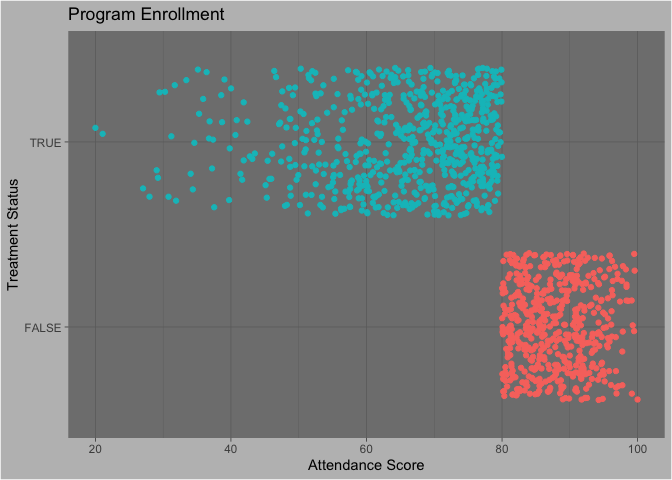
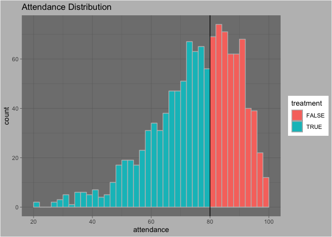
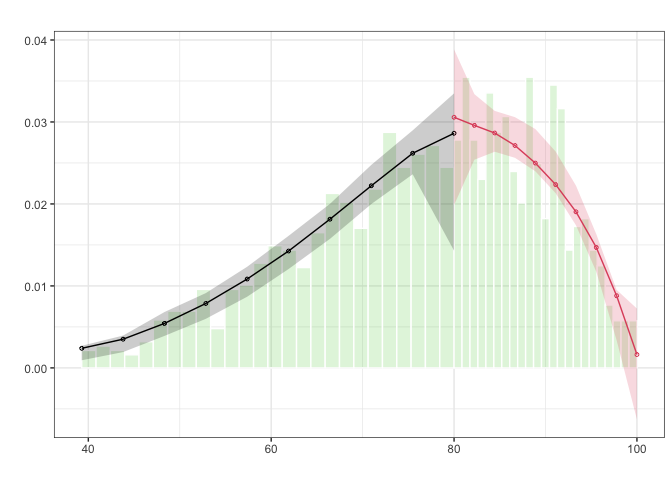
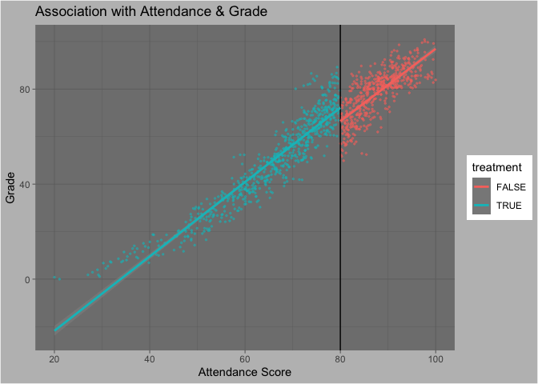
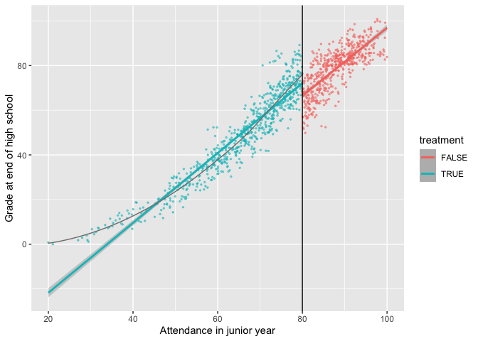

Problem Set 6
================
W. Hunter Giles

<script src="6_assignment_files/libs/kePrint-0.0.1/kePrint.js"></script>
<link href="6_assignment_files/libs/lightable-0.0.1/lightable.css" rel="stylesheet" />


- <a
  href="#step-1-determine-if-process-of-assigning-treatment-is-rule-based"
  id="toc-step-1-determine-if-process-of-assigning-treatment-is-rule-based">Step
  1: Determine if process of assigning treatment is rule-based</a>
- <a href="#step-2-determine-if-the-design-is-fuzzy-or-sharp"
  id="toc-step-2-determine-if-the-design-is-fuzzy-or-sharp">Step 2:
  Determine if the design is fuzzy or sharp</a>
- <a
  href="#step-3-check-for-discontinuity-in-running-variable-around-cut-point"
  id="toc-step-3-check-for-discontinuity-in-running-variable-around-cut-point">Step
  3: Check for discontinuity in running variable around cut-point</a>
- <a
  href="#step-4-check-for-discontinuity-in-outcome-across-running-variable"
  id="toc-step-4-check-for-discontinuity-in-outcome-across-running-variable">Step
  4: Check for discontinuity in outcome across running variable</a>
- <a href="#step-5-measure-the-size-of-the-effect"
  id="toc-step-5-measure-the-size-of-the-effect">Step 5: Measure the size
  of the effect</a>
  - <a href="#parametric-estimation"
    id="toc-parametric-estimation">Parametric estimation</a>
  - <a href="#nonparametric-estimation"
    id="toc-nonparametric-estimation">Nonparametric estimation</a>
  - <a href="#nonparametric-sensitivity-checks"
    id="toc-nonparametric-sensitivity-checks">Nonparametric sensitivity
    checks</a>
- <a href="#step-6-compare-all-the-effects"
  id="toc-step-6-compare-all-the-effects">Step 6: Compare all the
  effects</a>

------------------------------------------------------------------------

There is substantial research and evidence that [class attendance has a
positive and significant effect on student
performance](http://graphics8.nytimes.com/packages/pdf/nyregion/20110617attendancereport.pdf).
Because of this, state and local government agencies and school
districts have designed programs and policies that incentivize students
to not miss school days. Examples include tangible prizes like [colorful
pendants and free tickets to
events](https://www.nytimes.com/2011/06/17/nyregion/city-reduces-chronic-absenteeism-in-public-schools.html),
[automated calls from
celebrities](https://cityroom.blogs.nytimes.com/2011/02/10/schools-use-celebrity-robo-calls-to-battle-truancy/),
or [class policies that mandate
attendance](https://people.ucsc.edu/~cdobkin/Papers/2010%20Skipping%20class%20in%20college%20and%20exam%20performance%20Evidence%20from%20a%20regression%20discontinuity%20classroom%20experiment.pdf).

Existing research has used a range of methods to test the relationship
between attendance programs and student performance, including [simple
regression analysis](https://dx.doi.org/10.1016/j.sbspro.2016.07.051),
[randomized experiments](https://dx.doi.org/10.3200/JECE.39.3.213-227),
and [regression discontinuity
approaches](https://people.ucsc.edu/~cdobkin/Papers/2010%20Skipping%20class%20in%20college%20and%20exam%20performance%20Evidence%20from%20a%20regression%20discontinuity%20classroom%20experiment.pdf).

In this assignment, you will use regression discontinuity approaches to
measure the effect of a hypothetical program on hypothetical student
grades (this data is 100% fake).

In this simulated program, high school students who have less than 80%
attendance during their junior year (11th grade) are assigned to a
mandatory school attendance program during their senior year (12th
grade). This program requires them to attend school and also provides
them with additional support and tutoring to help them attend and remain
in school. At the end of their senior year, students take a final test
to assess their overall learning in high school.

The dataset I’ve provided contains four columns:

- `id`: A randomly assigned student ID number
- `attendance`: The proportion of days of school attended during a
  student’s junior year (ranges from 0 to 100)
- `treatment`: Binary variable indicating if a student was assigned to
  the attendance program during their senior year
- `grade`: A student’s final test grade at the end of their senior year

``` r
library(tidyverse)
library(rdrobust)
library(rddensity)
library(broom)
library(modelsummary)

# This turns off this message that appears whenever you use summarize():
# `summarise()` ungrouping output (override with `.groups` argument)
options(dplyr.summarise.inform = FALSE)

program <- read_csv("../data/attendance_program.csv")
```

# Step 1: Determine if process of assigning treatment is rule-based

Regression discontinuity can be used to measure the program effect
because the program is rule based, with a hard cut off score. Students
whose attendance is less than 80% receive the treatment and students
above do not. There is no logical difference in students that have an
attendance score right above or below the cut off point (i.e. Range
\[75,85\]).

# Step 2: Determine if the design is fuzzy or sharp

It appears that all observations with an attendance score below 80 are
in the treatment group and that there is a sharp cut off. However, there
may be some mixing right at the 80 vertical line.

``` r
# Dot plot with attendance on the x-axis and treatment on the y-axis
ggplot(program, mapping =aes(attendance, treatment, color = treatment)) +
  geom_jitter(show.legend = F) +
  labs(title = "Program Enrollment", x="Attendance Score", y="Treatment Status") +
  theme_dark() +
  theme(plot.background = element_rect(fill = "gray"))
```



Below we see that there is no group leakage.

``` r
program %>%
  group_by(treatment, attendance <= 80) %>%
  summarise(count = n())
```

    # A tibble: 2 × 3
    # Groups:   treatment [2]
      treatment `attendance <= 80` count
      <lgl>     <lgl>              <int>
    1 FALSE     FALSE                519
    2 TRUE      TRUE                 681

# Step 3: Check for discontinuity in running variable around cut-point

The histogram below provides evidence that teachers may be pushing
students with actual attendance scores between 78 and 80 above 80. There
is a dip in treatment density just before the 80 cut-off point that
shows this.

``` r
# Histogram of attendance
ggplot(program, mapping = aes(attendance, fill=treatment)) +
  geom_histogram(boundary = 80, binwidth = 2, color="gray") +
  geom_vline(xintercept = 80) +
  labs(title = "Attendance Distribution") +
  theme_dark() +
  theme(plot.background = element_rect(fill = "gray"))
```



From the output below, in the “robust” line, we see that the p-value is
not significant, so we can assume that there is not manipulation

``` r
# McCrary test
test_density <- rddensity(program$attendance, c = 80)
summary(test_density)
```


    Manipulation testing using local polynomial density estimation.

    Number of obs =       1200
    Model =               unrestricted
    Kernel =              triangular
    BW method =           estimated
    VCE method =          jackknife

    c = 80                Left of c           Right of c          
    Number of obs         681                 519                 
    Eff. Number of obs    384                 421                 
    Order est. (p)        2                   2                   
    Order bias (q)        3                   3                   
    BW est. (h)           13.574              12.521              

    Method                T                   P > |T|             
    Robust                0.7748              0.4384              


    P-values of binomial tests (H0: p=0.5).

    Window Length / 2          <c     >=c    P>|T|
    0.290                       6      14    0.1153
    0.580                      12      23    0.0895
    0.870                      22      29    0.4011
    1.160                      31      37    0.5446
    1.450                      42      55    0.2229
    1.740                      52      66    0.2313
    2.030                      58      70    0.3309
    2.320                      72      84    0.3785
    2.610                      74      95    0.1237
    2.900                      88     103    0.3111

``` r
rdplotdensity(rdd=test_density, 
              X = program$attendance,
              type = "both")
```



    $Estl
    Call: lpdensity

    Sample size                                      681
    Polynomial order for point estimation    (p=)    2
    Order of derivative estimated            (v=)    1
    Polynomial order for confidence interval (q=)    3
    Kernel function                                  triangular
    Scaling factor                                   0.567139282735613
    Bandwidth method                                 user provided

    Use summary(...) to show estimates.

    $Estr
    Call: lpdensity

    Sample size                                      519
    Polynomial order for point estimation    (p=)    2
    Order of derivative estimated            (v=)    1
    Polynomial order for confidence interval (q=)    3
    Kernel function                                  triangular
    Scaling factor                                   0.432026688907423
    Bandwidth method                                 user provided

    Use summary(...) to show estimates.

    $Estplot


# Step 4: Check for discontinuity in outcome across running variable

From the graph, we can see that there is discontinuity around the cut
off point. It appears students who receive the treatment make higher
scores.

``` r
# Graph showing discontinuity in grades across levels of attendance
ggplot(program, mapping = aes(attendance, grade, color=treatment)) +
  geom_point(size = .5, alpha = .5) +
  geom_vline(xintercept = 80) +
  geom_smooth(method = "lm") +
  labs(title = "Association with Attendance & Grade", 
       y = "Grade", 
       x = "Attendance Score") +
    theme_dark() +
  theme(plot.background = element_rect(fill = "gray"))
```

    `geom_smooth()` using formula 'y ~ x'



# Step 5: Measure the size of the effect

## Parametric estimation

Create a new dataset based on `program` that has a new variable in it
named `attendance_centered`. This will be the value of `attendance`
minus 80. This centers student attendance around the cutpoint (if a
student had 85% attendance, they’d have a value of 5; if they had 70%
attendance, they’d have a value of 10; etc.) and makes it easier to
interpret the intercept coefficient in linear models since it shifts the
y-intercept up to the cutpoint instead of zero.

``` r
# Add column to program that centers attendance
program.parametric <- program %>%
  mutate(attendance_centered = attendance - 80)
```

Regression model:

$$
\text{Grade} = \beta_0 + \beta_1 \text{Attendance (centered)} + \beta_2 \text{Program} + \epsilon
$$

For each additional point in the Attendance Score above 80, a students
grade will be 1.56 points higher (p\<.01). If a student is in the
program, then on average, there grade is 5.88 points higher (p\<.01).

``` r
# Linear model
program.parametric.model <- lm(grade ~ attendance_centered + treatment, 
                               data = program.parametric)
tidy(program.parametric.model)
```

    # A tibble: 3 × 5
      term                estimate std.error statistic  p.value
      <chr>                  <dbl>     <dbl>     <dbl>    <dbl>
    1 (Intercept)            66.2     0.330     201.   0       
    2 attendance_centered     1.56    0.0203     76.6  0       
    3 treatmentTRUE           5.88    0.595       9.89 3.07e-22

``` r
# Data and model with bandwidth = 5
program.parametric.bw5 <- program.parametric %>%
  filter(abs(attendance_centered) < 5)

program.parametric.model.bw5 <- lm(grade ~ attendance_centered + treatment, 
                               data = program.parametric.bw5)
```

``` r
# Data and model with bandwidth = 10
program.parametric.bw10 <- program.parametric %>%
  filter(abs(attendance_centered) < 10)

program.parametric.model.bw10 <- lm(grade ~ attendance_centered + treatment, 
                               data = program.parametric.bw10)
```

The coefficient of the treatment variable increases as the bandwidth
decreases. A bandwidth of 10 produces a coefficient of 11.87, and a
bandwidth of 5 produces a treatment coefficient of 12.43. This means
that the program increases grades by 11.87 and 12.43 points,
respectively. The number of observations seems to fall by a factor of 2
between each model. 1200 observations in model one, 640 in model two,
and 330 in model three.

The advantage of the smaller bandwidth is we can assume the treatment
and control group are identical with more certainty, so the most likely
coeifficent is model 3.

``` r
# All three models
modelsummary(list(
  "No Bandwidth" = program.parametric.model,
  "Bandwidth 10" = program.parametric.model.bw10,
    "Bandwidth 5" = program.parametric.model.bw5
))
```

<table class="table" style="width: auto !important; margin-left: auto; margin-right: auto;">
 <thead>
  <tr>
   <th style="text-align:left;">   </th>
   <th style="text-align:center;"> No Bandwidth </th>
   <th style="text-align:center;"> Bandwidth 10 </th>
   <th style="text-align:center;"> Bandwidth 5 </th>
  </tr>
 </thead>
<tbody>
  <tr>
   <td style="text-align:left;"> (Intercept) </td>
   <td style="text-align:center;"> 66.191 </td>
   <td style="text-align:center;"> 64.195 </td>
   <td style="text-align:center;"> 64.050 </td>
  </tr>
  <tr>
   <td style="text-align:left;">  </td>
   <td style="text-align:center;"> (0.330) </td>
   <td style="text-align:center;"> (0.601) </td>
   <td style="text-align:center;"> (0.859) </td>
  </tr>
  <tr>
   <td style="text-align:left;"> attendance_centered </td>
   <td style="text-align:center;"> 1.560 </td>
   <td style="text-align:center;"> 2.026 </td>
   <td style="text-align:center;"> 2.148 </td>
  </tr>
  <tr>
   <td style="text-align:left;">  </td>
   <td style="text-align:center;"> (0.020) </td>
   <td style="text-align:center;"> (0.097) </td>
   <td style="text-align:center;"> (0.272) </td>
  </tr>
  <tr>
   <td style="text-align:left;"> treatmentTRUE </td>
   <td style="text-align:center;"> 5.884 </td>
   <td style="text-align:center;"> 11.869 </td>
   <td style="text-align:center;"> 12.340 </td>
  </tr>
  <tr>
   <td style="text-align:left;box-shadow: 0px 1px">  </td>
   <td style="text-align:center;box-shadow: 0px 1px"> (0.595) </td>
   <td style="text-align:center;box-shadow: 0px 1px"> (1.094) </td>
   <td style="text-align:center;box-shadow: 0px 1px"> (1.575) </td>
  </tr>
  <tr>
   <td style="text-align:left;"> Num.Obs. </td>
   <td style="text-align:center;"> 1200 </td>
   <td style="text-align:center;"> 640 </td>
   <td style="text-align:center;"> 330 </td>
  </tr>
  <tr>
   <td style="text-align:left;"> R2 </td>
   <td style="text-align:center;"> 0.907 </td>
   <td style="text-align:center;"> 0.505 </td>
   <td style="text-align:center;"> 0.169 </td>
  </tr>
  <tr>
   <td style="text-align:left;"> R2 Adj. </td>
   <td style="text-align:center;"> 0.907 </td>
   <td style="text-align:center;"> 0.503 </td>
   <td style="text-align:center;"> 0.163 </td>
  </tr>
  <tr>
   <td style="text-align:left;"> AIC </td>
   <td style="text-align:center;"> 7924.3 </td>
   <td style="text-align:center;"> 4297.8 </td>
   <td style="text-align:center;"> 2228.8 </td>
  </tr>
  <tr>
   <td style="text-align:left;"> BIC </td>
   <td style="text-align:center;"> 7944.6 </td>
   <td style="text-align:center;"> 4315.6 </td>
   <td style="text-align:center;"> 2244.0 </td>
  </tr>
  <tr>
   <td style="text-align:left;"> Log.Lik. </td>
   <td style="text-align:center;"> −3958.135 </td>
   <td style="text-align:center;"> −2144.889 </td>
   <td style="text-align:center;"> −1110.378 </td>
  </tr>
  <tr>
   <td style="text-align:left;"> F </td>
   <td style="text-align:center;"> 5823.048 </td>
   <td style="text-align:center;"> 324.837 </td>
   <td style="text-align:center;"> 33.144 </td>
  </tr>
  <tr>
   <td style="text-align:left;"> RMSE </td>
   <td style="text-align:center;"> 6.56 </td>
   <td style="text-align:center;"> 6.92 </td>
   <td style="text-align:center;"> 7.03 </td>
  </tr>
</tbody>
</table>

## Nonparametric estimation

The non-parametric approach yields similar results to the parametric
approach. Form the table below, we see that the effect size is 12.013,
meaning the local treatment effect yields 12.013 grade points higher.

``` r
# rdrobust()
rdrobust(y = program$grade, x = program$attendance, c = 80) %>% 
  summary()
```

    Sharp RD estimates using local polynomial regression.

    Number of Obs.                 1200
    BW type                       mserd
    Kernel                   Triangular
    VCE method                       NN

    Number of Obs.                  681          519
    Eff. Number of Obs.             255          279
    Order est. (p)                    1            1
    Order bias  (q)                   2            2
    BW est. (h)                   8.112        8.112
    BW bias (b)                  12.449       12.449
    rho (h/b)                     0.652        0.652
    Unique Obs.                     627          451

    =============================================================================
            Method     Coef. Std. Err.         z     P>|z|      [ 95% C.I. ]       
    =============================================================================
      Conventional   -12.013     1.394    -8.619     0.000   [-14.745 , -9.281]    
            Robust         -         -    -7.244     0.000   [-15.473 , -8.883]    
    =============================================================================

``` r
# Plot
# rdplot(y = program$grade, x = program$attendance, c = 80)
ggplot(program, aes(x = attendance, y = grade, color = treatment)) +
  geom_point(size = 0.5, alpha = 0.5) + 
  geom_smooth(data = filter(program, attendance < 80), method = "lm") +
  geom_smooth(data = filter(program, attendance < 80), method = "loess", 
              size = 0.5, color = "grey50", se = FALSE) +
  geom_smooth(data = filter(program, attendance >= 80), method = "lm") +
  geom_vline(xintercept = 80) +
  labs(x = "Attendance in junior year", y = "Grade at end of high school")
```

    `geom_smooth()` using formula 'y ~ x'
    `geom_smooth()` using formula 'y ~ x'
    `geom_smooth()` using formula 'y ~ x'



## Nonparametric sensitivity checks

Now that we have an effect, we can adjust some of the default options to
see how robust the effect size is.

First we’ll play with the bandwidth. Find the ideal bandwidth with with
`rdbwselect()`, then run `rdrobust` with twice that bandwidth and half
that bandwidth (hint: use `h = SOMETHING`).

``` r
# Find the ideal bandwidth. Make sure rdbwselect() pipes into summary() so you
# can see the results: rdbwselect() %>% summary()
#
# You'll use the same y, x, and c as before
rdbwselect(y = program$grade, x = program$attendance, c = 80) %>%
  summary()
```

    Call: rdbwselect

    Number of Obs.                 1200
    BW type                       mserd
    Kernel                   Triangular
    VCE method                       NN

    Number of Obs.                  681          519
    Order est. (p)                    1            1
    Order bias  (q)                   2            2
    Unique Obs.                     627          451

    =======================================================
                      BW est. (h)    BW bias (b)
                Left of c Right of c  Left of c Right of c
    =======================================================
         mserd     8.112      8.112     12.449     12.449
    =======================================================

``` r
# rdrobust() with half bandwidth
rdrobust(y = program$grade, x = program$attendance, c = 80, h = 8.112/2) %>% 
  summary()
```

    Sharp RD estimates using local polynomial regression.

    Number of Obs.                 1200
    BW type                      Manual
    Kernel                   Triangular
    VCE method                       NN

    Number of Obs.                  681          519
    Eff. Number of Obs.             122          146
    Order est. (p)                    1            1
    Order bias  (q)                   2            2
    BW est. (h)                   4.056        4.056
    BW bias (b)                   4.056        4.056
    rho (h/b)                     1.000        1.000
    Unique Obs.                     681          519

    =============================================================================
            Method     Coef. Std. Err.         z     P>|z|      [ 95% C.I. ]       
    =============================================================================
      Conventional   -12.761     2.000    -6.380     0.000   [-16.681 , -8.841]    
            Robust         -         -    -3.913     0.000   [-16.492 , -5.485]    
    =============================================================================

``` r
# rdrobust() with two times the bandwidth
rdrobust(y = program$grade, x = program$attendance, c = 80, h = 8.112*2) %>% 
  summary()
```

    Sharp RD estimates using local polynomial regression.

    Number of Obs.                 1200
    BW type                      Manual
    Kernel                   Triangular
    VCE method                       NN

    Number of Obs.                  681          519
    Eff. Number of Obs.             436          490
    Order est. (p)                    1            1
    Order bias  (q)                   2            2
    BW est. (h)                  16.224       16.224
    BW bias (b)                  16.224       16.224
    rho (h/b)                     1.000        1.000
    Unique Obs.                     681          519

    =============================================================================
            Method     Coef. Std. Err.         z     P>|z|      [ 95% C.I. ]       
    =============================================================================
      Conventional   -11.327     0.980   -11.554     0.000   [-13.248 , -9.405]    
            Robust         -         -    -8.613     0.000   [-15.499 , -9.753]    
    =============================================================================

Next we’ll play with the kernel. Use the default ideal bandwidth and
adjust the kernel to change how heavily weighted the observations right
by the cutoff are. You already used a triangular kernel—that was the
first `rdrobust()` model you ran, since triangular is the default. Try
using Epanechnikov and uniform kernels (look at the help file for
`rdrobust` or look at the in-class example to see how to specify
different kernels):

``` r
# rdrobust() with an Epanechnikov kernel
rdrobust(y = program$grade, x = program$attendance, c = 80, kernel = "epanechnikov") %>% 
  summary()
```

    Sharp RD estimates using local polynomial regression.

    Number of Obs.                 1200
    BW type                       mserd
    Kernel                   Epanechnikov
    VCE method                       NN

    Number of Obs.                  681          519
    Eff. Number of Obs.             245          261
    Order est. (p)                    1            1
    Order bias  (q)                   2            2
    BW est. (h)                   7.780        7.780
    BW bias (b)                  12.498       12.498
    rho (h/b)                     0.622        0.622
    Unique Obs.                     627          451

    =============================================================================
            Method     Coef. Std. Err.         z     P>|z|      [ 95% C.I. ]       
    =============================================================================
      Conventional   -11.910     1.377    -8.649     0.000   [-14.609 , -9.211]    
            Robust         -         -    -7.313     0.000   [-15.348 , -8.860]    
    =============================================================================

``` r
# rdrobust() with a uniform kernel
rdrobust(y = program$grade, x = program$attendance, c = 80, kernel = "uniform") %>% 
  summary()
```

    Sharp RD estimates using local polynomial regression.

    Number of Obs.                 1200
    BW type                       mserd
    Kernel                      Uniform
    VCE method                       NN

    Number of Obs.                  681          519
    Eff. Number of Obs.             195          231
    Order est. (p)                    1            1
    Order bias  (q)                   2            2
    BW est. (h)                   6.441        6.441
    BW bias (b)                  11.081       11.081
    rho (h/b)                     0.581        0.581
    Unique Obs.                     627          451

    =============================================================================
            Method     Coef. Std. Err.         z     P>|z|      [ 95% C.I. ]       
    =============================================================================
      Conventional   -11.531     1.448    -7.965     0.000   [-14.368 , -8.694]    
            Robust         -         -    -6.817     0.000   [-15.171 , -8.395]    
    =============================================================================

# Step 6: Compare all the effects

I believe the most accurate model is the Parametric model with a
bandwidth of 5. The data appears to be relatively linear, so the
nonparametric line is unnecessary. Also the low bandwidth gives us
confidences that the values are all similar.

|    Method     | Bandwidth |    Kernel    | Estimate |
|:-------------:|:---------:|:------------:|:--------:|
|  Parametric   | Full data |  Unweighted  |  5.884   |
|  Parametric   |    10     |  Unweighted  |  11.869  |
|  Parametric   |     5     |  Unweighted  |  12.340  |
| Nonparametric |   8.112   |  Triangular  |  12.013  |
| Nonparametric |   4.056   |  Trianglar   |  12.761  |
| Nonparametric |  16.224   |  Triangular  |  11.327  |
| Nonparametric |   7.780   | Epanechnikov |  11.910  |
| Nonparametric |   6.441   |   Uniform    |  11.531  |

The program appears to have significant effect. Assuming the benefits
out-way the cost, the new program could help students attain better
grades. Further research should be done, if the program can benefit all
students, and not just students around the cut-off point.
