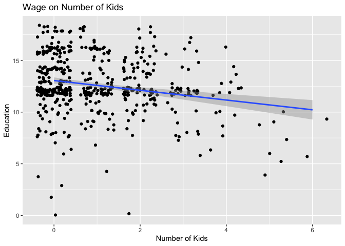
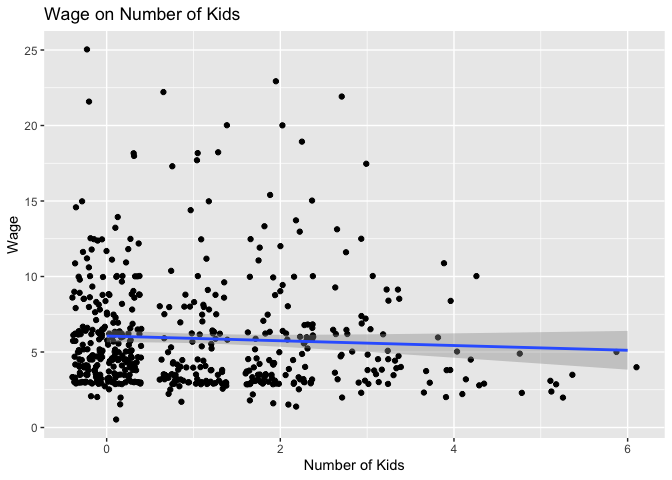
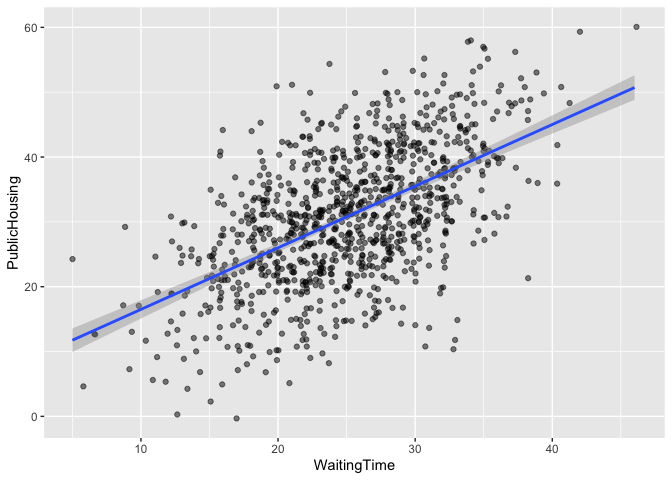
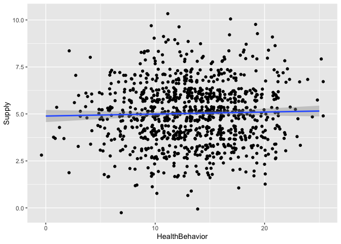
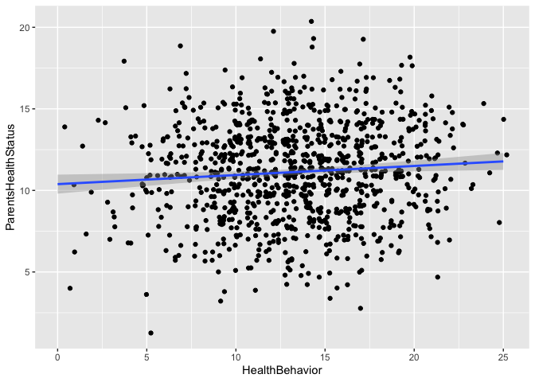
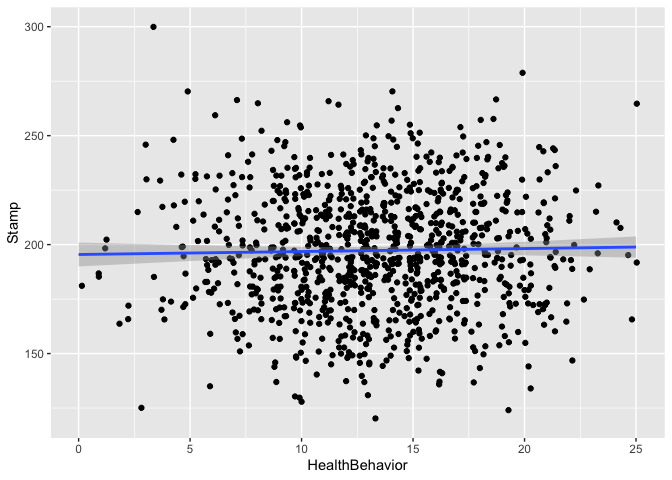

Problem Set 7
================
W. Hunter Giles

<script src="7_assignment_files/libs/kePrint-0.0.1/kePrint.js"></script>
<link href="7_assignment_files/libs/lightable-0.0.1/lightable.css" rel="stylesheet" />


- <a href="#task-1-education-wages-and-kids"
  id="toc-task-1-education-wages-and-kids">Task 1: Education, wages, and
  kids</a>
  - <a href="#step-1" id="toc-step-1">Step 1</a>
  - <a href="#step-2" id="toc-step-2">Step 2</a>
    - <a href="#relevance" id="toc-relevance">Relevance</a>
    - <a href="#exclusion" id="toc-exclusion">Exclusion</a>
    - <a href="#exogeneity" id="toc-exogeneity">Exogeneity</a>
  - <a href="#step-3" id="toc-step-3">Step 3</a>
  - <a href="#step-4" id="toc-step-4">Step 4</a>
  - <a href="#step-6" id="toc-step-6">Step 6</a>
- <a href="#task-2-public-housing-and-health"
  id="toc-task-2-public-housing-and-health">Task 2: Public housing and
  health</a>
  - <a href="#relevance-1" id="toc-relevance-1">Relevance</a>
  - <a href="#exclusion-1" id="toc-exclusion-1">Exclusion</a>
  - <a href="#exogeneity-1" id="toc-exogeneity-1">Exogeneity</a>
  - <a href="#naive-model" id="toc-naive-model">Naive Model</a>
  - <a href="#sls" id="toc-sls">2SLS</a>
  - <a href="#model-summary" id="toc-model-summary">Model Summary</a>

------------------------------------------------------------------------

``` r
library(tidyverse)     # For ggplot, mutate(), filter(), and friends
library(broom)         # For converting models to data frames
library(estimatr)      # For lm_robust() and iv_robust()
library(modelsummary)  # For showing side-by-side regression tables
```

# Task 1: Education, wages, and kids

Let’s look once again at the effect of education on earnings. You’ll use
data from the 1976 Current Population Survey run by the US Census. The
data is available as `wage` in the **wooldridge** R package—here I’ve
just taken a subset of variables and renamed them. There are three
columns:

| Variable name | Description                               |
|---------------|-------------------------------------------|
| `wage`        | Average hourly earnings (in 1976 dollars) |
| `education`   | Years of education                        |
| `n_kids`      | Number of dependents living at home       |

You’re interested in estimating $\beta_1$ in:

$$
\text{Wage}_i = \beta_0 + \beta_1 \text{Education}_i + \epsilon_i
$$

However, there is an issue with omitted variable bias and endogeneity.
Instrumental variables can potentially help address the endogeneity.

## Step 1

Load and look at the dataset

``` r
wages <- read_csv("../data/wages.csv")
```

## Step 2

We need an instrument for education, since part of it is endogenous. Do
you think the variable `n_kids` (the number of children) would be a
valid instrument? Does it meet the three requirements of a valid
instrument?

`Education` in endogenous because of association with ability.
Unfortunately, ability is measurable, and when using the Naive model,
left in the error term. To account for this, we can use the instrumental
variable `n_kids`.

Below are tests for the efficacy of the Instrument Variable.

### Relevance

`n_kids` is correlated with `education` (r = -0.22) and has a regression
coefficient of -0.47.

``` r
ggplot(wages, aes(n_kids, education)) +
  geom_jitter() +
  geom_smooth(method = "lm") +
  labs(title = "Wage on Number of Kids", x = "Number of Kids", y = "Education")
```

    `geom_smooth()` using formula 'y ~ x'



``` r
check_relevance <- lm(education ~ n_kids, data = wages)
tidy(check_relevance)
```

    # A tibble: 2 × 5
      term        estimate std.error statistic   p.value
      <chr>          <dbl>     <dbl>     <dbl>     <dbl>
    1 (Intercept)   13.1      0.153      85.2  3.22e-309
    2 n_kids        -0.472    0.0936     -5.05 6.21e-  7

``` r
cor(wages$education, wages$n_kids)
```

    [1] -0.2152914

### Exclusion

`n_kids` must only effect `wage` through `education`. We can test this
in the following way:

$$  
Wage = \beta_0 + \beta_1education \\
Education = \gamma_0 + \gamma_1 nkids \\
Wage = \alpha_0 + \alpha_1nkids \\
\\
H_a: \space \text{Exclusion if } \alpha_1 = \beta_1 \gamma_1
$$

#### Mathematical testing:

The Instrument Variable does not pass the Exclusion

``` r
equation.1 <- lm(wage ~ education, data = wages)
equation.2 <- lm(education ~ n_kids, data = wages)
equation.3 <- lm(wage ~ n_kids, data = wages)

beta_1 <- coef(equation.1)["education"]
gamma_1 <- coef(equation.2)["n_kids"]
alpha_1 <- coef(equation.3)["n_kids"]

as.numeric(beta_1 * gamma_1 - alpha_1)
```

    [1] -0.09821587

#### Graphical Testing

``` r
ggplot(wages, aes(n_kids, wage)) +
  geom_jitter() +
  geom_smooth(method = "lm") +
  labs(title = "Wage on Number of Kids", x = "Number of Kids", y = "Wage")
```

    `geom_smooth()` using formula 'y ~ x'



### Exogeneity

From economic intuition, we can argue that `n_kids` is not correlated
with `ability`. Ability or IQ is likely randomly distributed at birth
and not a result of the number of offspring.

## Step 3

Assume that the number of children is a valid instrument (regardless of
whatever you concluded earlier). Using the number of children (`n_kids`)
as an instrument for education (`education`), estimate the effect of
education on wages via two-stage least squares (2SLS) instrumental
variables (IV).

Do this by hand: create a first stage model, extract the predicted
education, and use predicted education in the second stage.

``` r
first_stage <- lm(education ~ n_kids, data = wages)
wages_fitted <- augment_columns(first_stage, wages) %>%
  rename(education.fitted = .fitted)

second_stage <- lm(wage ~ education.fitted, data = wages_fitted)
tidy(second_stage)
```

    # A tibble: 2 × 5
      term             estimate std.error statistic p.value
      <chr>               <dbl>     <dbl>     <dbl>   <dbl>
    1 (Intercept)         1.71      3.40      0.503   0.615
    2 education.fitted    0.333     0.270     1.23    0.218

From the 2SLS model above, as education level increases by 1, average
hourly earnings will increase by 33 cents. However the relationship in
insignificant, so we are speaking in trends.

Another way to do it:

``` r
model_2sls <- iv_robust(wage ~ education | n_kids, data = wages)
tidy(model_2sls)
```

             term  estimate std.error statistic   p.value   conf.low conf.high  df
    1 (Intercept) 1.7093781 2.8030095 0.6098367 0.5422343 -3.7971383 7.2158945 524
    2   education 0.3331669 0.2221214 1.4999318 0.1342343 -0.1031909 0.7695247 524
      outcome
    1    wage
    2    wage

## Step 4

Run a naive model predicting the effect of education on wages
(i.e. without any instruments). How does this naive model compare with
the IV model?

``` r
naive_model <- lm(wage ~ education, data = wages)
```

Comparable Table

| Model | Education Coeifficent | p.value |
|-------|-----------------------|---------|
| 2SLS  | 0.33                  | 0.21    |
| Naive | 0.54                  | 0.00    |

From the model it looks like omitting the ability variable bias up the
coefficient, so that the Naive coefficient appears larger and more
significant than the 2SLS.

## Step 6

I would trust the Naive model more because the 2SLS model goes not pass
the Exclusion Restriction. This means `n_kids` is mediating or
confounding through another variable besides `education` to effect wage.

------------------------------------------------------------------------

# Task 2: Public housing and health

[Economic research shows](https://dx.doi.org/10.1002/pam.20288) that
there is a potential (albeit weak) connection between health outcomes
and residency in public housing. You are interested in finding the
effect of public housing assistance on health outcomes. In the absence
of experimental data, you must use observational data collected by the
Georgia Department of Public Health. You have access to a dataset of
1,000 rows with the following columns:

| Variable name         | Description                                                                      |
|-----------------------|----------------------------------------------------------------------------------|
| `HealthStatus`        | Health status on a scale from 1 = poor to 20 = excellent                         |
| `HealthBehavior`      | Omitted variable (you can’t actually measure this!)                              |
| `PublicHousing`       | Number of years spent in public housing                                          |
| `Supply`              | Number of available public housing units in the city per 100 eligible households |
| `ParentsHealthStatus` | Health status of parents on a scale from 1 = poor to 20 = excellent              |
| `WaitingTime`         | Average waiting time before obtaining public housing in the city (in months)     |
| `Stamp`               | Dollar amount of food stamps (SNAP) spent each month                             |
| `Age`                 | Age                                                                              |
| `Race`                | Race; 1 = White, 2 = Black, 3 = Hispanic, 4 = Other                              |
| `Education`           | Education; 1 = Some high school, 2 = High school, 3 = Bachelor’s, 4 = Master’s   |
| `MaritalStatus`       | Marital status; 1 = Single, 2 = Married, 3 = Widow, 4 = Divorced                 |

(This is simulated data, but it’s based on analysis by [Angela R. Fertig
and David A. Reingold](https://dx.doi.org/10.1002/pam.20288))

Your goal is to measure the effect of living in public housing
(`PublicHousing`) on health (`HealthStatus`). There is omitted variable
bias, though, since people who care more about their health might be
more likely to self-select into public housing and report a better
health status score. The magic variable `HealthBehavior` measures this
omitted variable, and you can use it as reference to make sure you get
the models right (this is the same as “ability” in the examples in
class), but don’t include it in any of your actual models, since it’s
not real.

This data includes four potential instruments:

- `Supply`: Number of available public housing units in the city per 100
  eligible households
- `ParentsHealthStatus`: Health status of parents on a scale from 1 =
  poor to 5 = excellent
- `WaitingTime`: Average waiting time before obtaining public housing in
  the city (in months)
- `Stamp`: Dollar amount of food stamps (SNAP) spent each month

You have three tasks:

1.  Evaluate the suitability of each of the four potential instruments.
    Check if they (1) have *relevance* with a scatterplot and model and
    F-test, (2) meet the *excludability* assumption, and (3) meet the
    *exogeneity* assumption. Choose one of these as your main instrument
    and justify why it’s the best. Explain why the other three are not.

2.  Estimate a naive model of the effect of public housing on health
    status (i.e. without any instruments). You can include any control
    variables you feel appropriate (i.e. that fit in your causal model).
    If you use variables that are categorical like race, education, or
    marital status, make sure you wrap them with `as.factor()` to treat
    them as categories instead of numbers (e.g. `as.factor(education)`).

3.  Estimate the effect of public housing on health status using
    2SLS IV. You can use `iv_robust()` to do it all in one step if you
    want (but you’ll still need to run a first-stage model to find the F
    statistic). Compare the results with the naive model. Which model do
    you trust (if any), and why?

``` r
housing <- read_csv("../data/public_housing.csv")
```

$$
HealthStatus = \beta_0 + \beta_1PublicHousing
$$

### Relevance

##### Supply

``` r
ggplot(housing, mapping = aes(Supply, PublicHousing)) +
  geom_jitter(alpha = .5) +
  geom_smooth(method = "lm")
```

    `geom_smooth()` using formula 'y ~ x'


``` r
check_relevance_supply <- lm(PublicHousing ~ Supply, data = housing)
tidy(check_relevance_supply)
```

    # A tibble: 2 × 5
      term        estimate std.error statistic   p.value
      <chr>          <dbl>     <dbl>     <dbl>     <dbl>
    1 (Intercept)   27.1       1.07      25.4  3.86e-110
    2 Supply         0.729     0.202      3.61 3.23e-  4

``` r
glance(check_relevance_supply)
```

    # A tibble: 1 × 12
      r.squared adj.r.squared sigma statistic  p.value    df logLik   AIC   BIC
          <dbl>         <dbl> <dbl>     <dbl>    <dbl> <dbl>  <dbl> <dbl> <dbl>
    1    0.0129        0.0119  10.3      13.0 0.000323     1 -3753. 7512. 7527.
    # … with 3 more variables: deviance <dbl>, df.residual <int>, nobs <int>

`Supply` and `PublicHousing` have a significant and positive
relationship, and a F-statistic greater than 10, so we can assume that
`Supply` is Relevant.

##### Parents Health Status

``` r
ggplot(housing, mapping = aes(ParentsHealthStatus, PublicHousing)) +
  geom_jitter(alpha = .5) +
  geom_smooth(method = "lm")
```

    `geom_smooth()` using formula 'y ~ x'


``` r
check_relevance_ParentsHealthStatus <- lm(PublicHousing ~ ParentsHealthStatus, data = housing)
tidy(check_relevance_ParentsHealthStatus)
```

    # A tibble: 2 × 5
      term                estimate std.error statistic  p.value
      <chr>                  <dbl>     <dbl>     <dbl>    <dbl>
    1 (Intercept)           27.8       1.29      21.6  6.66e-85
    2 ParentsHealthStatus    0.270     0.112      2.41 1.61e- 2

``` r
glance(check_relevance_ParentsHealthStatus)
```

    # A tibble: 1 × 12
      r.squared adj.r.squared sigma statistic p.value    df logLik   AIC   BIC
          <dbl>         <dbl> <dbl>     <dbl>   <dbl> <dbl>  <dbl> <dbl> <dbl>
    1   0.00579       0.00479  10.4      5.81  0.0161     1 -3757. 7519. 7534.
    # … with 3 more variables: deviance <dbl>, df.residual <int>, nobs <int>

`ParentsHealthStatus` and `PublicHousing` are significant and positively
correlated, but have a F-statistic less than 10, so we cannot assume
relevancy.

##### Waiting Time

``` r
ggplot(housing, mapping = aes(WaitingTime, PublicHousing)) +
  geom_jitter(alpha = .5) +
  geom_smooth(method = "lm")
```

    `geom_smooth()` using formula 'y ~ x'



``` r
check_relevance_WaitingTime <- lm(PublicHousing ~ WaitingTime, data = housing)
tidy(check_relevance_WaitingTime)
```

    # A tibble: 2 × 5
      term        estimate std.error statistic  p.value
      <chr>          <dbl>     <dbl>     <dbl>    <dbl>
    1 (Intercept)    6.99     1.14        6.13 1.28e- 9
    2 WaitingTime    0.951    0.0443     21.5  2.50e-84

``` r
glance(check_relevance_WaitingTime)
```

    # A tibble: 1 × 12
      r.squared adj.r.squared sigma statistic  p.value    df logLik   AIC   BIC
          <dbl>         <dbl> <dbl>     <dbl>    <dbl> <dbl>  <dbl> <dbl> <dbl>
    1     0.316         0.315  8.60      461. 2.50e-84     1 -3570. 7146. 7160.
    # … with 3 more variables: deviance <dbl>, df.residual <int>, nobs <int>

`WaitingTime` and `PublicHousing` are significantly and positively
correlated, and the F-statistic in above 10, so we can assume relevancy.

##### Stamp

``` r
ggplot(housing, mapping = aes(Stamp, PublicHousing)) +
  geom_jitter(alpha = .5) +
  geom_smooth(method = "lm") 
```

    `geom_smooth()` using formula 'y ~ x'


``` r
check_relevance_Stamp <- lm(PublicHousing ~ Stamp, data = housing)
tidy(check_relevance_Stamp)
```

    # A tibble: 2 × 5
      term        estimate std.error statistic  p.value
      <chr>          <dbl>     <dbl>     <dbl>    <dbl>
    1 (Intercept) 31.8        2.38      13.3   1.74e-37
    2 Stamp       -0.00522    0.0120    -0.436 6.63e- 1

``` r
glance(check_relevance_Stamp)
```

    # A tibble: 1 × 12
      r.squared adj.r.squared sigma statistic p.value    df logLik   AIC   BIC
          <dbl>         <dbl> <dbl>     <dbl>   <dbl> <dbl>  <dbl> <dbl> <dbl>
    1  0.000191     -0.000811  10.4     0.190   0.663     1 -3760. 7525. 7540.
    # … with 3 more variables: deviance <dbl>, df.residual <int>, nobs <int>

`Stamp` and `PublicHousing` are insignificantly correlated, and the
F-statistic is less than 10, so we cannot assume relevancy.

### Exclusion

Creating a function to evaluate exclusion:

``` r
exclusion <- function(Y, X, Z) {
  equation.1 <- lm(Y ~ X)
  equation.2 <- lm(X ~ Z)
  equation.3 <- lm(Y ~ Z)

  beta_1 <- coef(equation.1)[2]
  gamma_1 <- coef(equation.2)[2]
  alpha_1 <- coef(equation.3)[2]
  
  mylist <- list()
  mylist["beta x gamma"] <- gamma_1 * beta_1
  mylist["alpha"] <- alpha_1
  mylist["diff"] <- (beta_1*gamma_1) - alpha_1
  
  return(mylist)
}
```

##### Supply

``` r
exclusion(housing$HealthStatus, housing$PublicHousing, housing$Supply)
```

    $`beta x gamma`
    [1] 0.234959

    $alpha
    [1] 0.1900004

    $diff
    [1] 0.04495858

The difference is close to zero, so we can assume that is passes the
exclusion restriction.

##### Parents Health Status

``` r
exclusion(housing$HealthStatus, housing$PublicHousing, housing$ParentsHealthStatus)
```

    $`beta x gamma`
    [1] 0.08696487

    $alpha
    [1] 0.09953293

    $diff
    [1] -0.01256806

The difference is close to 0, so it passes the exclusion restrictions.

##### Waiting Time

``` r
exclusion(housing$HealthStatus, housing$PublicHousing, housing$WaitingTime)
```

    $`beta x gamma`
    [1] 0.3063208

    $alpha
    [1] 0.2128377

    $diff
    [1] 0.09348304

The difference is small enough where an exclusion argument can be made,
but it is possible that `WaitingTime` effects `HealthStatus` through a
mediator or confounding variable.

##### Stamp

``` r
exclusion(housing$HealthStatus, housing$PublicHousing, housing$Stamp)
```

    $`beta x gamma`
    [1] -0.001683272

    $alpha
    [1] -0.001567504

    $diff
    [1] -0.000115768

The difference is very small so we can assume exclusion.

### Exogeneity

##### Supply

``` r
ggplot(housing, aes(x = HealthBehavior, y = Supply)) +
  geom_jitter() +
  geom_smooth(method = "lm")
```

    `geom_smooth()` using formula 'y ~ x'



``` r
cor(housing$HealthBehavior, housing$Supply)
```

    [1] 0.02868536

The correlation is close to zero, so we can assume it passes exogeneity
criterion.

##### Parents Health Status

``` r
ggplot(housing, aes(x = HealthBehavior, y = ParentsHealthStatus)) +
  geom_jitter() +
  geom_smooth(method = "lm")
```

    `geom_smooth()` using formula 'y ~ x'



``` r
cor(housing$HealthBehavior, housing$ParentsHealthStatus)
```

    [1] 0.0830035

The correlation is close to zero, so we can assume it passes exogeneity
criterion.

##### Waiting Time

``` r
ggplot(housing, aes(x = HealthBehavior, y = WaitingTime)) +
  geom_jitter() +
  geom_smooth(method = "lm")
```

    `geom_smooth()` using formula 'y ~ x'


``` r
cor(housing$HealthBehavior, housing$ParentsHealthStatus)
```

    [1] 0.0830035

The correlation is close to zero, so we can assume it passes exogeneity
criterion.

##### Stamp

``` r
ggplot(housing, aes(x = HealthBehavior, y = Stamp)) +
  geom_jitter() +
  geom_smooth(method = "lm")
```

    `geom_smooth()` using formula 'y ~ x'



``` r
cor(housing$HealthBehavior, housing$ParentsHealthStatus)
```

    [1] 0.0830035

The correlation is close to zero, so we can assume it passes exogeneity
criterion.

### Naive Model

``` r
naive_model <- lm(HealthStatus ~ PublicHousing , data = housing)
tidy(naive_model)
```

    # A tibble: 2 × 5
      term          estimate std.error statistic  p.value
      <chr>            <dbl>     <dbl>     <dbl>    <dbl>
    1 (Intercept)      1.25    0.0885       14.2 1.09e-41
    2 PublicHousing    0.322   0.00272     118.  0       

The Naive Model above shows the number of years spent in public housing
(`PublicHousing`) increases by 1, health status increase by .32
(p\<.01).

### 2SLS

``` r
first_stage <- lm(PublicHousing ~ WaitingTime, data = housing)
housing_fitted <- augment_columns(first_stage, housing) %>%
  rename(PublicHousing.fitted = .fitted)

second_stage <- lm(HealthStatus ~ PublicHousing.fitted, data = housing_fitted)
tidy(second_stage)
```

    # A tibble: 2 × 5
      term                 estimate std.error statistic  p.value
      <chr>                   <dbl>     <dbl>     <dbl>    <dbl>
    1 (Intercept)             4.28     0.545       7.85 1.04e-14
    2 PublicHousing.fitted    0.224    0.0174     12.9  3.55e-35

### Model Summary

``` r
modelsummary::modelsummary(list(
  "Naive" = naive_model,
  "First Stage" = first_stage,
  "Second Stage" = second_stage
))
```

<table class="table" style="width: auto !important; margin-left: auto; margin-right: auto;">
 <thead>
  <tr>
   <th style="text-align:left;">   </th>
   <th style="text-align:center;"> Naive </th>
   <th style="text-align:center;"> First Stage </th>
   <th style="text-align:center;"> Second Stage </th>
  </tr>
 </thead>
<tbody>
  <tr>
   <td style="text-align:left;"> (Intercept) </td>
   <td style="text-align:center;"> 1.254 </td>
   <td style="text-align:center;"> 6.991 </td>
   <td style="text-align:center;"> 4.280 </td>
  </tr>
  <tr>
   <td style="text-align:left;">  </td>
   <td style="text-align:center;"> (0.088) </td>
   <td style="text-align:center;"> (1.141) </td>
   <td style="text-align:center;"> (0.545) </td>
  </tr>
  <tr>
   <td style="text-align:left;"> PublicHousing </td>
   <td style="text-align:center;"> 0.322 </td>
   <td style="text-align:center;">  </td>
   <td style="text-align:center;">  </td>
  </tr>
  <tr>
   <td style="text-align:left;">  </td>
   <td style="text-align:center;"> (0.003) </td>
   <td style="text-align:center;">  </td>
   <td style="text-align:center;">  </td>
  </tr>
  <tr>
   <td style="text-align:left;"> WaitingTime </td>
   <td style="text-align:center;">  </td>
   <td style="text-align:center;"> 0.951 </td>
   <td style="text-align:center;">  </td>
  </tr>
  <tr>
   <td style="text-align:left;">  </td>
   <td style="text-align:center;">  </td>
   <td style="text-align:center;"> (0.044) </td>
   <td style="text-align:center;">  </td>
  </tr>
  <tr>
   <td style="text-align:left;"> PublicHousing.fitted </td>
   <td style="text-align:center;">  </td>
   <td style="text-align:center;">  </td>
   <td style="text-align:center;"> 0.224 </td>
  </tr>
  <tr>
   <td style="text-align:left;box-shadow: 0px 1px">  </td>
   <td style="text-align:center;box-shadow: 0px 1px">  </td>
   <td style="text-align:center;box-shadow: 0px 1px">  </td>
   <td style="text-align:center;box-shadow: 0px 1px"> (0.017) </td>
  </tr>
  <tr>
   <td style="text-align:left;"> Num.Obs. </td>
   <td style="text-align:center;"> 1000 </td>
   <td style="text-align:center;"> 1000 </td>
   <td style="text-align:center;"> 1000 </td>
  </tr>
  <tr>
   <td style="text-align:left;"> R2 </td>
   <td style="text-align:center;"> 0.933 </td>
   <td style="text-align:center;"> 0.316 </td>
   <td style="text-align:center;"> 0.142 </td>
  </tr>
  <tr>
   <td style="text-align:left;"> R2 Adj. </td>
   <td style="text-align:center;"> 0.933 </td>
   <td style="text-align:center;"> 0.315 </td>
   <td style="text-align:center;"> 0.141 </td>
  </tr>
  <tr>
   <td style="text-align:left;"> AIC </td>
   <td style="text-align:center;"> 2619.3 </td>
   <td style="text-align:center;"> 7145.7 </td>
   <td style="text-align:center;"> 5175.7 </td>
  </tr>
  <tr>
   <td style="text-align:left;"> BIC </td>
   <td style="text-align:center;"> 2634.1 </td>
   <td style="text-align:center;"> 7160.5 </td>
   <td style="text-align:center;"> 5190.5 </td>
  </tr>
  <tr>
   <td style="text-align:left;"> Log.Lik. </td>
   <td style="text-align:center;"> −1306.668 </td>
   <td style="text-align:center;"> −3569.868 </td>
   <td style="text-align:center;"> −2584.864 </td>
  </tr>
  <tr>
   <td style="text-align:left;"> F </td>
   <td style="text-align:center;"> 14000.142 </td>
   <td style="text-align:center;"> 460.710 </td>
   <td style="text-align:center;"> 165.618 </td>
  </tr>
  <tr>
   <td style="text-align:left;"> RMSE </td>
   <td style="text-align:center;"> 0.89 </td>
   <td style="text-align:center;"> 8.60 </td>
   <td style="text-align:center;"> 3.21 </td>
  </tr>
</tbody>
</table>

Both results show that the duration spent in public housing
significantly increases health status, therefore we can reject the null
hypothesis that public housing does not increase health status. I would
argue that the 2SLS has more authenticity than the naive model. An
individuals Health Behavior is correlated with their living environment
and their health status. Since Health Behavior is unobserved, this
leaves endogeneity on the model. The variable `WaitingTime` is a good
instrument because is passed the three assumptions mentions above.
Intuitively, we can expect that `WaitingTime` is randomly assigned to
people, so it cannot be correlated with behavior. Therefore, I would
suggest that the 2SLS is more unbiased than the naive model.
