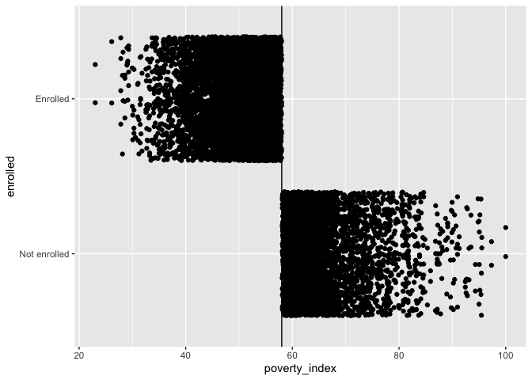
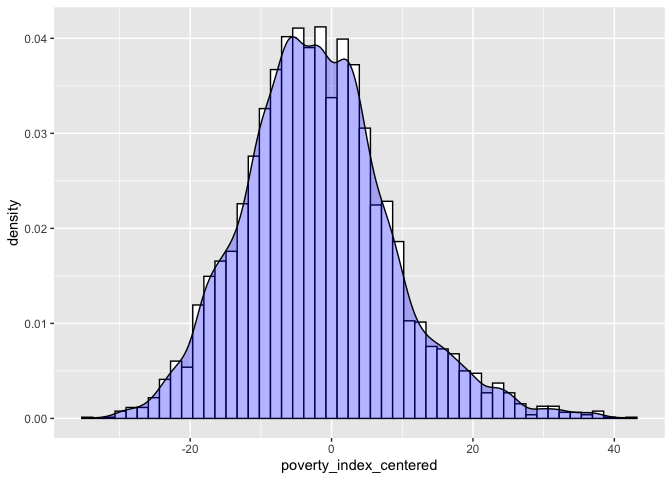
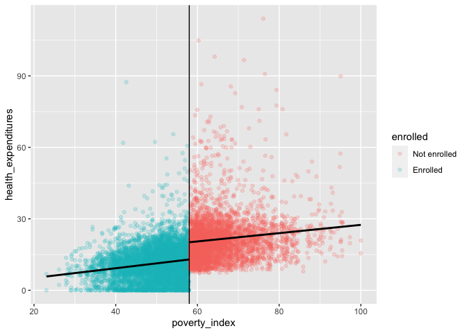

Problem Set 8
================
W. Hunter Giles

<script src="8_assignment_files/libs/kePrint-0.0.1/kePrint.js"></script>
<link href="8_assignment_files/libs/lightable-0.0.1/lightable.css" rel="stylesheet" />


- <a href="#set-up" id="toc-set-up">Set-up</a>
- <a href="#background" id="toc-background">Background</a>
- <a href="#task-1-rcts" id="toc-task-1-rcts">Task 1: RCTs</a>
- <a href="#task-2-inverse-probability-weighting-andor-matching"
  id="toc-task-2-inverse-probability-weighting-andor-matching">Task 2:
  Inverse probability weighting and/or matching</a>
  - <a href="#naive-model" id="toc-naive-model">Naive Model</a>
  - <a href="#inverse-probability-weighting"
    id="toc-inverse-probability-weighting">Inverse Probability Weighting</a>
- <a href="#task-3-diff-in-diff" id="toc-task-3-diff-in-diff">Task 3:
  Diff-in-diff</a>
- <a href="#task-4-rdd" id="toc-task-4-rdd">Task 4: RDD</a>
- <a href="#task-5-ivs2sls" id="toc-task-5-ivs2sls">Task 5: IVs/2SLS</a>
- <a href="#task-6-summary" id="toc-task-6-summary">Task 6: Summary</a>

------------------------------------------------------------------------

### Set-up

``` r
library(tidyverse)     # For ggplot, mutate(), filter(), and friends
library(broom)         # For converting models to data frames
library(estimatr)      # For lm_robust() and iv_robust()
library(modelsummary)  # For showing side-by-side regression tables
library(MatchIt)       # For matching
library(rdrobust)      # For nonparametric RD
library(rddensity)     # For nonparametric RD density tests
library(haven)         # For reading Stata files

set.seed(1234)  # Make any random stuff be the same every time you run this

# Round everything to 3 digits by default
options("digits" = 3)

# Turn off the message that happens when you use group_by() and summarize()
options(dplyr.summarise.inform = FALSE)

# Load raw data
hisp_raw <- read_stata("../data/evaluation.dta")

# Make nice clean dataset to use for the rest of the assignment
hisp <- hisp_raw %>% 
  # Having a numeric 0/1 column is sometimes helpful for things that don't like
  # categories, like matchit()
  mutate(enrolled_num = enrolled) %>% 
  # Convert these 0/1 values to actual categories
  mutate(eligible = factor(eligible, labels = c("Not eligible", "Eligible")),
         enrolled = factor(enrolled, labels = c("Not enrolled", "Enrolled")),
         round = factor(round, labels = c("Before", "After")),
         treatment_locality = factor(treatment_locality, labels = c("Control", "Treatment")),
         promotion_locality = factor(promotion_locality, labels = c("No promotion", "Promotion"))) %>% 
  # Get rid of this hospital column because (1) we're not using it, and (2) half
  # of the households are missing data, and matchit() complains if any data is
  # missing, even if you're not using it
  select(-hospital)
```

### Background

The World Bank’s *Impact Evaluation in Practice* has used a hypothetical
example of a health insurance program throughout the book. This Health
Insurance Subsidy Program (HISP) provides subsidies for buying private
health insurance to poorer households, with the goal of lowering
personal health expenditures, since people can rely on insurance
coverage instead of paying out-of-pocket. Think of the HISP as a version
of the Affordable Care Act (ACA, commonly known as Obamacare).

The dataset includes a number of important variables you’ll use
throughout this assignment:

| Variable name         | Description                                                      |
|-----------------------|------------------------------------------------------------------|
| `health_expenditures` | Out of pocket health expenditures (per person per year)          |
| `eligible`            | Household eligible to enroll in HISP                             |
| `enrolled`            | Household enrolled in HISP                                       |
| `round`               | Indicator for before and after intervention                      |
| `treatment_locality`  | Household is located in treatment community                      |
| `poverty_index`       | 1-100 scale of poverty                                           |
| `promotion_locality`  | Household is located in community that received random promotion |
| `enrolled_rp`         | Household enrolled in HISP following random promotion            |

It also includes several demographic variables about the households.
**Each of these are backdoor confounders between health expenditures
participation in the HISP**:

| Variable name       | Description                                               |
|---------------------|-----------------------------------------------------------|
| `age_hh`            | Age of the head of household (years)                      |
| `age_sp`            | Age of the spouse (years)                                 |
| `educ_hh`           | Education of the head of household (years)                |
| `educ_sp`           | Education of the spouse (years)                           |
| `female_hh`         | Head of household is a woman (1 = yes)                    |
| `indigenous`        | Head of household speaks an indigenous language (1 = yes) |
| `hhsize`            | Number of household members                               |
| `dirtfloor`         | Home has a dirt floor (1 = yes)                           |
| `bathroom`          | Home has a private bathroom (1 = yes)                     |
| `land`              | Number of hectares of land owned by household             |
| `hospital_distance` | Distance to closest hospital (km)                         |

You will use each of the five main econometric approaches for estimating
causal effects to measure the effect of HISP on household health
expenditures. **Don’t worry about conducting in-depth baseline checks
and robustness checks.** For the sake of this assignment, you’ll do the
minimum amount of work for each method to determine the causal effect of
the program.

# Task 1: RCTs

To measure the effect of HISP accurately, World Bank researchers
randomly assigned different localities (villages, towns, cities,
whatever) to treatment and control groups. Some localities were allowed
to join HISP; others weren’t.

``` r
hisp_eligible <- hisp %>% 
  filter(eligible == "Eligible")

hisp_after <- hisp %>% 
  filter(round == "After")
```

Below are the average health expenditures for the treatment and control
group before the intervention. The control group had an average
expenditure of 14.6, and the the treatment group had an average
expenditure of 14.5.

``` r
hisp_eligible %>%
  filter(round == "Before") %>%
  group_by(treatment_locality) %>%
  summarize(mean = mean(health_expenditures))
```

    # A tibble: 2 × 2
      treatment_locality  mean
      <fct>              <dbl>
    1 Control             14.6
    2 Treatment           14.5

After the intervention, the control group’s average expenditure
increases to 17.98 and the the treatment group’s average expenditure
decreases to 7.84.

``` r
df <- hisp_eligible %>%
  filter(round == "After") %>%
  group_by(treatment_locality) %>%
  summarize(mean = mean(health_expenditures))
df
```

    # A tibble: 2 × 2
      treatment_locality  mean
      <fct>              <dbl>
    1 Control            18.0 
    2 Treatment           7.84

The treatment group has an average health expenditure that is 10.1 less
than the control group after the intervention.

``` r
diff(df$mean) # Control - Treatment
```

    [1] -10.1

The linear regression shows that the treatment group’s expenditure after
the intervention is 6.41 less than the control group’s.

``` r
lm_model <- lm_robust(health_expenditures ~ treatment_locality, 
          data = hisp_after, 
          clusters = locality_identifier)
tidy(lm_model)
```

                             term estimate std.error statistic  p.value conf.low
    1                 (Intercept)    20.06     0.379      52.9 6.81e-48    19.30
    2 treatment_localityTreatment    -6.41     0.504     -12.7 3.32e-23    -7.41
      conf.high    df             outcome
    1     20.83  53.5 health_expenditures
    2     -5.41 108.6 health_expenditures

The confounders slightly biased the treatment effect away from zero.
When controlling for confounders the treatment effect is 6.12, meaning
the treatment group spends 6.12 less than the control group after the
intervention.

``` r
full_linear_model <- lm_robust(health_expenditures ~ treatment_locality + age_hh + age_sp + educ_hh + educ_sp + female_hh + indigenous + hhsize + dirtfloor + bathroom + land + hospital_distance, 
          data = hisp_after, 
          clusters = locality_identifier
          )
tidy(full_linear_model)
```

                              term estimate std.error statistic  p.value conf.low
    1                  (Intercept) 28.95706   0.80870    35.807 5.46e-58  27.3522
    2  treatment_localityTreatment -6.12955   0.40172   -15.258 8.37e-29  -6.9258
    3                       age_hh  0.10801   0.01495     7.224 1.15e-10   0.0783
    4                       age_sp  0.00799   0.01643     0.486 6.28e-01  -0.0246
    5                      educ_hh  0.11265   0.04600     2.449 1.60e-02   0.0214
    6                      educ_sp -0.00980   0.05009    -0.196 8.45e-01  -0.1091
    7                    female_hh  1.08976   0.47396     2.299 2.37e-02   0.1489
    8                   indigenous -2.80641   0.37524    -7.479 4.02e-11  -3.5515
    9                       hhsize -2.38237   0.06408   -37.180 5.05e-62  -2.5094
    10                   dirtfloor -3.04384   0.29840   -10.201 2.25e-17  -3.6355
    11                    bathroom  0.97106   0.25513     3.806 2.41e-04   0.4650
    12                        land  0.16545   0.04006     4.130 1.01e-04   0.0855
    13           hospital_distance -0.00600   0.00454    -1.320 1.91e-01  -0.0151
       conf.high    df             outcome
    1   30.56195  97.7 health_expenditures
    2   -5.33334 108.9 health_expenditures
    3    0.13769  96.9 health_expenditures
    4    0.04059  99.6 health_expenditures
    5    0.20387 104.6 health_expenditures
    6    0.08953 104.5 health_expenditures
    7    2.03059  95.8 health_expenditures
    8   -2.06131  93.4 health_expenditures
    9   -2.25531 104.4 health_expenditures
    10  -2.45215 104.7 health_expenditures
    11   1.47710 102.1 health_expenditures
    12   0.24538  68.6 health_expenditures
    13   0.00306  71.3 health_expenditures

``` r
modelsummary(list(
  "Simple Regression" = lm_model,
  "Multiple Regression" = full_linear_model 
), 
title = "Health Expenditure on Helath Insurance Program")
```

<table class="table" style="width: auto !important; margin-left: auto; margin-right: auto;">
<caption>Health Expenditure on Helath Insurance Program</caption>
 <thead>
  <tr>
   <th style="text-align:left;">   </th>
   <th style="text-align:center;"> Simple Regression </th>
   <th style="text-align:center;"> Multiple Regression </th>
  </tr>
 </thead>
<tbody>
  <tr>
   <td style="text-align:left;"> (Intercept) </td>
   <td style="text-align:center;"> 20.064 </td>
   <td style="text-align:center;"> 28.957 </td>
  </tr>
  <tr>
   <td style="text-align:left;">  </td>
   <td style="text-align:center;"> (0.379) </td>
   <td style="text-align:center;"> (0.809) </td>
  </tr>
  <tr>
   <td style="text-align:left;"> treatment_localityTreatment </td>
   <td style="text-align:center;"> −6.406 </td>
   <td style="text-align:center;"> −6.130 </td>
  </tr>
  <tr>
   <td style="text-align:left;">  </td>
   <td style="text-align:center;"> (0.504) </td>
   <td style="text-align:center;"> (0.402) </td>
  </tr>
  <tr>
   <td style="text-align:left;"> age_hh </td>
   <td style="text-align:center;">  </td>
   <td style="text-align:center;"> 0.108 </td>
  </tr>
  <tr>
   <td style="text-align:left;">  </td>
   <td style="text-align:center;">  </td>
   <td style="text-align:center;"> (0.015) </td>
  </tr>
  <tr>
   <td style="text-align:left;"> age_sp </td>
   <td style="text-align:center;">  </td>
   <td style="text-align:center;"> 0.008 </td>
  </tr>
  <tr>
   <td style="text-align:left;">  </td>
   <td style="text-align:center;">  </td>
   <td style="text-align:center;"> (0.016) </td>
  </tr>
  <tr>
   <td style="text-align:left;"> educ_hh </td>
   <td style="text-align:center;">  </td>
   <td style="text-align:center;"> 0.113 </td>
  </tr>
  <tr>
   <td style="text-align:left;">  </td>
   <td style="text-align:center;">  </td>
   <td style="text-align:center;"> (0.046) </td>
  </tr>
  <tr>
   <td style="text-align:left;"> educ_sp </td>
   <td style="text-align:center;">  </td>
   <td style="text-align:center;"> −0.010 </td>
  </tr>
  <tr>
   <td style="text-align:left;">  </td>
   <td style="text-align:center;">  </td>
   <td style="text-align:center;"> (0.050) </td>
  </tr>
  <tr>
   <td style="text-align:left;"> female_hh </td>
   <td style="text-align:center;">  </td>
   <td style="text-align:center;"> 1.090 </td>
  </tr>
  <tr>
   <td style="text-align:left;">  </td>
   <td style="text-align:center;">  </td>
   <td style="text-align:center;"> (0.474) </td>
  </tr>
  <tr>
   <td style="text-align:left;"> indigenous </td>
   <td style="text-align:center;">  </td>
   <td style="text-align:center;"> −2.806 </td>
  </tr>
  <tr>
   <td style="text-align:left;">  </td>
   <td style="text-align:center;">  </td>
   <td style="text-align:center;"> (0.375) </td>
  </tr>
  <tr>
   <td style="text-align:left;"> hhsize </td>
   <td style="text-align:center;">  </td>
   <td style="text-align:center;"> −2.382 </td>
  </tr>
  <tr>
   <td style="text-align:left;">  </td>
   <td style="text-align:center;">  </td>
   <td style="text-align:center;"> (0.064) </td>
  </tr>
  <tr>
   <td style="text-align:left;"> dirtfloor </td>
   <td style="text-align:center;">  </td>
   <td style="text-align:center;"> −3.044 </td>
  </tr>
  <tr>
   <td style="text-align:left;">  </td>
   <td style="text-align:center;">  </td>
   <td style="text-align:center;"> (0.298) </td>
  </tr>
  <tr>
   <td style="text-align:left;"> bathroom </td>
   <td style="text-align:center;">  </td>
   <td style="text-align:center;"> 0.971 </td>
  </tr>
  <tr>
   <td style="text-align:left;">  </td>
   <td style="text-align:center;">  </td>
   <td style="text-align:center;"> (0.255) </td>
  </tr>
  <tr>
   <td style="text-align:left;"> land </td>
   <td style="text-align:center;">  </td>
   <td style="text-align:center;"> 0.165 </td>
  </tr>
  <tr>
   <td style="text-align:left;">  </td>
   <td style="text-align:center;">  </td>
   <td style="text-align:center;"> (0.040) </td>
  </tr>
  <tr>
   <td style="text-align:left;"> hospital_distance </td>
   <td style="text-align:center;">  </td>
   <td style="text-align:center;"> −0.006 </td>
  </tr>
  <tr>
   <td style="text-align:left;box-shadow: 0px 1px">  </td>
   <td style="text-align:center;box-shadow: 0px 1px">  </td>
   <td style="text-align:center;box-shadow: 0px 1px"> (0.005) </td>
  </tr>
  <tr>
   <td style="text-align:left;"> Num.Obs. </td>
   <td style="text-align:center;"> 9914 </td>
   <td style="text-align:center;"> 9914 </td>
  </tr>
  <tr>
   <td style="text-align:left;"> R2 </td>
   <td style="text-align:center;"> 0.073 </td>
   <td style="text-align:center;"> 0.344 </td>
  </tr>
  <tr>
   <td style="text-align:left;"> R2 Adj. </td>
   <td style="text-align:center;"> 0.072 </td>
   <td style="text-align:center;"> 0.343 </td>
  </tr>
  <tr>
   <td style="text-align:left;"> Std.Errors </td>
   <td style="text-align:center;"> by: locality_identifier </td>
   <td style="text-align:center;"> by: locality_identifier </td>
  </tr>
</tbody>
</table>

# Task 2: Inverse probability weighting and/or matching

### Naive Model

According to the model below, the people who enrolled in the
intervention had 12.9 less in health expenditures compared to the
non-enrollees. However, this is an inaccurate representation because it
includes both compilers and always-takers.

``` r
model.naive <- lm(health_expenditures ~ enrolled, 
              data = hisp_after)
tidy(model.naive)
```

    # A tibble: 2 × 5
      term             estimate std.error statistic p.value
      <chr>               <dbl>     <dbl>     <dbl>   <dbl>
    1 (Intercept)          20.7     0.124     167.        0
    2 enrolledEnrolled    -12.9     0.227     -56.8       0

### Inverse Probability Weighting

$$
\frac{\text{Treatment}}{\text{Propensity}} + \frac{1 - \text{Treatment}}{1 - \text{Propensity}}
$$

Logistic regression to model the probability of enrolling in the HISP
based on demographic features.

``` r
model_logit <- glm(enrolled ~ age_hh + age_sp + educ_hh + educ_sp + female_hh + indigenous + hhsize + dirtfloor + bathroom + land + hospital_distance,
                   data = hisp_after,
                   family = binomial(link = "logit"))
```

Below we fit the logistic regression model to get the probability of
enrollment for each observation. When them mutate the probability to
create the *inverse probability weighting ratio* (IPW)*.* This ratio
gives observations with with weird outcomes more weight.

``` r
enrolled_propensities <- augment_columns(model_logit, hisp_after, 
                                         type.predict = "response") %>% 
                                          rename(p_enrolled = .fitted)  

enrolled_propensities <- enrolled_propensities %>%
  mutate(inverse_prob = (enrolled_num/p_enrolled)+((1-enrolled_num)/(1-p_enrolled))) %>%
  filter(inverse_prob <= 10)
```

A new linear model is used, but this time weights are included.

``` r
ipw_model <- lm(health_expenditures ~ enrolled, 
                         data = enrolled_propensities,
                         weights = inverse_prob)

tidy(ipw_model)
```

    # A tibble: 2 × 5
      term             estimate std.error statistic p.value
      <chr>               <dbl>     <dbl>     <dbl>   <dbl>
    1 (Intercept)          19.8     0.134     148.        0
    2 enrolledEnrolled    -11.0     0.194     -56.6       0

Below the naive model’s results show that the effect of being enrolled
in the program decreases the health expenditure by 12.87 on average
(p\<.01). The IPW model has a smaller coefficient magnitude of 11.00,
meaning that participation in the program decrease health expenditure by
11.00 dollars per year. The IPW model can be assumed to be the causal
effect, because it accounts for always-takers, and never-takers.

``` r
modelsummary(list(
  "Naive" = model.naive,
  "IPW" = ipw_model
),
title = "Health Expenditures on Health Insurance Program")
```

<table class="table" style="width: auto !important; margin-left: auto; margin-right: auto;">
<caption>Health Expenditures on Health Insurance Program</caption>
 <thead>
  <tr>
   <th style="text-align:left;">   </th>
   <th style="text-align:center;"> Naive </th>
   <th style="text-align:center;"> IPW </th>
  </tr>
 </thead>
<tbody>
  <tr>
   <td style="text-align:left;"> (Intercept) </td>
   <td style="text-align:center;"> 20.707 </td>
   <td style="text-align:center;"> 19.830 </td>
  </tr>
  <tr>
   <td style="text-align:left;">  </td>
   <td style="text-align:center;"> (0.124) </td>
   <td style="text-align:center;"> (0.134) </td>
  </tr>
  <tr>
   <td style="text-align:left;"> enrolledEnrolled </td>
   <td style="text-align:center;"> −12.867 </td>
   <td style="text-align:center;"> −11.002 </td>
  </tr>
  <tr>
   <td style="text-align:left;box-shadow: 0px 1px">  </td>
   <td style="text-align:center;box-shadow: 0px 1px"> (0.227) </td>
   <td style="text-align:center;box-shadow: 0px 1px"> (0.194) </td>
  </tr>
  <tr>
   <td style="text-align:left;"> Num.Obs. </td>
   <td style="text-align:center;"> 9914 </td>
   <td style="text-align:center;"> 9869 </td>
  </tr>
  <tr>
   <td style="text-align:left;"> R2 </td>
   <td style="text-align:center;"> 0.246 </td>
   <td style="text-align:center;"> 0.245 </td>
  </tr>
  <tr>
   <td style="text-align:left;"> R2 Adj. </td>
   <td style="text-align:center;"> 0.245 </td>
   <td style="text-align:center;"> 0.245 </td>
  </tr>
  <tr>
   <td style="text-align:left;"> AIC </td>
   <td style="text-align:center;"> 74435.6 </td>
   <td style="text-align:center;"> 73846.1 </td>
  </tr>
  <tr>
   <td style="text-align:left;"> BIC </td>
   <td style="text-align:center;"> 74457.2 </td>
   <td style="text-align:center;"> 73867.7 </td>
  </tr>
  <tr>
   <td style="text-align:left;"> Log.Lik. </td>
   <td style="text-align:center;"> −37214.778 </td>
   <td style="text-align:center;"> −36920.046 </td>
  </tr>
  <tr>
   <td style="text-align:left;"> F </td>
   <td style="text-align:center;"> 3225.402 </td>
   <td style="text-align:center;"> 3203.813 </td>
  </tr>
  <tr>
   <td style="text-align:left;"> RMSE </td>
   <td style="text-align:center;"> 10.33 </td>
   <td style="text-align:center;"> 13.41 </td>
  </tr>
</tbody>
</table>

# Task 3: Diff-in-diff

Instead of using experimental data, we can estimate the causal effect
using observational data alone with a difference-in-difference approach.
We have data indicating if households were enrolled in the program
(`enrolled`) and data indicating if they were surveyed before or after
the intervention (`round`), which means we can find the differences
between enrolled/not enrolled before and after the program.

``` r
hisp_tr <- hisp %>% filter(treatment_locality == "Treatment")
```

Results of the robust difference-and-difference model show that the
causal effect of program enrollment reduces health expenditures by 8.16.

``` r
dd_model <- lm_robust(health_expenditures ~ enrolled + round + enrolled * round, 
                      data = hisp_tr,
                      clusters = locality_identifier)
tidy(dd_model)
```

                             term estimate std.error statistic  p.value conf.low
    1                 (Intercept)    20.79     0.174    119.76 2.56e-59    20.44
    2            enrolledEnrolled    -6.30     0.194    -32.40 1.54e-36    -6.69
    3                  roundAfter     1.51     0.360      4.21 1.17e-04     0.79
    4 enrolledEnrolled:roundAfter    -8.16     0.321    -25.44 2.53e-31    -8.81
      conf.high   df             outcome
    1     21.14 46.3 health_expenditures
    2     -5.91 52.8 health_expenditures
    3      2.24 46.3 health_expenditures
    4     -7.52 52.8 health_expenditures

When controlling for other factors in the difference-and-difference
model, we see that the causal effect of program enrollment does not
change ($\beta = -8.16$).

``` r
dd_multi_model <- lm_robust(health_expenditures ~ enrolled + round + enrolled * round + age_hh + age_sp + educ_hh + educ_sp + female_hh + indigenous + hhsize + dirtfloor + bathroom + land + hospital_distance,
                      data = hisp_tr,
                      clusters = locality_identifier)
tidy(dd_multi_model)
```

                              term estimate std.error statistic  p.value conf.low
    1                  (Intercept) 27.39458   0.56144     48.79 6.16e-45 26.26784
    2             enrolledEnrolled -1.51276   0.13019    -11.62 2.76e-16 -1.77380
    3                   roundAfter  1.45053   0.35889      4.04 1.99e-04  0.72822
    4                       age_hh  0.08049   0.01150      7.00 9.02e-09  0.05734
    5                       age_sp -0.01972   0.01310     -1.51 1.39e-01 -0.04607
    6                      educ_hh  0.05999   0.02932      2.05 4.56e-02  0.00121
    7                      educ_sp -0.07651   0.03426     -2.23 2.98e-02 -0.14526
    8                    female_hh  1.10393   0.31800      3.47 1.09e-03  0.46485
    9                   indigenous -2.31199   0.23919     -9.67 4.59e-13 -2.79231
    10                      hhsize -1.99473   0.03942    -50.60 3.74e-47 -2.07376
    11                   dirtfloor -2.29984   0.16464    -13.97 2.54e-19 -2.63014
    12                    bathroom  0.50004   0.15950      3.14 2.84e-03  0.17990
    13                        land  0.09090   0.02908      3.13 3.67e-03  0.03175
    14           hospital_distance -0.00319   0.00311     -1.02 3.12e-01 -0.00949
    15 enrolledEnrolled:roundAfter -8.16150   0.32125    -25.41 2.73e-31 -8.80590
       conf.high   df             outcome
    1   28.52132 51.7 health_expenditures
    2   -1.25172 53.8 health_expenditures
    3    2.17283 46.3 health_expenditures
    4    0.10363 46.1 health_expenditures
    5    0.00662 47.4 health_expenditures
    6    0.11878 53.5 health_expenditures
    7   -0.00777 52.0 health_expenditures
    8    1.74302 48.8 health_expenditures
    9   -1.83166 50.4 health_expenditures
    10  -1.91570 54.0 health_expenditures
    11  -1.96954 52.5 health_expenditures
    12   0.82019 51.5 health_expenditures
    13   0.15005 33.2 health_expenditures
    14   0.00311 39.2 health_expenditures
    15  -7.51710 52.8 health_expenditures

``` r
modelsummary(list(
  "DD" = dd_model,
  "Multi variate DD" = dd_multi_model
),
title = "Health Expenditures on Health Insurance Program")
```

<table class="table" style="width: auto !important; margin-left: auto; margin-right: auto;">
<caption>Health Expenditures on Health Insurance Program</caption>
 <thead>
  <tr>
   <th style="text-align:left;">   </th>
   <th style="text-align:center;"> DD </th>
   <th style="text-align:center;"> Multi variate DD </th>
  </tr>
 </thead>
<tbody>
  <tr>
   <td style="text-align:left;"> (Intercept) </td>
   <td style="text-align:center;"> 20.791 </td>
   <td style="text-align:center;"> 27.395 </td>
  </tr>
  <tr>
   <td style="text-align:left;">  </td>
   <td style="text-align:center;"> (0.174) </td>
   <td style="text-align:center;"> (0.561) </td>
  </tr>
  <tr>
   <td style="text-align:left;"> enrolledEnrolled </td>
   <td style="text-align:center;"> −6.302 </td>
   <td style="text-align:center;"> −1.513 </td>
  </tr>
  <tr>
   <td style="text-align:left;">  </td>
   <td style="text-align:center;"> (0.194) </td>
   <td style="text-align:center;"> (0.130) </td>
  </tr>
  <tr>
   <td style="text-align:left;"> roundAfter </td>
   <td style="text-align:center;"> 1.513 </td>
   <td style="text-align:center;"> 1.451 </td>
  </tr>
  <tr>
   <td style="text-align:left;">  </td>
   <td style="text-align:center;"> (0.360) </td>
   <td style="text-align:center;"> (0.359) </td>
  </tr>
  <tr>
   <td style="text-align:left;"> enrolledEnrolled × roundAfter </td>
   <td style="text-align:center;"> −8.163 </td>
   <td style="text-align:center;"> −8.161 </td>
  </tr>
  <tr>
   <td style="text-align:left;">  </td>
   <td style="text-align:center;"> (0.321) </td>
   <td style="text-align:center;"> (0.321) </td>
  </tr>
  <tr>
   <td style="text-align:left;"> age_hh </td>
   <td style="text-align:center;">  </td>
   <td style="text-align:center;"> 0.080 </td>
  </tr>
  <tr>
   <td style="text-align:left;">  </td>
   <td style="text-align:center;">  </td>
   <td style="text-align:center;"> (0.011) </td>
  </tr>
  <tr>
   <td style="text-align:left;"> age_sp </td>
   <td style="text-align:center;">  </td>
   <td style="text-align:center;"> −0.020 </td>
  </tr>
  <tr>
   <td style="text-align:left;">  </td>
   <td style="text-align:center;">  </td>
   <td style="text-align:center;"> (0.013) </td>
  </tr>
  <tr>
   <td style="text-align:left;"> educ_hh </td>
   <td style="text-align:center;">  </td>
   <td style="text-align:center;"> 0.060 </td>
  </tr>
  <tr>
   <td style="text-align:left;">  </td>
   <td style="text-align:center;">  </td>
   <td style="text-align:center;"> (0.029) </td>
  </tr>
  <tr>
   <td style="text-align:left;"> educ_sp </td>
   <td style="text-align:center;">  </td>
   <td style="text-align:center;"> −0.077 </td>
  </tr>
  <tr>
   <td style="text-align:left;">  </td>
   <td style="text-align:center;">  </td>
   <td style="text-align:center;"> (0.034) </td>
  </tr>
  <tr>
   <td style="text-align:left;"> female_hh </td>
   <td style="text-align:center;">  </td>
   <td style="text-align:center;"> 1.104 </td>
  </tr>
  <tr>
   <td style="text-align:left;">  </td>
   <td style="text-align:center;">  </td>
   <td style="text-align:center;"> (0.318) </td>
  </tr>
  <tr>
   <td style="text-align:left;"> indigenous </td>
   <td style="text-align:center;">  </td>
   <td style="text-align:center;"> −2.312 </td>
  </tr>
  <tr>
   <td style="text-align:left;">  </td>
   <td style="text-align:center;">  </td>
   <td style="text-align:center;"> (0.239) </td>
  </tr>
  <tr>
   <td style="text-align:left;"> hhsize </td>
   <td style="text-align:center;">  </td>
   <td style="text-align:center;"> −1.995 </td>
  </tr>
  <tr>
   <td style="text-align:left;">  </td>
   <td style="text-align:center;">  </td>
   <td style="text-align:center;"> (0.039) </td>
  </tr>
  <tr>
   <td style="text-align:left;"> dirtfloor </td>
   <td style="text-align:center;">  </td>
   <td style="text-align:center;"> −2.300 </td>
  </tr>
  <tr>
   <td style="text-align:left;">  </td>
   <td style="text-align:center;">  </td>
   <td style="text-align:center;"> (0.165) </td>
  </tr>
  <tr>
   <td style="text-align:left;"> bathroom </td>
   <td style="text-align:center;">  </td>
   <td style="text-align:center;"> 0.500 </td>
  </tr>
  <tr>
   <td style="text-align:left;">  </td>
   <td style="text-align:center;">  </td>
   <td style="text-align:center;"> (0.160) </td>
  </tr>
  <tr>
   <td style="text-align:left;"> land </td>
   <td style="text-align:center;">  </td>
   <td style="text-align:center;"> 0.091 </td>
  </tr>
  <tr>
   <td style="text-align:left;">  </td>
   <td style="text-align:center;">  </td>
   <td style="text-align:center;"> (0.029) </td>
  </tr>
  <tr>
   <td style="text-align:left;"> hospital_distance </td>
   <td style="text-align:center;">  </td>
   <td style="text-align:center;"> −0.003 </td>
  </tr>
  <tr>
   <td style="text-align:left;box-shadow: 0px 1px">  </td>
   <td style="text-align:center;box-shadow: 0px 1px">  </td>
   <td style="text-align:center;box-shadow: 0px 1px"> (0.003) </td>
  </tr>
  <tr>
   <td style="text-align:left;"> Num.Obs. </td>
   <td style="text-align:center;"> 9919 </td>
   <td style="text-align:center;"> 9919 </td>
  </tr>
  <tr>
   <td style="text-align:left;"> R2 </td>
   <td style="text-align:center;"> 0.344 </td>
   <td style="text-align:center;"> 0.552 </td>
  </tr>
  <tr>
   <td style="text-align:left;"> R2 Adj. </td>
   <td style="text-align:center;"> 0.343 </td>
   <td style="text-align:center;"> 0.551 </td>
  </tr>
  <tr>
   <td style="text-align:left;"> Std.Errors </td>
   <td style="text-align:center;"> by: locality_identifier </td>
   <td style="text-align:center;"> by: locality_identifier </td>
  </tr>
</tbody>
</table>

# Task 4: RDD

Eligibility for the HISP is determined by income. Households that have
an income of less than 58 on a standardized 1-100 scale
(`poverty_index`) qualify for the program and are automatically
enrolled. Because we have an arbitrary cutoff in a running variable, we
can use regression discontinuity to measure the effect of the program on
health expenditures.

Use `mutate()` to add new variable that centers the poverty index
variable at 58

``` r
hisp_tr <- hisp_tr %>% mutate(
  poverty_index_centered = poverty_index - 58
)
```

Determine if the discontinuity is sharp or fuzzy. (Hint: create a
scatterplot with `poverty_index` on the x-axis, `enrolled` on the
y-axis, and a vertical line at 58.)

``` r
ggplot(hisp_tr) +
  geom_jitter(aes(poverty_index,enrolled)) +
  geom_vline(xintercept = 58)
```



Determine if the distribution of the running variable (`poverty_index`)
has a jump near the cutoff (it shouldn’t). (Hint: create a histogram
with `poverty_index` on the x-axis and a vertical line at 58. Use a
McCrary test to see if there’s a significant break in the distribution
at 58.)

``` r
ggplot(hisp_tr) +
  geom_histogram(aes(poverty_index_centered, ..density..), bins = 50, color = "black", fill = "white") +
  geom_density(aes(poverty_index_centered), fill = "blue", alpha = .3)
```



``` r
denstest <- rddensity(hisp_tr$poverty_index_centered, c = 0)
summary(denstest)
```


    Manipulation testing using local polynomial density estimation.

    Number of obs =       9919
    Model =               unrestricted
    Kernel =              triangular
    BW method =           estimated
    VCE method =          jackknife

    c = 0                 Left of c           Right of c          
    Number of obs         5929                3990                
    Eff. Number of obs    1858                1992                
    Order est. (p)        2                   2                   
    Order bias (q)        3                   3                   
    BW est. (h)           4.81                5.673               

    Method                T                   P > |T|             
    Robust                -0.6822             0.4951              


    P-values of binomial tests (H0: p=0.5).

    Window Length / 2          <c     >=c    P>|T|
    0.114                      16      14    0.8555
    0.229                      58      32    0.0080
    0.343                      98      66    0.0152
    0.457                     148     122    0.1280
    0.572                     186     160    0.1789
    0.686                     242     202    0.0641
    0.801                     274     254    0.4083
    0.915                     320     288    0.2086
    1.029                     362     318    0.0991
    1.144                     428     376    0.0720

Visualize the jump in outcome at the cutoff with a scatterplot (Hint:
create a scatterplot with `poverty_index` on the x-axis,
`health_expenditures` on the y-xis, color by `enrolled`, add a vertical
line at 58, and add trendlines with `geom_smooth(method = "lm")`. You
might want to adjust the size and transparency of the points with
`geom_point(alpha = 0.2, size = 0.2)` or something similar.)

*From the graph below, we can see a distinct jump in health expenditures
above the cutoff, however statistical significance is still in
question.*

``` r
ggplot(hisp_tr, mapping = aes(poverty_index, health_expenditures, color = enrolled)) +
  geom_point(alpha = .2) +
  geom_vline(xintercept = 58) +
  geom_smooth(aes(group=enrolled), method = "lm", color = "black", se = F)
```



Build a parametric regression model to estimate the size of the gap at
the cutoff. You’ll want to use the centered policy index variable to
make it easier to interpret. You probably want to create a new dataset
that only includes observations within some bandwidth that you choose
(`filter(poverty_index_centered >= SOMETHING & poverty_index_centered <= SOMETHING)`).
How big is the effect?

*From the results below, we see that program enrollment reduces health
expenditures by 6.81.*

``` r
rdd_model <- lm(health_expenditures ~ poverty_index_centered + enrolled,
               data = filter(hisp_tr, poverty_index_centered < 10, poverty_index_centered > -10))

tidy(rdd_model)
```

    # A tibble: 3 × 5
      term                   estimate std.error statistic  p.value
      <chr>                     <dbl>     <dbl>     <dbl>    <dbl>
    1 (Intercept)              20.0      0.220      90.8  0       
    2 poverty_index_centered    0.236    0.0367      6.45 1.21e-10
    3 enrolledEnrolled         -6.82     0.392     -17.4  2.90e-66

Use `rdrobust()` from the **rdrobust** library to estimate the size of
the gap nonparametrically. For the sake of simplicity, just use the
default (automatic) bandwidth and kernel. How big is the effect?

*From the results below, we see that program enrollment reduces health
expenditures by 6.52.*

``` r
rdrobust(y = hisp_tr$health_expenditures, x = hisp_tr$poverty_index_centered, c = 0) %>%
  summary()
```

    Sharp RD estimates using local polynomial regression.

    Number of Obs.                 9919
    BW type                       mserd
    Kernel                   Triangular
    VCE method                       NN

    Number of Obs.                 5929         3990
    Eff. Number of Obs.            2498         2130
    Order est. (p)                    1            1
    Order bias  (q)                   2            2
    BW est. (h)                   6.359        6.359
    BW bias (b)                  10.803       10.803
    rho (h/b)                     0.589        0.589
    Unique Obs.                     717          669

    =============================================================================
            Method     Coef. Std. Err.         z     P>|z|      [ 95% C.I. ]       
    =============================================================================
      Conventional     6.523     0.512    12.729     0.000     [5.519 , 7.528]     
            Robust         -         -    10.590     0.000     [5.236 , 7.614]     
    =============================================================================

# Task 5: IVs/2SLS

Finally, we can use an instrument to remove the endogeneity from the
choice to enroll in the HISP and estimate the causal effect from
observational data. As you read in chapter 5, World Bank evaluators
randomly selected households to receive encouragement to enroll in HISP.
You can use this encouragement as an instrument for enrollment.

Build a naive regression model that estimates the effect of HISP
enrollment on health expenditures. You’ll need to use the `enrolled_rp`
variable instead of `enrolled`, since we’re measuring enrollment after
the encouragement intervention. (Hint: you’ll want to use
`health_expenditures ~ enrolled_rp`.) What does this naive model tell us
about the effect of enrolling in HISP?

*The naive model shows the Intent to Treat (ITT) effect of program
enrollment on health expenditures (*$\beta = -12.7$)*. Also, this can be
interpreted as the effect of encouragement on health expenditure.*

``` r
naive_model <- lm(health_expenditures ~ enrolled_rp, 
                  data = hisp_after)
tidy(naive_model)
```

    # A tibble: 2 × 5
      term        estimate std.error statistic p.value
      <chr>          <dbl>     <dbl>     <dbl>   <dbl>
    1 (Intercept)     20.6     0.124     166.        0
    2 enrolled_rp    -12.7     0.229     -55.5       0

Check the relevance, exclusion, and exogeneity of promotion
(`promotion_locality`) as an instrument. For relevance, you’ll want to
run a model that predicts enrollment based on promotion (hint:
`enrolled_rp ~ promotion_locality`) and check (1) the significance of
the coefficient and (2) the F-statistic. For exclusion and exogeneity,
you’ll have to tell a convincing story that proves promotion influences
health expenditures *only through* HISP enrollment.

#### Relevance

The coefficient is significant and the f-stat is greater than 10.

``` r
relevance <- lm(enrolled_rp ~ promotion_locality,
        data = hisp_after,
        )
tidy(relevance)
```

    # A tibble: 2 × 5
      term                        estimate std.error statistic  p.value
      <chr>                          <dbl>     <dbl>     <dbl>    <dbl>
    1 (Intercept)                   0.0842   0.00586      14.4 1.97e-46
    2 promotion_localityPromotion   0.408    0.00818      49.8 0       

``` r
glance(relevance)
```

    # A tibble: 1 × 12
      r.squared adj.r.squared sigma statistic p.value    df logLik    AIC    BIC
          <dbl>         <dbl> <dbl>     <dbl>   <dbl> <dbl>  <dbl>  <dbl>  <dbl>
    1     0.200         0.200 0.407     2485.       0     1 -5158. 10322. 10343.
    # … with 3 more variables: deviance <dbl>, df.residual <int>, nobs <int>

#### Exclusion & Endogeneity

Randomized encouragement passes both the exclusion and endogeneity
assumption, because of its inherit “randomness”. This means that no
other variables are correlated with it except for `enrollment_rp` and
`health_expenditures` through `enrollment_rp`

------------------------------------------------------------------------

Run a 2SLS regression model with promotion as the instrument. You can do
this by hand if you want (i.e. run a first stage model, extract
predicted enrollment, and use predicted enrollment as the second stage),
*or* you can just use the `iv_robust()` function from the **estimatr**
library. (Hint: you’ll want to use
`health_expenditures ~ enrolled_rp | promotion_locality` as the
formula). After removing the endogeneity from enrollment, what is the
casual effect of enrollment in the HISP on health expenditures?

*From the model below, we can see that program enrollment, instrumented
by program encouragement, causes a 9.5 decrease in health expenditure.*

``` r
iv_model <- iv_robust(health_expenditures ~ enrolled_rp | promotion_locality,
                      data = hisp_after)

tidy(iv_model)
```

             term estimate std.error statistic  p.value conf.low conf.high   df
    1 (Intercept)     19.6     0.181     108.8 0.00e+00     19.3     20.00 9912
    2 enrolled_rp     -9.5     0.516     -18.4 2.29e-74    -10.5     -8.49 9912
                  outcome
    1 health_expenditures
    2 health_expenditures

- Show the results from the two regressions in a side-by-side table if
  you want

``` r
modelsummary(list(
  "Naive" = naive_model,
  "IV" = iv_model
),
title = "Health Expenditures on Health Insurance Program")
```

<table class="table" style="width: auto !important; margin-left: auto; margin-right: auto;">
<caption>Health Expenditures on Health Insurance Program</caption>
 <thead>
  <tr>
   <th style="text-align:left;">   </th>
   <th style="text-align:center;"> Naive </th>
   <th style="text-align:center;"> IV </th>
  </tr>
 </thead>
<tbody>
  <tr>
   <td style="text-align:left;"> (Intercept) </td>
   <td style="text-align:center;"> 20.587 </td>
   <td style="text-align:center;"> 19.646 </td>
  </tr>
  <tr>
   <td style="text-align:left;">  </td>
   <td style="text-align:center;"> (0.124) </td>
   <td style="text-align:center;"> (0.181) </td>
  </tr>
  <tr>
   <td style="text-align:left;"> enrolled_rp </td>
   <td style="text-align:center;"> −12.708 </td>
   <td style="text-align:center;"> −9.500 </td>
  </tr>
  <tr>
   <td style="text-align:left;box-shadow: 0px 1px">  </td>
   <td style="text-align:center;box-shadow: 0px 1px"> (0.229) </td>
   <td style="text-align:center;box-shadow: 0px 1px"> (0.516) </td>
  </tr>
  <tr>
   <td style="text-align:left;"> Num.Obs. </td>
   <td style="text-align:center;"> 9914 </td>
   <td style="text-align:center;"> 9914 </td>
  </tr>
  <tr>
   <td style="text-align:left;"> R2 </td>
   <td style="text-align:center;"> 0.237 </td>
   <td style="text-align:center;"> 0.222 </td>
  </tr>
  <tr>
   <td style="text-align:left;"> R2 Adj. </td>
   <td style="text-align:center;"> 0.237 </td>
   <td style="text-align:center;"> 0.222 </td>
  </tr>
  <tr>
   <td style="text-align:left;"> AIC </td>
   <td style="text-align:center;"> 74549.2 </td>
   <td style="text-align:center;">  </td>
  </tr>
  <tr>
   <td style="text-align:left;"> BIC </td>
   <td style="text-align:center;"> 74570.8 </td>
   <td style="text-align:center;">  </td>
  </tr>
  <tr>
   <td style="text-align:left;"> Log.Lik. </td>
   <td style="text-align:center;"> −37271.617 </td>
   <td style="text-align:center;">  </td>
  </tr>
  <tr>
   <td style="text-align:left;"> F </td>
   <td style="text-align:center;"> 3075.623 </td>
   <td style="text-align:center;">  </td>
  </tr>
  <tr>
   <td style="text-align:left;"> RMSE </td>
   <td style="text-align:center;"> 10.39 </td>
   <td style="text-align:center;">  </td>
  </tr>
  <tr>
   <td style="text-align:left;"> Std.Errors </td>
   <td style="text-align:center;">  </td>
   <td style="text-align:center;"> HC2 </td>
  </tr>
  <tr>
   <td style="text-align:left;"> statistic.endogeneity </td>
   <td style="text-align:center;">  </td>
   <td style="text-align:center;">  </td>
  </tr>
  <tr>
   <td style="text-align:left;"> p.value.endogeneity </td>
   <td style="text-align:center;">  </td>
   <td style="text-align:center;">  </td>
  </tr>
  <tr>
   <td style="text-align:left;"> statistic.weakinst </td>
   <td style="text-align:center;">  </td>
   <td style="text-align:center;">  </td>
  </tr>
  <tr>
   <td style="text-align:left;"> p.value.weakinst </td>
   <td style="text-align:center;">  </td>
   <td style="text-align:center;">  </td>
  </tr>
  <tr>
   <td style="text-align:left;"> statistic.overid </td>
   <td style="text-align:center;">  </td>
   <td style="text-align:center;">  </td>
  </tr>
  <tr>
   <td style="text-align:left;"> p.value.overid </td>
   <td style="text-align:center;">  </td>
   <td style="text-align:center;">  </td>
  </tr>
</tbody>
</table>

# Task 6: Summary

| Model        | Beta  |
|--------------|-------|
| Naive        | -12.7 |
| IPW          | -11.0 |
| Diff-in-Diff | -8.16 |
| RDD          | -6.81 |
| IV           | -9.5  |
|              |       |

All of the models yield the same conclusion that program enrollment
significantly reduces the amount of health expenditures paid. There is a
question of by out much. One could argue that the true effect is in the
range of -6.81 and -12.7.
