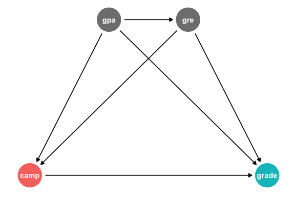
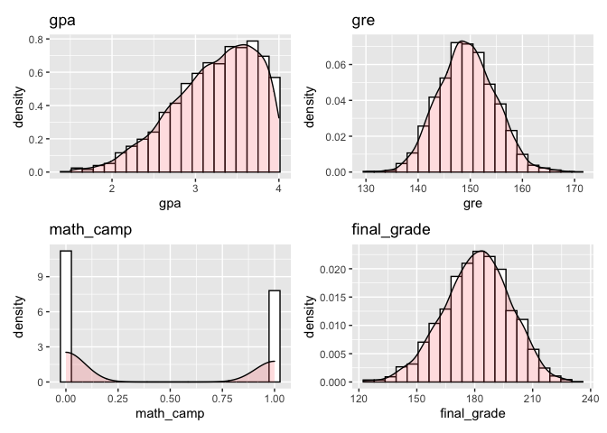
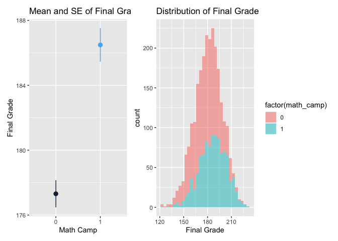
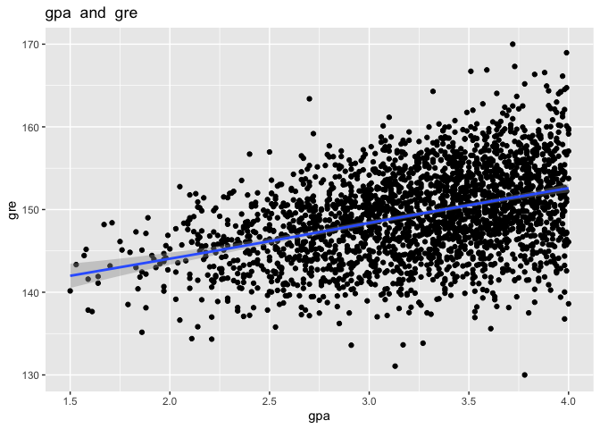
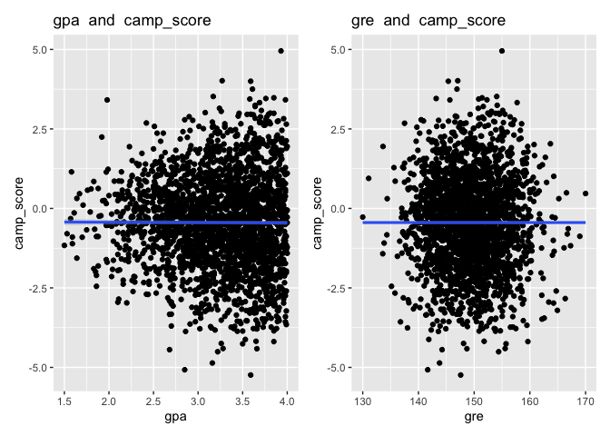
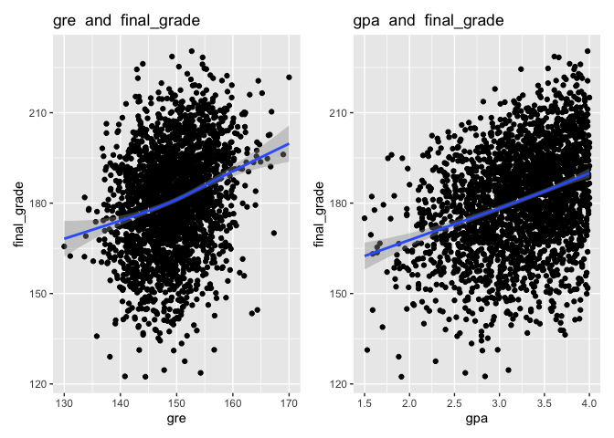

Program Evaluation Assignment 9
================
W. Hunter Giles

<script src="9_assignment_files/libs/kePrint-0.0.1/kePrint.js"></script>
<link href="9_assignment_files/libs/lightable-0.0.1/lightable.css" rel="stylesheet" />


- <a href="#set-up" id="toc-set-up">Set-up</a>
- <a
  href="#draw-a-dag-that-maps-out-how-all-the-columns-you-care-about-are-related"
  id="toc-draw-a-dag-that-maps-out-how-all-the-columns-you-care-about-are-related">1:
  Draw a DAG that maps out how all the columns you care about are
  related</a>
- <a href="#specify-how-those-nodes-are-measured"
  id="toc-specify-how-those-nodes-are-measured">2: Specify how those nodes
  are measured</a>
- <a
  href="#specify-the-relationships-between-the-nodes-based-on-the-dag-equations"
  id="toc-specify-the-relationships-between-the-nodes-based-on-the-dag-equations">3:
  Specify the relationships between the nodes based on the DAG
  equations</a>
- <a href="#generate-data-based-on-the-dag-relationships"
  id="toc-generate-data-based-on-the-dag-relationships">4: Generate data
  based on the DAG relationships</a>
- <a href="#verify-all-relationships-with-plots-and-models"
  id="toc-verify-all-relationships-with-plots-and-models">5: Verify all
  relationships with plots and models</a>
- <a href="#try-it-out" id="toc-try-it-out">6: Try it out!</a>
- <a href="#save-the-data" id="toc-save-the-data">7: Save the data</a>

------------------------------------------------------------------------

### Set-up

``` r
library(tidyverse)  # For ggplot, mutate(), filter(), and friends
library(broom)      # For converting models to data frames
library(ggdag)      # For drawing DAGs
library(scales)     # For rescaling data with rescale()
library(truncnorm)  # For truncated normal distributions
library(ggplot2)
library(sn)
library(sigmoid)
library(patchwork)
options(width = 100)

set.seed(1234)  # Make any random stuff be the same every time you run this

# Turn off the message that happens when you use group_by() and summarize()
options(dplyr.summarise.inform = FALSE)
```

Many MPA and MPP programs offer a brief math camp in the weeks before
students begin their graduate degrees, with the hope that it will help
students by more prepared in math-heavy classes like statistics and
microeconomics.

You’re interested in evaluating the effectiveness of a hypothetical math
camp program. Does attending math camp cause higher grades in statistics
classes?

This program is not randomized and it’s not mandatory—anyone can decide
to sign up (or not!), which means you have selection bias and
confounding to worry about.

You don’t have any data for this, but that’s okay! You can simulate some
data and set up the infrastructure for answering this question later
with real data.

These two guides will be incredibly helpful for this assignment:

- Generating random numbers:
  <https://evalf21.classes.andrewheiss.com/example/random-numbers/>
- The ultimate guide to generating synthetic data for causal inference:
  <https://evalf21.classes.andrewheiss.com/example/synthetic-data/>

## 1: Draw a DAG that maps out how all the columns you care about are related

For the sake of this example, we’ll think about a DAG with just four
nodes. Students’ GRE scores and undergraduate GPAs confound both the
choice to enroll in math camp and final class grades. Additionally,
undergraduate degrees help cause GRE scores.

``` r
math_camp_dag <- dagify(grade ~ camp + gpa + gre,
                        camp ~ gpa + gre,
                        gre ~ gpa,
                        outcome = "grade",
                        exposure = "camp",
                        coords = list(x = c(camp = 1, gpa = 2, gre = 3, grade = 4),
                                      y = c(camp = 1, gpa = 2, gre = 2, grade = 1)))

ggdag_status(math_camp_dag) +
  theme_dag() +
  guides(color = "none")  # Turn off legend
```



## 2: Specify how those nodes are measured

``` r
n <- 2500
set.seed(1234)
math_camp_data <- tibble(
  # truncated normal distribution with domain = [1.5,4.0] centered around 3.5
  gpa = rtruncnorm(n, a = 1.5, b = 4.0, mean = 3.5, sd = .7),
  # normal distribution centered around 150 with a slight left skew
  gre = rsn(n, xi = 170, omega = 20, alpha = -1),
  # binomial distribution with uniform distribution
  math_camp = rbinom(n, size = 1, prob = .5),
  # beta distribution centered around 70 with a left skew
  final_grade = rbeta(n, shape1 = 7, shape2 = 3) * 100
) %>%
  # rescaling distribution to be between 130 and 170
  mutate(gre = rescale(gre, to = c(130,170))) %>%
  # rounding 
  mutate(gpa = round(gpa,2)) %>%
  mutate(gre = round(gre,0)) %>%
  mutate(final_grade = round(final_grade,1))
```

## 3: Specify the relationships between the nodes based on the DAG equations

$$
\begin{cases}
GRE = \alpha_0 + 10*GPA + \epsilon_0 \\
CampScore = \alpha_1 -5*GPA - .5*GRE + \epsilon_1 \\
Final = \alpha_2 + 10*GPA + .5*GRE + 10*I[\Phi (CampScore) > .5] + \epsilon_2
\end{cases}
$$

## 4: Generate data based on the DAG relationships

``` r
relational_data <- math_camp_data %>%
  # creating gpa coefficent with random noise
  mutate(beta_gre.gpa = rnorm(n, mean = 10, sd = 3)) %>%
  # making gre a linear function of gpa
  mutate(gre_r = gre + (beta_gre.gpa*gpa)) %>%
  # rescaling the data
  mutate(gre_r = rescale(gre_r, to = c(130,170))) %>%
  
  # creating coefficents with random noise
  mutate(beta_camp_score.gpa = rnorm(n, mean = -.05, sd = .4)) %>%
  mutate(beta_camp_score.gre = rnorm(n, mean = -.005, sd = .002)) %>%
  # making camp_score a linear function of gpa and gre
  mutate(camp_score = math_camp + (beta_camp_score.gpa*gpa) + (beta_camp_score.gre*gre_r)) %>%
  # making camp_score binary
  mutate(math_camp_r = ifelse(rescale(camp_score, to = c(0,1))>.5,1,0)) %>%
  # mutate(math_camp_r = ifelse(sigmoid(camp_score)>.5,1,0)) %>%
  
  # creating coefficents with random noise  
  mutate(beta_final.gpa = rnorm(n, mean = 10, sd = 1.54)) %>%
  mutate(beta_final.gre = rnorm(n, mean = .5, sd = .023)) %>%
  mutate(beta_final.math_camp = rnorm(n, mean = 10, sd = 2.91)) %>%
  # making final grade a linear function of gpa, gre, and math_camp
  mutate(final_grade_r = final_grade + (beta_final.gpa*gpa) + (beta_final.gre*gre_r) + (beta_final.math_camp*math_camp_r)) %>%
  
  select(gpa, gre_r, math_camp_r, final_grade_r, camp_score) %>%
  rename(gre = gre_r, math_camp = math_camp_r, final_grade = final_grade_r)
```

## 5: Verify all relationships with plots and models

Below are the distributions for each of the explanatory and dependent
variables.

``` r
# function that generates ggplots
var_distr <- function(data, var) {
  distr <- ggplot(data, aes(x={{var}})) + 
    geom_histogram(aes(y=..density..),      # Histogram with density instead of count on y-axis
                   bins=20,
                   colour="black", fill="white") +
    geom_density(alpha=.2, fill="#FF6666") + # Overlay with transparent density plot 
    labs(title = deparse(substitute(var)))
}

gpa_distr <- var_distr(relational_data, gpa)
gre_distr <- var_distr(relational_data, gre)
math_camp_distr <- var_distr(relational_data, math_camp)
final_grade_distr <- var_distr(relational_data, final_grade)

gpa_distr + gre_distr + math_camp_distr + final_grade_distr
```



Below is a comparison between math camp participation and student’s
final grades.

``` r
final_grade_summary <- ggplot(relational_data, mapping = aes(x = factor(math_camp), y = final_grade, color = math_camp)) +
  stat_summary(geom = "pointrange", fun.data = "mean_se", fun.args = list(mult = 1.96)) +
  guides(color = "none") +
  labs(title = "Mean and SE of Final Grade", x = "Math Camp", y = "Final Grade")

final_grade_dis <- ggplot(relational_data, aes(x=final_grade, fill=factor(math_camp))) +
  geom_histogram(alpha = .5) + 
  labs(title = "Distribution of Final Grade", x = "Final Grade")

final_grade_summary + final_grade_dis
```



Below is a scatter plot showing the data’s relationship between gpa and
gre scores.

``` r
var_scatter <- function(data, x, y) {
  title <- paste(deparse(substitute(x))," and ", deparse(substitute(y)))
  distr <- ggplot(data, aes(x={{x}}, y = {{y}})) + 
    geom_point() +
    geom_smooth() +
    labs(title = title, x = deparse(substitute(x)), y = deparse(substitute(y)))
  return(distr)
}

var_scatter(relational_data, gpa, gre)
```



Below shows the relationship between `camp_score` and its linear
regressors Note that camp_score is the ‘math_camp’ variable before its
been rescaled. The directional relationships should be the same. Also,
note that the coefficients are significant but very small, so it appears
that there is not relationship in the scatter plots.

``` r
var_scatter(relational_data, gpa, camp_score) + var_scatter(relational_data, gre, camp_score)
```

    `geom_smooth()` using method = 'gam' and formula 'y ~ s(x, bs = "cs")'
    `geom_smooth()` using method = 'gam' and formula 'y ~ s(x, bs = "cs")'



Below are scatter plots to represent the relationship between
`final_grades` and its linear regressors.

``` r
var_scatter(relational_data, gre, final_grade) +
  var_scatter(relational_data, gpa, final_grade) 
```



## 6: Try it out!

Below are the naive and multivariate models for `final_grade` on
`math_camp`.

``` r
naive <- lm(final_grade ~ math_camp,
            data = relational_data)

tidy(naive)
```

    # A tibble: 2 × 5
      term        estimate std.error statistic  p.value
      <chr>          <dbl>     <dbl>     <dbl>    <dbl>
    1 (Intercept)   177.       0.431     411.  0       
    2 math_camp       9.18     0.673      13.6 6.95e-41

``` r
multi <- lm(final_grade ~ math_camp + gpa + gre,
            data = relational_data)

tidy(multi)
```

    # A tibble: 4 × 5
      term        estimate std.error statistic  p.value
      <chr>          <dbl>     <dbl>     <dbl>    <dbl>
    1 (Intercept)   74.0      8.63        8.57 1.73e-17
    2 math_camp      9.31     0.625      14.9  3.65e-48
    3 gpa            9.10     0.664      13.7  3.31e-41
    4 gre            0.494    0.0619      7.98 2.15e-15

``` r
modelsummary::modelsummary(list(
  "Naive" = naive,
  "Multivaiate" = multi
))
```

<table class="table" style="width: auto !important; margin-left: auto; margin-right: auto;">
 <thead>
  <tr>
   <th style="text-align:left;">   </th>
   <th style="text-align:center;"> Naive </th>
   <th style="text-align:center;"> Multivaiate </th>
  </tr>
 </thead>
<tbody>
  <tr>
   <td style="text-align:left;"> (Intercept) </td>
   <td style="text-align:center;"> 177.313 </td>
   <td style="text-align:center;"> 73.975 </td>
  </tr>
  <tr>
   <td style="text-align:left;">  </td>
   <td style="text-align:center;"> (0.431) </td>
   <td style="text-align:center;"> (8.628) </td>
  </tr>
  <tr>
   <td style="text-align:left;"> math_camp </td>
   <td style="text-align:center;"> 9.175 </td>
   <td style="text-align:center;"> 9.306 </td>
  </tr>
  <tr>
   <td style="text-align:left;">  </td>
   <td style="text-align:center;"> (0.673) </td>
   <td style="text-align:center;"> (0.625) </td>
  </tr>
  <tr>
   <td style="text-align:left;"> gpa </td>
   <td style="text-align:center;">  </td>
   <td style="text-align:center;"> 9.097 </td>
  </tr>
  <tr>
   <td style="text-align:left;">  </td>
   <td style="text-align:center;">  </td>
   <td style="text-align:center;"> (0.664) </td>
  </tr>
  <tr>
   <td style="text-align:left;"> gre </td>
   <td style="text-align:center;">  </td>
   <td style="text-align:center;"> 0.494 </td>
  </tr>
  <tr>
   <td style="text-align:left;box-shadow: 0px 1px">  </td>
   <td style="text-align:center;box-shadow: 0px 1px">  </td>
   <td style="text-align:center;box-shadow: 0px 1px"> (0.062) </td>
  </tr>
  <tr>
   <td style="text-align:left;"> Num.Obs. </td>
   <td style="text-align:center;"> 2500 </td>
   <td style="text-align:center;"> 2500 </td>
  </tr>
  <tr>
   <td style="text-align:left;"> R2 </td>
   <td style="text-align:center;"> 0.069 </td>
   <td style="text-align:center;"> 0.199 </td>
  </tr>
  <tr>
   <td style="text-align:left;"> R2 Adj. </td>
   <td style="text-align:center;"> 0.069 </td>
   <td style="text-align:center;"> 0.198 </td>
  </tr>
  <tr>
   <td style="text-align:left;"> AIC </td>
   <td style="text-align:center;"> 21131.5 </td>
   <td style="text-align:center;"> 20760.1 </td>
  </tr>
  <tr>
   <td style="text-align:left;"> BIC </td>
   <td style="text-align:center;"> 21149.0 </td>
   <td style="text-align:center;"> 20789.2 </td>
  </tr>
  <tr>
   <td style="text-align:left;"> Log.Lik. </td>
   <td style="text-align:center;"> −10562.766 </td>
   <td style="text-align:center;"> −10375.061 </td>
  </tr>
  <tr>
   <td style="text-align:left;"> F </td>
   <td style="text-align:center;"> 185.911 </td>
   <td style="text-align:center;"> 206.758 </td>
  </tr>
  <tr>
   <td style="text-align:left;"> RMSE </td>
   <td style="text-align:center;"> 16.55 </td>
   <td style="text-align:center;"> 15.36 </td>
  </tr>
</tbody>
</table>

## 7: Save the data

Make a version of your fake data that removes all the intermediate
columns you made. Save the final clean data as a CSV file with
`write_csv()`.

``` r
write_csv(relational_data, "../data/math_camp_relational.csv")
```
