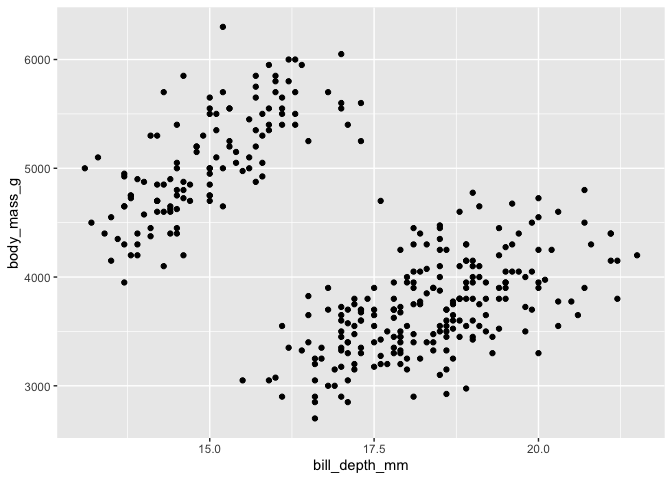
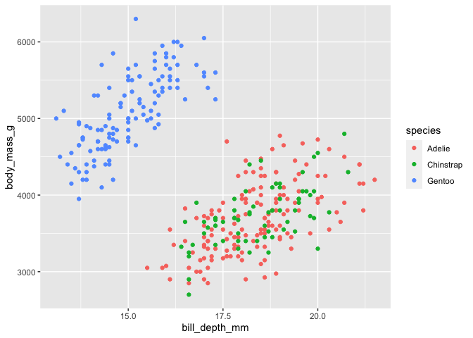
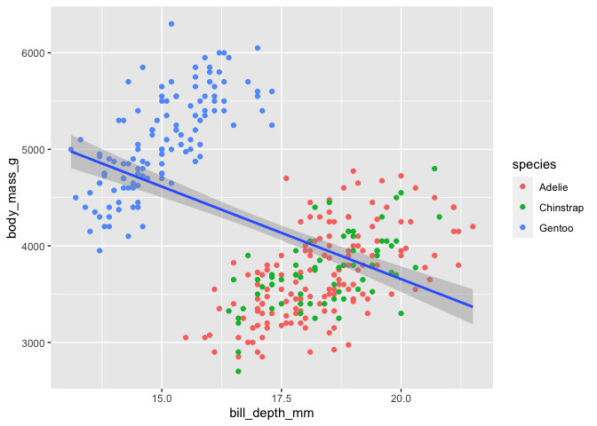
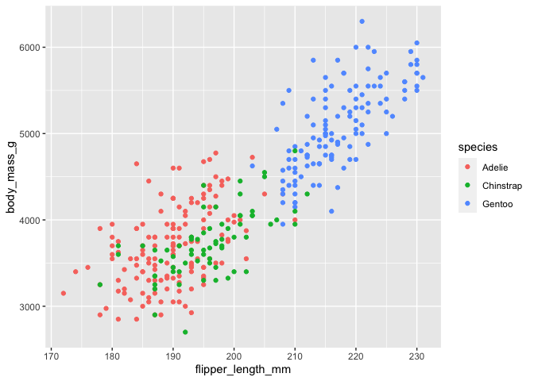
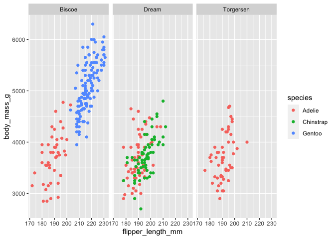
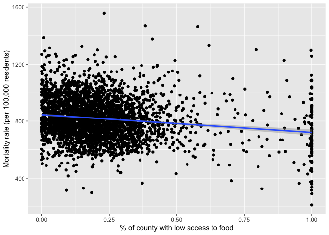
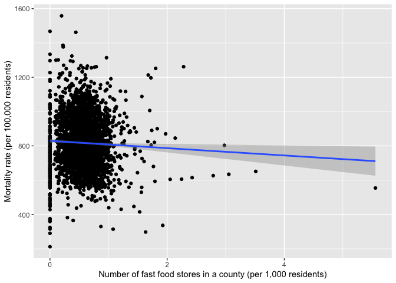
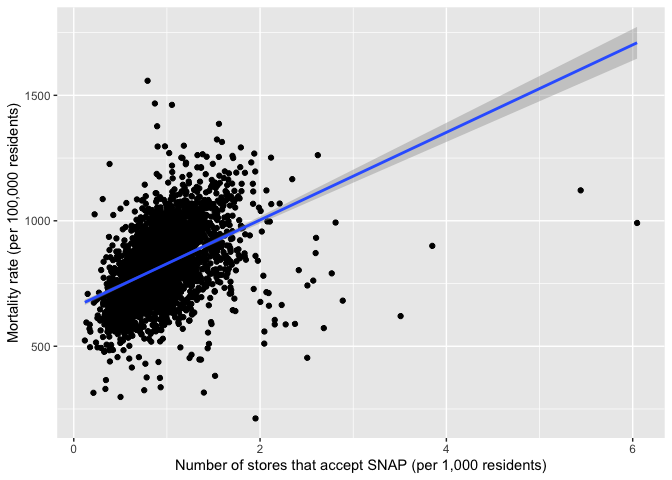
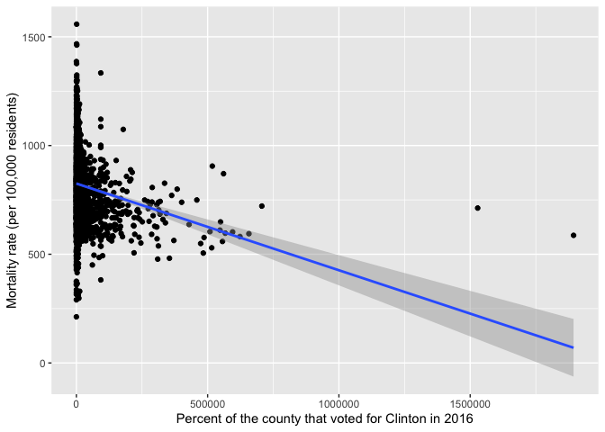

Problem set 2: Regression
================
Hunter Giles
September 1, 2022

``` r
library(tidyverse)
library(broom)
library(modelsummary)


# Load penguins data
penguins <- read_csv("data/penguins.csv")
```

# Task 1: Penguins

Between 2007 and 2009, researchers collected data on penguins in three
islands in the Palmer Archipelago in Antarctica: Biscoe, Dream, and
Torgersen. The `penguins` dataset has data for 342 penguins from 3
different species: Chinstrap, Gentoo, and Adélie. It includes the
following variables:

-   `species`: The penguin’s species (Chinstrap, Gentoo, and Adélie)
-   `island`: The island where the penguin lives (Biscoe, Dream, and
    Torgersen)
-   `bill_length_mm`: The length of the penguin’s bill, in millimeters
    (distance from the penguin’s face to the tip of the bill)
-   `bill_depth_mm`: The depth of the penguin’s bill, in millimeters
    (height of the bill; distance from the bottom of the bill to the top
    of the bill)
-   `flipper_length_mm`: The length of the penguin’s flippers, in
    millimeters
-   `body_mass_g`: The weight of the penguin, in grams
-   `sex`: The sex of the penguin
-   `year`: The year the observation was made

## Exploratory analysis

What is the relationship between penguin weight and bill depth? This
plot shows some initial trends:

``` r
ggplot(data = penguins, 
       aes(x = bill_depth_mm, y = body_mass_g)) +
  geom_point()
```

<!-- -->

Make a new plot that colors these points by species. What can you tell
about the relationship between bill depth and penguin weight?

``` r
ggplot(data = penguins, 
       aes(x = bill_depth_mm, y = body_mass_g, color = species)) +
  geom_point()
```

<!-- -->

*There is a positive relationship between bill depth and body mass.*

Add a `geom_smooth()` layer to the plot and make sure it uses a straight
line (hint: include `method="lm"` in the function). What does this tell
you about the relationship between bill depth and body mass?

``` r
ggplot(data = penguins, 
       aes(x = bill_depth_mm, y = body_mass_g, color = species)) +
  geom_point() +
  geom_smooth(method = lm)
```

    ## `geom_smooth()` using formula 'y ~ x'

<!-- -->

*The lines show the average increase in body mass as bill depth
increases for a given species.*

Change the plot so that there’s a single line for all the points instead
of one line per species. How does the slope of this single line differ
from the slopes of the species specific lines? ***Why??***

``` r
ggplot(data = penguins, 
       aes(x = bill_depth_mm, y = body_mass_g)) +
  geom_point(mapping = aes(color = species)) +
  geom_smooth(method = lm)
```

    ## `geom_smooth()` using formula 'y ~ x'

<!-- -->

*This lines shows that there is a negative relationship between bill
depth and body mass. From this visual we can infer that species biases
the relationship.*

What is the relationship between flipper length and body mass? Make
another plot with `flipper_length_mm` on the x-axis, `body_mass_g` on
the y-axis, and points colored by `species`.

``` r
ggplot(data = penguins, 
       aes(x = flipper_length_mm, y = body_mass_g, color = species)) +
  geom_point() 
```

<!-- -->

*There is a positive relationship between flipper length and body mass.*

Facet the plot by island (`island`)

``` r
ggplot(data = penguins,
       aes(x = flipper_length_mm, y = body_mass_g, color = species)) +
  geom_point() +
  facet_wrap(vars(island))
```

<!-- -->

Tell a story about the relationship between flipper length and weight in
these three penguin species.

*There is a positive correlation between body mass and flipper length
for all species. On average the Gentoo species weighs more and has
bigger flippers, while the Adelie and Chinstrap are smaller birds.*

Tell a story about the distribution of penguins across the three
islands.

*The Adelie seems to be the most versatile bird, they live on all three
islands, while Chinstrap and Gentoo are restricted to their respective
habitats.*

## Models

### Predicting weight with bill depth

Does bill depth predict penguin weight?

``` r
model_depth_weight <- lm(body_mass_g ~ bill_depth_mm,
                         data = penguins)

tidy(model_depth_weight, conf.int = TRUE)
```

    ## # A tibble: 2 × 7
    ##   term          estimate std.error statistic  p.value conf.low conf.high
    ##   <chr>            <dbl>     <dbl>     <dbl>    <dbl>    <dbl>     <dbl>
    ## 1 (Intercept)      7489.     335.      22.3  1.13e-68    6829.     8148.
    ## 2 bill_depth_mm    -192.      19.4     -9.87 2.28e-20    -230.     -153.

``` r
glance(model_depth_weight)
```

    ## # A tibble: 1 × 12
    ##   r.squared adj.r.squared sigma statistic  p.value    df logLik   AIC   BIC
    ##       <dbl>         <dbl> <dbl>     <dbl>    <dbl> <dbl>  <dbl> <dbl> <dbl>
    ## 1     0.223         0.220  708.      97.4 2.28e-20     1 -2729. 5463. 5475.
    ## # … with 3 more variables: deviance <dbl>, df.residual <int>, nobs <int>

INTERPRET THE COEFFICIENTS AND RESULTS HERE. What happens as bills get
taller? Is the association statistically significant? How confident are
you about these results? (Hint: look at the
)

*On average, as bill_depth increases by 1 mm, body_mass significantly
decreases by 191 grams (p\<.001). However, the simple regression only
explains 22% of the variation (R^2 = .22), so we can infer that the
model may suffer from an omitted variable problem.*

### Predicting weight with bill depth and flipper length

RUN A MODEL that predicts weight with bill depth and flipper length
(i.e. body_mass_g \~ bill_depth_mm + flipper_length_mm)

``` r
reg1 <- lm(body_mass_g ~ bill_depth_mm + flipper_length_mm, data = penguins)
```

``` r
glance(reg1)
```

    ## # A tibble: 1 × 12
    ##   r.squared adj.r.squared sigma statistic   p.value    df logLik   AIC   BIC
    ##       <dbl>         <dbl> <dbl>     <dbl>     <dbl> <dbl>  <dbl> <dbl> <dbl>
    ## 1     0.761         0.760  393.      540. 4.23e-106     2 -2527. 5062. 5077.
    ## # … with 3 more variables: deviance <dbl>, df.residual <int>, nobs <int>

INTERPRET THESE RESULTS. Did the size of the bill depth coefficient
change after controlling for flipper length?

*On average, as bill_depth increases by 1mm, body_mass increases by 22.6
grams at a .10 significance level. 1 mm increase in flipper_length
increases body_mass by 51.5 grams (p\<.01). The previous model’s omitted
variable, flipper_length, biased down the bill_depth coefficient.*

### Predicting weight with bill depth, flipper length, and species

RUN A MODEL that predicts weight with bill depth, flipper length, and
species.

``` r
reg2 <- lm(body_mass_g ~ bill_depth_mm + flipper_length_mm + species, data = penguins)
```

``` r
glance(reg2)
```

    ## # A tibble: 1 × 12
    ##   r.squared adj.r.squared sigma statistic   p.value    df logLik   AIC   BIC
    ##       <dbl>         <dbl> <dbl>     <dbl>     <dbl> <dbl>  <dbl> <dbl> <dbl>
    ## 1     0.832         0.830  331.      417. 4.66e-129     4 -2467. 4946. 4969.
    ## # … with 3 more variables: deviance <dbl>, df.residual <int>, nobs <int>

INTERPRET THESE RESULTS. What do the species coefficients mean? Did the
bill depth coefficient change after controlling for both flipper length
and species?

*In this model the Adelie species is used as a reference, so, on
average, the Chinstrap is 131.97 grams lighter than the Adelie and the
Gentoo is 1288 grams heavier. From the above results, we can see that
species biases the bill_depth coefficient down when omitted.*

## All models at the same time

``` r
# Right now there's only one model here. Add the others from above (whatever you
# called them) like so: 
modelsummary(list(model_depth_weight, reg1, reg2))
```

|                   |  Model 1  |  Model 2  |  Model 3  |
|:------------------|:---------:|:---------:|:---------:|
| (Intercept)       | 7488.652  | -6541.907 | -4526.887 |
|                   | (335.218) | (540.751) | (516.931) |
| bill_depth_mm     | -191.643  |  22.634   |  182.364  |
|                   | (19.417)  | (13.280)  | (18.358)  |
| flipper_length_mm |           |  51.541   |  25.700   |
|                   |           |  (1.865)  |  (3.098)  |
| speciesChinstrap  |           |           | -131.968  |
|                   |           |           | (51.400)  |
| speciesGentoo     |           |           | 1288.968  |
|                   |           |           | (132.774) |
| Num.Obs.          |    342    |    342    |    342    |
| R2                |   0.223   |   0.761   |   0.832   |
| R2 Adj.           |   0.220   |   0.760   |   0.830   |
| AIC               |  5463.3   |  5061.9   |  4945.7   |
| BIC               |  5474.8   |  5077.3   |  4968.7   |
| Log.Lik.          | -2728.667 | -2526.968 | -2466.846 |
| F                 |  97.414   |  539.824  |  416.867  |
| RMSE              |  708.08   |  393.18   |  330.77   |

------------------------------------------------------------------------

# Task 2: Food access and mortality

``` r
# Make sure you look at this dataset by clicking on its name in the Environment
# panel in RStudio. Sort some of the different columns and look around to get a
# feel for what's in the data
food_health <- read_csv("data/food_health_politics.csv") 
```

    ## Rows: 3143 Columns: 26
    ## ── Column specification ────────────────────────────────────────────────────────
    ## Delimiter: ","
    ## chr  (2): state, county
    ## dbl (24): FIPS, low_access_pop, low_access_change, pct_low_access_pop, child...
    ## 
    ## ℹ Use `spec()` to retrieve the full column specification for this data.
    ## ℹ Specify the column types or set `show_col_types = FALSE` to quiet this message.

We’re interested in looking at the relationships between food access,
mortality, and politics. Do do this, we look at data from three
different sources:

-   The USDA’s [Food Environment
    Atlas](https://www.ers.usda.gov/data-products/food-environment-atlas/documentation/)
-   The CDC’s [“Compressed Mortality File 1999-2015 Series 20 No. 2U,
    2016”](http://wonder.cdc.gov/cmf-icd10.html)
-   2016 election results (found all over the internet)

Each row in the dataset is a US county. The main outcome we care about
is `mortality_rate`, or the number of deaths per 100,000 people in a
county between 2013-2015. Other interesting variables in the dataset
include:

-   `pct_low_access_pop`: Percent of the county’s population with low
    access to food
-   `pct_children_low_access`: Percent of the county’s children with low
    access to food
-   `grocery_stores_per_1000`: Number of grocery stores in a county (per
    1,000 residents)
-   `snap_stores_per_1000`: Number of stores that accept SNAP (food
    stamps) in a county (per 1,000 residents)
-   `fastfood_per_1000`: Number of fast food stores in a county (per
    1,000 residents)
-   `per_dem_2012`: Percent of the county that voted for Obama in 2012
-   `per_dem_2016`: Percent of the county that voted for Clinton in 2016

## Exploratory analysis

### How related are mortality rate and access to food?

``` r
# Notice how this is a little different from what was in the complete example
# with SAT scores. It's not possible to calculate correlations when there is
# missing data. The `use = "complete.obs"` argument here tells R to ignore any
# rows where either mortality_rate or pct_low_access_pop is missing
cor(food_health$mortality_rate, food_health$pct_low_access_pop,
    use = "complete.obs")
```

    ## [1] -0.1631545

SAY SOMETHING HERE. This is backwards from what you might expect, since
it trends downward (i.e. the mortality rate is lower in counties with a
greater proportion of the population with low access to food). Why might
that be? Is there really a relationship?

*Intuitively, if the population has less access to food, then the
mortality rate should increase. The negative relationship above is
relatively weak, so there is likely another variable influencing this
relationship.*

``` r
# Use warning=FALSE in the chunk options to remove the warning about missing data
ggplot(food_health, aes(x = pct_low_access_pop, y = mortality_rate)) +
  geom_point() +
  geom_smooth(method = "lm") +
  labs(x = "% of county with low access to food", 
       y = "Mortality rate (per 100,000 residents)")
```

    ## `geom_smooth()` using formula 'y ~ x'

<!-- -->

### How related are mortality rate and the prevalence of fast food restaurants?

``` r
cor(food_health$mortality_rate, food_health$fastfood_per_1000,
    use = "complete.obs")
```

    ## [1] -0.04379786

SAY SOMETHING HERE

*Mortality rate and number of fastfood restaurants have a weak negative
correlation. This makes since, while fastfood does help hunger, it also
increases the risk of cardiovascular disease. The two opposing effects
cancel out.*

``` r
ggplot(food_health, aes(x = fastfood_per_1000, y = mortality_rate)) +
  geom_point() +
  geom_smooth(method = "lm") +
  labs(x = "Number of fast food stores in a county (per 1,000 residents)", 
       y = "Mortality rate (per 100,000 residents)")
```

    ## `geom_smooth()` using formula 'y ~ x'

    ## Warning: Removed 8 rows containing non-finite values (stat_smooth).

    ## Warning: Removed 8 rows containing missing values (geom_point).

<!-- -->

### How related are mortality rate and the prevalence of SNAP stores per 1,000 residents?

``` r
cor(food_health$mortality_rate, food_health$snap_stores_per_1000, 
    use = "complete.obs")
```

    ## [1] 0.444958

SAY SOMETHING HERE

*Mortality and number of store that accept snap have a moderate positive
correlation. Counties that accept SNAP are likely to be poor which
increases mortality.*

``` r
ggplot(food_health, aes(x = snap_stores_per_1000, y = mortality_rate)) +
  geom_point() +
  geom_smooth(method = "lm") +
  labs(x = "Number of stores that accept SNAP (per 1,000 residents)", 
       y = "Mortality rate (per 100,000 residents)")
```

    ## `geom_smooth()` using formula 'y ~ x'

    ## Warning: Removed 31 rows containing non-finite values (stat_smooth).

    ## Warning: Removed 31 rows containing missing values (geom_point).

<!-- -->

### How related are mortality rate and the percent of the county that voted for Democrats in 2016?

``` r
cor(food_health$mortality_rate, food_health$votes_dem_2016, 
    use = "complete.obs")
```

    ## [1] -0.1938325

SAY SOMETHING HERE

*There is a weak negative correlation between mortality rates and the
number of democratic votes in 2016.*

``` r
ggplot(food_health, aes(x = votes_dem_2016, y = mortality_rate)) +
  geom_point() +
  geom_smooth(method = "lm") +
  labs(x = "Percent of the county that voted for Clinton in 2016", 
       y = "Mortality rate (per 100,000 residents)")
```

    ## `geom_smooth()` using formula 'y ~ x'

    ## Warning: Removed 8 rows containing non-finite values (stat_smooth).

    ## Warning: Removed 8 rows containing missing values (geom_point).

<!-- -->

## Models

### Does access to food predict mortality?

SAY SOMETHING HERE

*Intuitively, low access to food should have a causal relationship with
mortality. However, the above analysis only shows correlation.*

``` r
model_mortality_food <- lm(mortality_rate ~ pct_low_access_pop,
                           data = food_health)

tidy(model_mortality_food, conf.int = TRUE)
```

    ## # A tibble: 2 × 7
    ##   term               estimate std.error statistic  p.value conf.low conf.high
    ##   <chr>                 <dbl>     <dbl>     <dbl>    <dbl>    <dbl>     <dbl>
    ## 1 (Intercept)            845.      4.06    208.   0            837.     853. 
    ## 2 pct_low_access_pop    -125.     13.5      -9.23 4.94e-20    -151.     -98.1

``` r
# View(select(food_health, mortality_rate, pct_low_access_pop))
```

``` r
glance(model_mortality_food)
```

    ## # A tibble: 1 × 12
    ##   r.squared adj.r.squared sigma statistic  p.value    df  logLik    AIC    BIC
    ##       <dbl>         <dbl> <dbl>     <dbl>    <dbl> <dbl>   <dbl>  <dbl>  <dbl>
    ## 1    0.0266        0.0263  146.      85.2 4.94e-20     1 -19948. 39901. 39920.
    ## # … with 3 more variables: deviance <dbl>, df.residual <int>, nobs <int>

INTERPRET THE COEFFICIENTS AND RESULTS HERE. What happens as the percent
of low access to food goes up by 1%? Is that significant? Again, this is
backwards from what you’d expect—as the percent of low access goes up,
mortality drops. Why might that be? How much do you trust this finding?
(Hint: look at the R2 value)

*On average, as pct_low_access_pop increases by 1%, the county’s
mortality rate drops by 1.24 (p\<.001). The results seem backwards. This
simple regression accounts for only 2.6% of the variation in mortality,
meaning there are other variables biasing the pct_low_access_pop
coefficient.*

### Do more SNAP stores per person predict mortality?

``` r
reg5 <- lm(data=food_health, mortality_rate ~ snap_stores_per_1000)
tidy(reg5, conf.int = TRUE)
```

    ## # A tibble: 2 × 7
    ##   term                 estimate std.error statistic   p.value conf.low conf.high
    ##   <chr>                   <dbl>     <dbl>     <dbl>     <dbl>    <dbl>     <dbl>
    ## 1 (Intercept)              654.      6.35     103.  0             642.      667.
    ## 2 snap_stores_per_1000     174.      6.30      27.7 3.22e-151     162.      187.

``` r
glance(reg5)
```

    ## # A tibble: 1 × 12
    ##   r.squared adj.r.squared sigma statistic   p.value    df  logLik    AIC    BIC
    ##       <dbl>         <dbl> <dbl>     <dbl>     <dbl> <dbl>   <dbl>  <dbl>  <dbl>
    ## 1     0.198         0.198  131.      768. 3.22e-151     1 -19595. 39196. 39214.
    ## # … with 3 more variables: deviance <dbl>, df.residual <int>, nobs <int>

``` r
#View(select(food_health, mortality_rate, snap_stores_per_1000))
```

SAY SOMETHING HERE. What happens as the proportion of SNAP stores goes
up? Do you trust this number more or less than low access to food?’

*As snap_stores_per_1000 increases by 1, the mortality rate rises by
174. snap_stores_per_1000 is a much better predictor than
pct_low_access_pop. We can infer this by looking at this model’s R^2
score (R^2 = .19). Intuitively, this makes sense. SNAP stores ate
primarily in lower class locations, which have higher criminal activity,
lower quality education, etc.*

### Do election results and access to food and SNAP stores predict mortality?

RUN A MODEL THAT PREDICTS MORTALITY WITH A BUNCH OF COVARIATES
(i.e. mortality_rate \~ pct_low_access_pop + snap_stores_per_1000 +
per_dem_2016 + anything else you want to throw in)

``` r
reg6 <- lm(mortality_rate ~ pct_low_access_pop + snap_stores_per_1000 + per_dem_2016 + grocery_stores_per_1000, data = food_health)
tidy(reg6, conf.int = TRUE)
```

    ## # A tibble: 5 × 7
    ##   term                 estimate std.error statistic   p.value conf.low conf.high
    ##   <chr>                   <dbl>     <dbl>     <dbl>     <dbl>    <dbl>     <dbl>
    ## 1 (Intercept)             746.       7.77     96.1  0             731.     761. 
    ## 2 pct_low_access_pop      -86.2     12.4      -6.97 3.87e- 12    -111.     -62.0
    ## 3 snap_stores_per_1000    217.       6.05     35.9  1.22e-236     206.     229. 
    ## 4 per_dem_2016           -181.      14.2     -12.7  2.62e- 36    -208.    -153. 
    ## 5 grocery_stores_per_…   -221.      11.6     -19.0  4.55e- 76    -244.    -198.

``` r
glance(reg6)
```

    ## # A tibble: 1 × 12
    ##   r.squared adj.r.squared sigma statistic   p.value    df  logLik    AIC    BIC
    ##       <dbl>         <dbl> <dbl>     <dbl>     <dbl> <dbl>   <dbl>  <dbl>  <dbl>
    ## 1     0.341         0.340  119.      400. 6.17e-278     4 -19163. 38338. 38374.
    ## # … with 3 more variables: deviance <dbl>, df.residual <int>, nobs <int>

``` r
#View(select(food_health, mortality_rate, pct_low_access_pop, snap_stores_per_1000, per_dem_2016, grocery_stores_per_1000 ))
```

SAY SOMETHING HERE. Interpret the different coefficients. How predictive
is this model (i.e. what’s the R2)? Do you believe this model?

*On Average, as pct_low_access_pop increases by 1%, mortality rate
decreases by .86. As snap_stores_per_1000 increases by 1, mortality rate
increases by 217. As per_dem_2016 increases by 1%, mortality rate
decreases by 1.8. As grocery_stores_per_1000 increases by 1, mortality
rate decreases by 220.89. This model accounts for 34.13% of the
variation in mortality rate. The the models robustness has greatly
increases from the simple regressions, so I am more likely to believe
this one.*

### Mortality, contolling for state differences

RUN A MODEL with some number of plausible independent/explanatory
variables. Include `state` as one of them

``` r
# Add other explanatory variables here
model_with_state <- lm(mortality_rate ~ pct_low_access_pop + state + snap_stores_per_1000 ,
                       data = food_health)

# This table is 50+ rows long! While it might be interesting to see changes in
# intercept in relation to Alaska (the omitted state here), like how Alabama's
# mortality rate is 137 higher than Alaska's while DC's is 84 lower, it's not
# super helpful. Controlling for state does capture some of the state-specific
# reasons for varying mortality though, so it's good to include. We just don't
# really need to see all those coefficients. To remove them from this table of
# results, filter them out. The "!" in R means "not", so here we're only looking
# at rows that don't start with "state"
tidy(model_with_state, conf.int = TRUE) %>% 
  filter(!str_starts(term, "state"))
```

    ## # A tibble: 3 × 7
    ##   term                 estimate std.error statistic   p.value conf.low conf.high
    ##   <chr>                   <dbl>     <dbl>     <dbl>     <dbl>    <dbl>     <dbl>
    ## 1 (Intercept)             622.      23.3      26.7  4.22e-141     576.     667. 
    ## 2 pct_low_access_pop      -95.2     11.6      -8.20 3.43e- 16    -118.     -72.4
    ## 3 snap_stores_per_1000    134.       5.69     23.6  2.20e-113     123.     146.

``` r
glance(model_with_state)
```

    ## # A tibble: 1 × 12
    ##   r.squared adj.r.squared sigma statistic p.value    df  logLik    AIC    BIC
    ##       <dbl>         <dbl> <dbl>     <dbl>   <dbl> <dbl>   <dbl>  <dbl>  <dbl>
    ## 1     0.483         0.474  106.      54.7       0    52 -18788. 37683. 38009.
    ## # … with 3 more variables: deviance <dbl>, df.residual <int>, nobs <int>

SAY SOMETHING ABOUT THIS MODEL

*By including state fixed effects, we are about to account for 48% of
the variation in mortality rate.*

## All models at the same time

PUT ALL THE MODEL RESULTS IN THE SAME SIDE-BY-SIDE TABLE HERE

``` r
# Right now there are only two models here. Add the others from above (whatever 
# you called them) like so: 
# modelsummary(list(model_mortality_food, some_other_model, yet_another_model, etc))

# Also, by default, modelsummary will include all the state coefficients, which
# we don't want. We can omit specific coefficients with the `coef_omit`
# argument. The ^ character means it'll omit coefficients that *start with*
# "state". Without ^, it would omit any coefficient where the characters "state"
# appeared anywhere in the name, which might be too greedy

modelsummary(list(model_mortality_food, model_with_state, reg5, reg6),
             coef_omit = "^state")
```

|                         |  Model 1   |  Model 2   |  Model 3   |  Model 4   |
|:------------------------|:----------:|:----------:|:----------:|:----------:|
| (Intercept)             |  845.314   |  621.735   |  654.367   |  746.259   |
|                         |  (4.056)   |  (23.302)  |  (6.350)   |  (7.767)   |
| pct_low_access_pop      |  -124.516  |  -95.207   |            |  -86.245   |
|                         |  (13.493)  |  (11.607)  |            |  (12.374)  |
| snap_stores_per_1000    |            |  134.444   |  174.487   |  217.433   |
|                         |            |  (5.692)   |  (6.297)   |  (6.050)   |
| per_dem_2016            |            |            |            |  -180.566  |
|                         |            |            |            |  (14.165)  |
| grocery_stores_per_1000 |            |            |            |  -220.891  |
|                         |            |            |            |  (11.638)  |
| Num.Obs.                |    3116    |    3093    |    3112    |    3093    |
| R2                      |   0.027    |   0.483    |   0.198    |   0.341    |
| R2 Adj.                 |   0.026    |   0.474    |   0.198    |   0.340    |
| AIC                     |  39901.5   |  37683.1   |  39196.3   |  38337.5   |
| BIC                     |  39919.6   |  38009.1   |  39214.4   |  38373.7   |
| Log.Lik.                | -19947.736 | -18787.559 | -19595.130 | -19162.763 |
| F                       |   85.160   |   54.659   |  767.746   |  399.981   |
| RMSE                    |   145.93   |   106.05   |   131.37   |   118.79   |
